# 王菲英语语法 第十四季

## 语法基础概念（10+9+8完美语法体系）

### <u>十种</u>词性

1. 介词
2. 冠词
3. 名词
4. 代词
5. 数词
6. 副词
7. 形容词
8. 动词
9. 连词
10. 感叹词（只有叹词没有语法内容）

### <u>九种</u>句子成分

1. 主语
2. 谓语
3. 宾语
4. 表语
5. 双宾
6. 同位语
7. 宾补
8. 定语
9. 状语

### <u>八种</u>句式

- **<u>五种</u>基础简单句**
  1. 主 + 谓 + 宾
  2. 主 + 系 + 表
  3. 主 + 谓 + 双宾
  4. 主 + 谓 + 宾补
  5. 主 + 谓
- **<u>三种</u>高级复合句**
  1. 名词性从句
  2. 定语从句
  3. 状语从句

### 王菲语法树

1. **名词**：
   1. 单复数 
   2. 所有格 
   3. 主谓一致
2. **代词**：
   1. 形式 
   2. 含义 
   3. 用法
3. **数词**： 
   1. 基数词 
   2. 序数词
4. **冠词**：
   1. 定冠词 
   2. 不定冠词 
   3. 零冠词
5. **形容词，副词**：
   1. 三级 
   2. 固定句型
6. **介词**：
   1. 用法 
   2. 分类 
   3. 功能 
   4. 固定搭配
7. **动词**：
   1. 时态 
   2. 语态 
   3. 非谓语动词
   4. 虚拟语气
   5. 独立主格结构
8. **连词**：
   1. 并列连词
   2. 从属连词（三大从句）
9. **其它**：
   1. 强调句 
   2. 倒装句 
   3. 反义疑问句

### 基本概念 - 简单句（重要）

1. **陈述句（五种句型）**

   1. **主语 + 系动词 + 表语**（系动词后面叫表语）
      - London is the capital of England.
      - 系动词: 
        - be 动词 
        - 感官动词（与五官相关单词）
   2. **主语 + 谓语**（动词是**不及物动词**，不能加宾语）
      - I get up early in the morning.
   3. **主语 + 谓语 + 宾语**
      - I love watermelon.
      - 表语/宾语本质相同
        - **动词后面叫宾语**
        - 两种特殊动词后面叫表语
   4. **主 + 谓 + 双宾**（直接宾语+间接宾语）
      - The rabbit showed *us* a *carrot*.
      - 改成被动句，会出现两个被动句
        - us 和 carrot 都可以做被动语态的主语
   5. **主 + 谓 + 宾语 + 宾补**
      - They elected *Martin* their monitor.
      - 改成被动句只有一个被动句
        - 只有 Martin 能做被动语态主语

2. **陈述句形式**

   1. **肯定式**
      - Honesty is the best policy.
   2. **否定式**
      - She will not listen to me.
      - l don' t think it right.
      - 在助动词后面加 not , 不能直接加动词后面

3. **一般疑问句**

   - 可以用 yes/no 回答
   - 陈述句变一般疑问句有**三种类型**
     1. **提前系动词**
        - 陈述句: 主语 + 系动词 + 表语
        - 疑问句: 系动词 + 主语 + 表语
        - You were coming with us. 
        - Were you coming with us？ -Yes
     2. **提前助动词**
        - 陈述句: 主语 + 谓语 + (宾语)
        - 疑问句: 助动词 + 主语 + 动词原形 + 其它
          - **助动词**: 帮助动词的动词 (完成**语态/时态/疑问/否定**) 无词义
        - You *have found* a new job. 
        - *Have* you *found* a new job yet？
          - Yes, I have/No, I haven 't.
     3. **提前情态动词**
        - 陈述句: 主语 + 情态动词 + 动词原形 + 其它
        - 疑问句: 情态动词 + 主语 + 动词原形 + 其它
          - **情态动词**和**助动词**都**不能**单独充当**谓语**, 必须和动词放在一起充当谓语
          - **情态动词**: 有词义; **助动词**: 无词义
        - You *can solve* this problem 
        - *Can* you *solve* this problem？
          - Yes I can/No, l can’t.

4. **特殊疑问句**

   1. 以特殊疑问词开头；

   2. 对句中某一成分提问；

   3. 不能用 Yes/No 进行回答

      | Who - 提问人          | Where - 提问地点         |
      | --------------------- | ------------------------ |
      | Whose - 提问所属      | Why - 提问原因           |
      | Whom - 提问宾格人     | How - 提问方式或数量     |
      | What - 提问事情或属性 | How much/many - 提问数量 |
      | When - 提问时间       | Which - 提问选择         |

      特殊疑问句 例句1

      - Who were you on the phone with？
      - Jim.

      特殊疑问句 例句2

      - Whom is he dating？
      - He is dating Anna.

5. **选择疑问句**

   1. 选择疑问句**用 or 连接**；

   2. 提出两个或两个以上的句式供选择；

   3. 选择疑问句不能用 Yes/No 回答。

      选择疑问句 例句1

      - Do you like chocolate or vanilla better？

      选择疑问句 例句2

      - Are you going to drive or do you want me to？

6. **反义疑问句**

   1. 陈述句部分是**肯定句**，疑问句部分用**否定句**；

   2. 陈述句部分是**否定句**，反意疑问句用**肯定句**。

      **前肯后否；前否后肯**

      **反义疑问句** 例句

      - He is your teacher, isn’t he?
      - You found the key in the bedroom, didn’t you？
      - The boy has to clean his room, doesn’t he?

   1. **感叹句**的反义疑问句
      - 一律用**否定式提问**
      - What a clever boy, isn’t he?
      - What a lovely day, isn't it？

   2. **祈使句**的反义疑问句
      - 用 **will you**
      - Let’s 开始, 用 **shall we**

   3. **含 must** 的反义疑问句
      - **表“必须”**：反意疑问句为 mustn't…？/ needn't…?
        - He <u>must</u> study hard at English, mustn 't he？/neednt he?
      - **表推测“一定，肯定”**：反意疑问句与 must 后面的**动词**呼应
        - You <u>must</u> be joking, aren't you?

   4. **含否定词**的反义疑问句
      - 常见否定词：hardly; never; seldom; little; few; nowhere; nothing 等
      - 反意疑问句用**肯定提问**。
        - Frank <u>hardly</u> goes to parties, does he?
        - He has <u>few</u> triends, has he?
   5. **复合句**的反义疑问句
      - 复合句的反意疑问句都**对主句提问**。
        - 复合句: 两个以上句子构成, 从句连词的三大从句
      - <u>He was punished</u> *because* he violated the regulation, wasn 't he？
      - You never told me *that* you had been ill, did you?
   6. **宾语从句**的反义疑问句
      - I don' t think/ suppose/ believe/ imagine 引导的**宾语从句**，反意疑问句应**与从句的主语，谓语部分一致**，用**肯定式的提问**。
        - 中英文否定词位置不一致, 否定词转移
      - I don' t <u>suppose anyone</u> will volunteer, will they?
        - 我相信没人会做 否定词属于后面从句
      -  I don' t <u>believe she</u> has done it, has she?
        - 我相信她没做这件事, 否定词属于后面从句

7. **感叹句**

   1. **What 感叹句**
      1. What + a/an + 形容词 + **可数名词单数** + [主语 + 谓语]！
      2. What + a/an + **名词** + 主语 + 谓语！
      3. What + 形容词 + **不可数名词/复数名词** + [主语 + 谓语]！
         - What a marvelous sight!
   2. **How 感叹句**
      1. How + **形容词/副词** + [主语 + 谓语]！
      2. How + **形容词** + a/an + 可数名词单数 + [主语 + 谓语]!
         - How noble of him to do that !
         - How intelligent you are！
   3. **语气词/感叹号**
      - Oh, I am depressed!
      - I cannot survive without you!

8. **祈使句**

   **没有主语, 通常用动词开头**

   1. 表示命令
      - Please sit down.
      - Leave this place at once.
   2. 表示请求或祝愿
      - Have a safe trip！
      - Let's go for a walk.

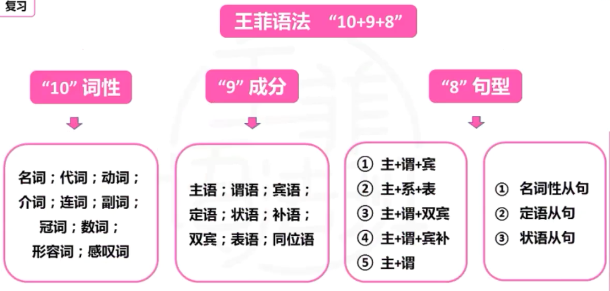

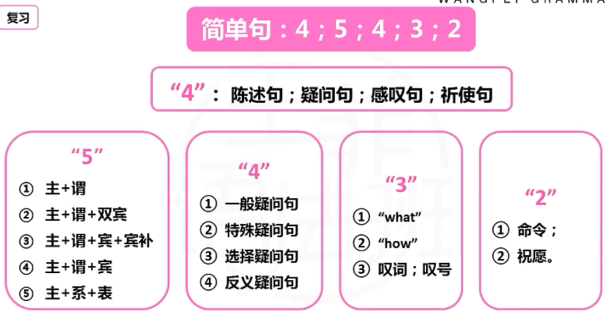

## 一、名词

### 1.1 名词的分类

#### 1.1.1 专有名词&普通名词

1. **专有名词**：特定的某人、地方或机构等专有的名称。

   1. 人名：Tom, Smith, Jackie, Wang

   2. 地名：Beijing, Virginia, London.

   3. 国家名：China, Rusa, Pakistan.

   4. 单位名：the State Council, the Ministry of Foreign Affairs, the Ministry of Finance.

   5. 组织名：IMF ASEAN EU OPEC

   6. 大型活动或事件：The Belt and Road, BCIKS

      注意专有名词第一个字母要大写

2. **普通名词**

   1. **可数名词**
      1. **个体名词**
         - aunt, uncle 
         - 表个体
      2. **集体名词**
         - class, army 
         - 表人或事物的总称
   2. **不可数名词**
      1. **物质名词**
         - Coffee, water
         - 无法分为个体的事物
      2. **抽象名词**
         - interesting, pleasure
         - 表性质 / 状态 / 情感 等抽象概念
         - 前一般不加定冠词
      3. **语言名词**
         - Chinese, French
         - 表语言名称

#### 1.1.2 可数名词&不可数名词

1. 例句
   - 可数: Most <u>classrooms</u> have <u>computers</u>.
   - 不可数: They left <u>the house</u> to go for a walk after <u>tea</u>.
2. 注意:
   1. 不可数名词, 不可数字计算
   2. 不可数名词, **不加不定冠词 ** (a/an) 与数词；
   3. 不可数名词, 可**加定冠词** (the)
      - 家具（furniture）
        We have too much furniture.
      - 设备（ equipment）
        The plant was dismantled of all its equipment and furniture.

#### 1.1.3 具体名词&抽象名词

1. **具体名词**：指可以看到，听到，闻到，触摸到的事物。
   1. 人物：man, Mrs. Jones
   2. 地点：river, London
   3. 事物：book, mountains, sports car
2. **抽象名词**：指代情感，观念，想法等无形的事物的名词。
   1. 例: love, happiness, intelligence, anger, excitement

#### 1.1.4 复数形式出现的名词

|         单词         | 例句                                             |
| :------------------: | :----------------------------------------------- |
|    scIssors 剪刀     | There are three pairs of scissors in the drawer. |
|    tweezers 镊子     | Could you pass me those tweezers？               |
|  binoculars 望远镜   | She gave me some binoculars.                     |
|     glasses 眼睛     | I've lost my glasses!                            |
|     clothes 衣服     | She put her clothes in the suitcase.             |
| congratulations 祝贺 | Many congratulations!                            |

### 1.2 名词的单复数

1. **规则名词**的复数形式

   1. -s 例如：大多数名词在单数名词后加 -s
      - desk→ desks day→days house→ houses
   2. -es 例如：**以 o, s, x, ch, sh 结尾的单数名词后加 -es**
      - hero→ heroes, bush→ bushes, fox→ foxes
   3. **以 -y 结尾**的名词
      1. **辅音 +y 的名词，变 y 为 i 加 -es**
         - city> cities 
         - country→> countries
      2. **元音 +y 的名词，加 -s**
         - boy→>boys 
         - donkey >donkeys
   4. **-f, -fe 结尾**的名词
      1. **变 f 为 v 加 -es**
         - half, life, leaf, loaf, knife, shelf, wife
      2. **直接加 -s** （没规律只能背诵）
         - belief, grief, cliff, gulf, roof, proof
   5. 特殊情况
      1. **-ch 结尾发 /k/ 音, 加 -s**
         - monarch（君主）→ monarchs 
         - stomach（胃）→ stomachs
      2. **“元音+o” 或 “oo” 结尾的词，加 “-s”**
         - bamboo → bamboos 
         - portfolio → portfolios
      3. **注意:**
         1. **有的 “o” 结尾，加 “es”, 辅音结尾**
            - cargo, echo, embargo, hero, tomato, veto
         2. **有的 “o” 结尾，加 “-s”, 辅音结尾**
            - memento, concerto, piano, solo, photo, quarto, kilo, largo
         3. **有的 o 结尾，加 “es” 或 “s” **
            - zero, volcano, mango, archipelago banjo, grotto, halo

2. **不规则名词**的复数形式

   | man-men     | child-children |
   | ----------- | -------------- |
   | woman-women | fish-fish      |
   | goose-geese | deer-deer      |
   | foot-foot   | sheep-sheep    |
   | tooth-teeth | mouse-mice     |

   

3. **复合名词**的复数形式

   1. **不可数名词-结尾，无复数形式**
      - home<u>work</u>, news<u>paper</u>
   2. **man 或 woman为前缀的，前后名词都变复数**
      - woman doctor → women doctors 
      - man waiter → men waiters
   3. **两个名词构成**的（前面的名词为man或 woman除外），**后面名词变复数**。
      - boy friend → boy <u>friends</u> 
      - paper bag → paper <u>bags</u>
   4. “**可数名词 + 介词**（短语）” **前面名词变复数**。
      - father-in-law → <u>fathers</u>-in-law : 岳父
   5. **动词/过去分词 + 副词**，**副词加s**。
      - grown-up → grown-<u>ups</u>, 
      - stand-by → stand-<u>bys</u>

### 1.3 所有格

- 英语名词有三个格，即主格、宾格和所有格。(名词的主格宾格相同)
- 它分 “s” 所有格和 “of“ 印所有格两种形式。
- 表所属关系，即“…的”。

1. **‘s 所有格** (中英语序一致)
   1. 构成
      - **单数名词**/复数名词**非 s 结尾**，后加 ‘s; 
      - **复数名词 s 结尾**, 加 ‘
        - boys' school 男子学校
        - the Smiths'car 史密斯家的小汽车
        - the boss's plan 老板的计划
      - 带**词尾 -s 的单数名词**后，通常仍加 -‘s。
        - the boss's plan老板的计划
      - 用 and 连接的**并列名词的所有格**要分两种情况。
        - 表示**各自的所有关系**时，要分别在并列名词后加 ‘s
        - 表示**共同的所有关系**时，只在最后一个名词后加 ‘s
          - Tom's and Jim‘s rooms. 汤姆和吉姆（各自）的房间。
          - Tom and jim’s room. 汤姆和吉姆（共同）的房间。
   2. 用法
      1. **时间后**
         - this month’s schedule 这个月的日程表
         - 10 day‘s holiday 十天的假期
      2. **国家或城市后**
         - China‘s policy 中国的政策
         - the town’s population 这个镇的人
      3. **组织机构后**
         - the station' s waiting-room 车站候车室
         - the newspaper' s editorial policy 这家报纸的编辑方针
      4. **度量衡后**
         - a kilo’s weight 1千克的重量
         - 1000 pound‘s price 1000磅的价钱
      5. **天体后**
         - the moon‘s light 月光
         - Jupiter’s size 木星的大小
2. **of 所有格** (中英语序相反)
   1. 修饰前面的名词;
   2. 表两个名词间的所属关系。
      - The content of the website.
      - A friend of mine told me that all of the tickets have already sold out.
3. **双重所有格**
   1. of + 名词 ′s 所有格;
   2. of + 名词性物主代词
      - He is a friend of mine.
      - This is a photo of my mother.
      - This is a photo of my mother’s.

### 1.4 主谓一致

1. 集合名词做主语

   1. 表**整体概念**，**谓语动词用复数**；
   2. 表**个体概念**，**谓语动词用单数**。
      - The whole <u>family</u> is active. 个体概念
      - The <u>family</u> have met their various obligations. 整体概念

2. **单复数同形名词**做主语：**根据句义**，判断谓语动词的单复数。

   - We need to find some other means of transportation. 
     - 我们得找其他交通工具了。

3. **国名、组织机构、书名、报刊名**等复数形式的专有名词作为整体对待，谓语**用单数**

   - <u>The United Nations</u> has passed a resolution to lift sanctions against Iraq.
     - 联合国通过了解除对伊制裁的决定。
   - <u>The Times</u> reports the news of the strike.
     - 时代杂志报导了罢工的消息。
   - <u>Great Expectations</u> was written by Dickens in 1860.
     - 《远大前程》是狄更斯于1860年写的。

4. **由 and 或 both… and… 连接两个单数名词**作主语时，指代复数概念，谓语动词**用复数**。

   - <u>She and her friends</u> are at the fair.
     - 她和她的朋友在会上。
   - and 连接的两个词**指同一个人**、同一事物或同一概念，且两个名词**共用一个冠词**，谓语动词必须**用单数**。
     - <u>The teacher and writer</u> is her friend.
       - 这位教师兼作家是她的朋友
   - and 连接**单数主语**前如有 **every, each, no, many a** 修饰时，谓语动词**用单数**。
     - No smoking or drinking is allowed. <u>Every man and woman</u> is required to check in.
       - 不许抽烟、饮酒。按要求，毎位男性及女性需要登记。

5. **时间，距离，金钱，价格**等常**作为整体**看待时，谓语动词**用单数**形式

   - <u>Five dollars</u> is a lot of money.
   - <u>Fifteen miles</u> is not a long way.

6. **就近原则**

   1. there (客观存在, 有) / here be 句型 (倒装结构, 谓语在前, 主语在后)
      - <u>There are</u> many possible candidates.
      - <u>Here are</u> some stones.
   2. or, either...or…(二选一)， neither... nor…(两者都不)，not only... but（also）连接并列成分作主语。
      - His friends <u>or</u> **the boy** <u>runs</u> every day. 
      - <u>Neither</u> gray <u>nor</u> **white** <u>is</u> my favorite color.
      - <u>Either</u> Grandpa <u>or</u> my **sisters** <u>are</u> going to the park.

7. **就远原则**

   - as well as (…和…, 除了…还有…); 
   - together / along / combined with; 
   - rather than; except; besides; including; 
   - in addition to; apart from.
     - **The politician**, <u>along with</u> the newsmen, <u>is</u> on the meeting. 
     - **Excitement**, <u>as well as</u> nervousness, <u>is</u> the cause of her shaking.

8. **some of, plenty of, a lot of, lots of, most of, the rest of, all of, half of, part of，分数、百分数 + of + 名词短语作主语**，谓语动常**与 of 后的名词保持数的一致**。

   - All of the **chicken** <u>is</u> gone.
   - Most of the **cookies** <u>were</u> eaten.

9. 在**四则运算**中，谓语动词多**用单数**。

   - 18 minus 12 <u>is</u> 6.
   - Two and two <u>is</u> four.
   - Four times four divided by two <u>is</u> eight.

10. “a number of + 可数名词复数” 谓语动词**用复数**； 许多,大量

    “the number of + 可数名词” 谓语动词**用单数**。…的数量

    - **A number of** students <u>were</u> late for class.
    - **The number of** students in the class <u>is</u> fifteen.

11. "**each, one, no one, some(any, no, every) + body(one 或 ething)**” 作主语或作限定词，谓语动词**单数**。

    - **Each** <u>gets</u> a trophy for playing.
    - **Somebody** will <u>pay</u> for this.

12. “one and a half + 复数名词”作主语，谓语动词**用单数**。大于等于 2 用复数

    - **One and a half** <u>apples is</u> left on the table.
    - **One and a half** <u>hours is</u> not enough.

13. “a/an + **单数名词** + or two” 作主语，谓语动词**用单数**。

    one or two + **复数名词**作主语，谓语动词**用复数**。

    - **A student** or two <u>has</u> failed the exam.
    - One or **two suggestions** <u>were</u> recommended.

14. many <u>a</u>…或 more than <u>one</u> + 名词作主语，谓语动词**用单数**。用单数名词代表许多,大量

    - **Many a** man <u>thinks</u> life <u>is</u> meaningless without purpose.
    - **More than one** student <u>has</u> tried this.

15. “one + of + 复数名词” 结构中，谓语动词**用单数**动词。群体中之一

    - **One of** the students in our class <u>is</u> from the UK. 
    - **One of** their daughters <u>has</u> just had a baby.

16. few, many, several, all, some后加名词作主语，谓语动词**用复数**。

    1. **Both** <u>are</u> qualified for the job.
    2. **Many** went to the beach and got sunburned.
    3. **Few** know what it really takes to get ahead.

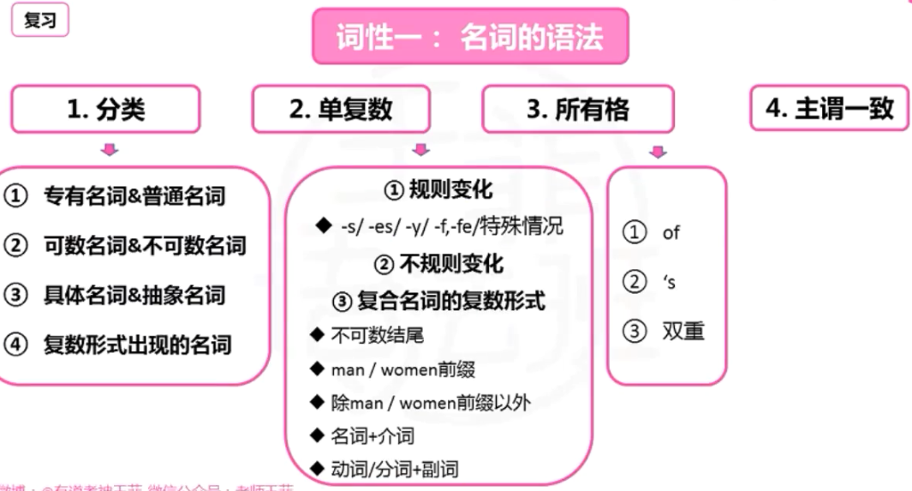

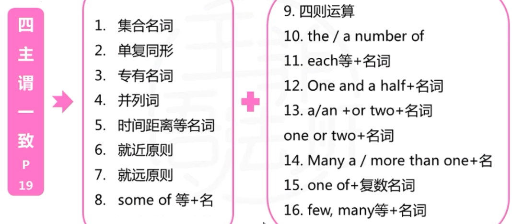

## 二、代词

- **指代**已经提到的或即将提到的人或物。
- **代替**所提到的名词或名词性短语。
- 在句中可做**主语**，**宾语**，**表语**或**同位语**。
  - It **is** a table.（**主语**）
  - I asked **myself** what i would have done in such a situation. (**宾语**)
  - The boys **all** laughed their heads oft.（**同位语**）
  - Who’s **that**？（**表语**）

### 2.1 人称代词

1. 定义

   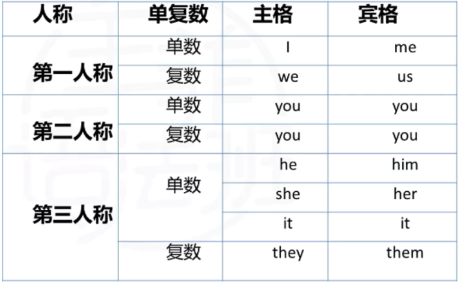

2. 人称代词的句法作用

   1. **做主语**

      - **I** asked my mother if she'd lend me some money, but she said no.

   2. **做宾语**

      - Neither of **us** forgot about it. 
      - ls sam there？ Let me talk to **him**.

   3. **作表语**

      - That must be **her** now.
      - Who is **it**？

   4. **it 的用法**

      1. **指上文提及的某一物体、动物或其他事物。**
         - <u>The company</u> was losing money and <u>it</u> had to let people go.
      2. **尚不知性别的婴儿**
         - She could compel him to support <u>the child</u> after <u>it</u> was born.
         - Her baby's due next month. She hopes it will be a boy.
      3. **指时间、距离、天气或环境等。**
         - It's ten past twelve.
         - It's time for lunch.
         - It is raining.
         - It 's two miles to the beach.
      4. **指已经发生或正在发生的事件或情况。**
         - When the factory closes, it will mean 500 people losing their jobs. 
         - Stop it, you're hurting me！
      5. **识别、分辨人**。
         - It's your mother on the phone.
         - Hello, Peter, it's Mike here.
         - Was it you who put these books on my desk？
      6. **强调句**
         - It' s spain that they're going to, not Portugal.
         - It was three weeks later that he heard the news.

      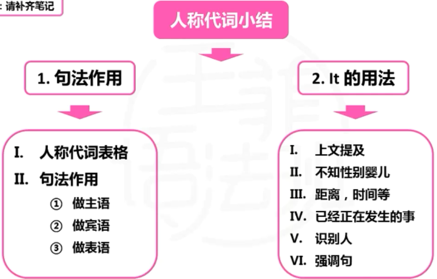

### 2.2 物主代词

1. 定义

   1. **形容词性物主代词**; + n = 名词性物主代词
      - Anyone who drives <u>his</u> car at 100 miles an hour is asking for trouble.
   2. **名词性物主代词（请背诵表格）** ; 避免名词重复出现
      - He' s a friend **of** <u>mine</u> (= one of my friends). 双重所有格
      - Which table is <u>ours</u>？
      - I think she's a relation of <u>theirs</u>.

2. 句法作用

   1. 形容词性物主代词：句中**做定语**，**修饰名词**。

      - <u>Your mother</u> is driving me crazy.

      注意：在**动名词**的复合结构中，形容词性物主代词做名词的**逻辑主语**。等同于定语从句

      - She was somewhat surprised at **my asking** (= that I asked) for the book to be returned.

   2. 名词性物主代词

      1. **主语**
         - <u>Ours</u> is the red car parked over there.
      2. **表语**
         - Whose bag is this？ It's <u>mine</u>.
      3. **宾语**
         - Let's go back to <u>yours</u> after the show.

### 2.3 反身代词

1. 表“自己。

2. 有人称和数的变化。

   - Be careful with that knife or you’ll cut <u>yourself</u>！
   - They asked <u>themselves</u> where they had gone wrong.

   |   人称   |            单数            |    复数    |
   | :------: | :------------------------: | :--------: |
   | 第一人称 |           myself           | ourselves  |
   | 第二人称 |          yourself          | yourselves |
   | 第三人称 | himself / herself / itself | themselves |

   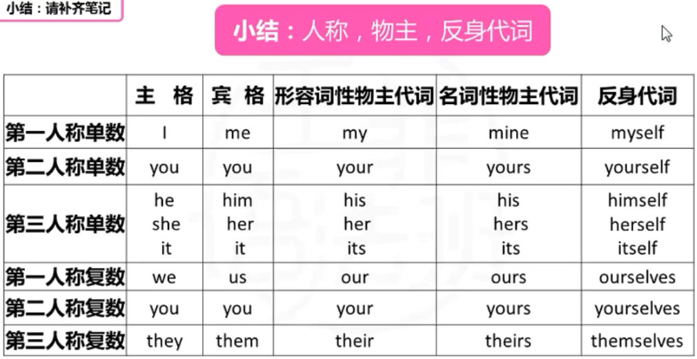

### 2.4 指示代词

- this, that, these, those 做代词时为指示代词；

- 表“这个，那个，这些，那些”；

- 在句中做主语，宾语。

  | 单数 | this  | that  |
  | ---- | ----- | ----- |
  | 复数 | these | those |

1. 句法作用

   1. **做主语**
      - <u>These</u> are too heavy for me to carry.
   2. **做宾语**
      - I like this better than <u>that</u>.
      - I don' t say no to <u>that</u>.
   3. **作定语**
      - Can I help you with <u>those</u> bags？
      - I've never liked <u>that</u> cousin of hers.
   4. **作表语**
      - Who's <u>that</u>？ Is that the girl you told me about?
      - What's <u>this</u>？Is this what you're looking for？

2. 用法

   1. this 和 these 指在时间或空间上**较近的人或物**， 

      that 和 those 指在时间或空间上**较远的人或者事物**。

      - <u>This</u> is a pen and <u>that’s</u> an eraser.

   2. 为避免重复，用 that 或 those 来代替**前面已提到**的人或物；

      用 this 或 these 来代替**下文中将要提**的人或物。

      - She's very friendly and <u>that</u> is why we all love her.

   3. **打电话**介绍自己时用 **this 指 “我”**，不用 l;

      **询问对方**用 **that 指 “你”**，不用 you。

      - Hello. <u>This</u> is Mary. Who's <u>that</u>？
      - <u>This</u> is tom.

### 2.5 关系代词

1. 用来**引导定语从句**；

2. 在从句中**充当一定的句子成分**；

3. 关系代词有**主格**，**宾格**和**属格**之分;

4. 有指人与指物之分。

   | 指人 | who, whom, whose, that, as |
   | ---- | -------------------------- |
   | 指物 | which, whose, that, as     |

### 2.6 连接代词

- **疑问代词**在引导**从句**时，称为连接代词。
  - who, whom whose, what, which whoever, whomever whichever, whatever

### 2.7 不定代词

不定代词指代情况不详的人或物。

1. **合成不定代词** : 复合不定代词

   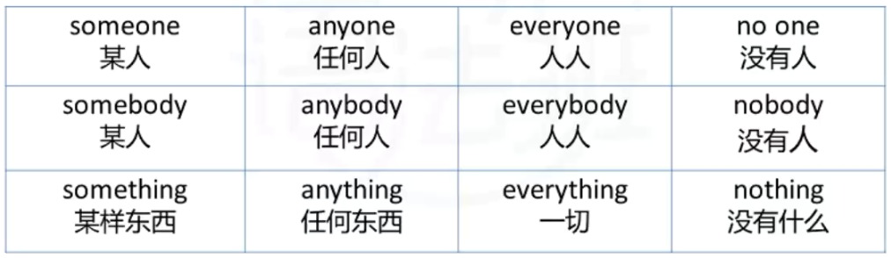

2. 第二类不定代词

   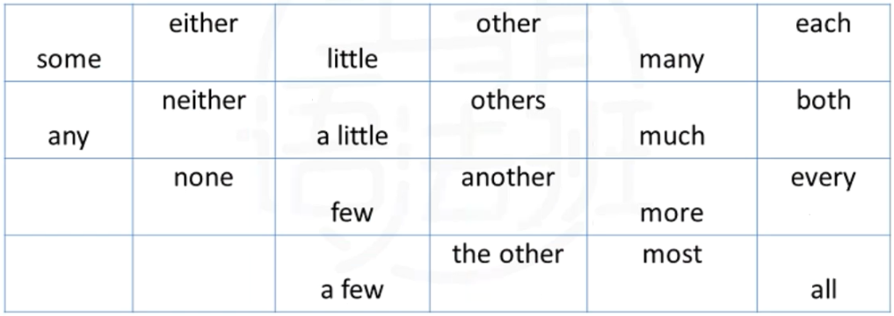

   1. 合成不定代词**谓语动词用单数**。
      - There's <u>something</u> sharp in my shoes.
      - <u>Nobody</u> agrees with me.
   2. **-thing 结尾指物**；**-one, -body 结尾指人**。
      - <u>Everyone</u> involved in the accident has been questioned by the police.
      - She could be <u>anything</u>（= any age） between 30 and 40.
   3. 合成不定代词
      1. 只能作**主语**、**宾语**或**表语**，不能作定语； 
      2. **some-， every-** 开头的不定代词用在**肯定句中**;
      3. **any-** 常用在**否定句与疑问句**汇中； 
      4. **no-** 用在**否定句**中。

3. 合成不定代词句法功能

   1. **做主语**
      - <u>Anybody</u> can use the pool—you don't need to be a member.
      - <u>Somebody</u> in the office will know.
   2. **做宾语**
      - The terrorists forced <u>everybody</u> to lie face down on the floor. 
        - 主+谓+宾+宾补+地点状语
      - You can't blame him for <u>everything</u>.
   3. **作表语**
      - A first I thought there was <u>no one</u> in the room.
      - There' s never <u>anything</u> worth watching on TV.
   4. **与 else 连用**：已经谈及一人或物，又想再提到另外的人或物，可在**合成不定代词后加 -else”** , 其余的 / 另外的
      1. You'll have to ask <u>someone else</u>.
      2. There's <u>nothing else</u> we can do to help.
   5. 注意
      1. 合成不定代词**前不能加定语**
      2. 如表示限定，需在**其后加限定词**。
         - an important somebody （x）
         - somebody important （v）
   6. **常用短语 (背诵)**
      1. **anything but** = definitely not ; 绝不
      2. **be/have nothing to do with somebody /something** = to have no connection with somebody/something ; 和人/事无关
      3. **nothing but** = only； no more /less than ; 只是, 肯定句
      4. **nothing like（informal 非正式）**= not at all like not nearly /not at all ; 

4. **many, much, more, most, few, little用法（请背诵）**

   - **a 肯定, 没 a 否定; 小(little) 不可数;**

     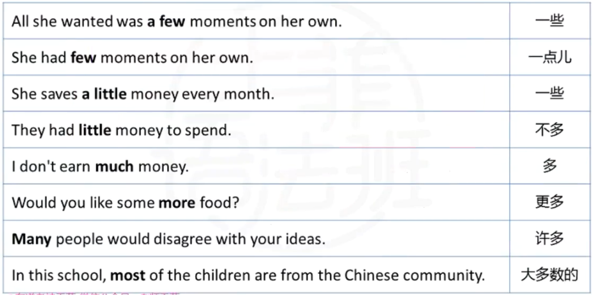

5. **some, any, either 用法 (请背诵)**

   1. **some 用**于**肯定句**中，表示一些。
      1. <u>Some</u> lucky person will win more than $1,000,000 in the competition.
      2. <u>Some</u> have compared his work to Picasso's.
   2. **any 用法**：用**否定句，疑问句**。
      1. 表 “一点儿，若干”
         - There was <u>hardly any</u> food left by the time we got there.
           - 我们到那儿的时候，几乎一点儿吃的都没了。
      2. 表 “任何一个，无论哪个”
         - <u>Any</u> of you should be able to answer this question.
           - 我希望他再也不要给我们添任何麻烦了。
      3. 表 “略微，稍微”
         - Can't you run <u>any</u> faster？
           - 不是所有单词能放到比较级之前
         - Those trousers don't look <u>any</u> different from the others.
           - 那条裤子看起来和其他裤子没什么两样
   3. **either 用法**
      1. **否定句**中代表 also 或 too，表 “也”。
         - They do really good food at that restaurant and it 's not very expensive <u>either</u>.
           - 那家餐厅饭菜做得很好，而且价格也不太贵。
      2. “**要么…要么**，不是…就是，**（两者中）任何一个**”
         - <u>Either</u> candidate would be ideal for the job.
           - 这两个人哪一个都是做这项工作的理想人选
         - <u>Either</u> you leave now <u>or</u> I call the police!
           - 要么你现在离开，要么我就叫警察！

6. **all, both, each, every用法**

   1. **all 的用法**

      1. “每一个，**全部**，所有”，**修饰可数名词**。

         - <u>All animals</u> have to eat in order to live.
         - The cast <u>all</u> lined up on stage to take their bow.
           - 全体演员都在台上站成一排向观众鞠躬。

      2. **“完全地”**

         - The downstairs rooms were painted <u>all</u> in greens and blues.
           - 楼下的房间全都粉刷成了绿色和蓝色。

      3. **固定搭配**

         1. **all in all** : 总的说来，从各方面来说；总之

         2. **all but** : 几乎，差不多

         3.  **all round** : 全面地，在各方面

            注意：**all 后面不能加 "the"**

   2. **both 用法**

      1. 表 “两个，两者”
      2. 句中作主语，定语，宾语，同位语。
         - <u>Both</u> my parents are teachers.
         - Would you like milk or sugar or <u>both</u>？
      3. 表 “两者都…” 时，用 ”both…and” 结构。
         - Both men and women have complained about the advertisement.
           - 男人和女人都抱怨过这个广告。

   3. **each 用法**

      1. each 表 “**每一个**”，可做主语，宾语，定语以及同位语。
         - We <u>each</u>（= every one of us） wanted the bedroom with the balcony, so we tossed a coin to decide. 主语
           - 我们大家都想住那间带阳台的卧室，所以只好扔硬币来决定
         - <u>Each</u> answer is worth 20 points. 定语
           - 每个答案值20分。

   4. **every 用法**

      1. 表 **“每一个” + 单数名词**，不单独使用。
         - <u>Every</u> player wants to be in a winning team.
           - 每一名玩家都想待在一个能赢的队伍里。
         - <u>Every</u> cook needs good knives and a chopping board.
           - 每个厨师都需要好的刀具以及案板。
      2. every 后再次出现，every 用 **“it” 指代**； every 还表 **“每隔”**
         - <u>Every</u> store has a manager in charge of it.
           - 每个商店都有管理它的经理。
         - <u>Every</u> area has its own park.
           - 每个区域都有自己的公园
         - There are buses into town <u>every</u> ten minutes.
           - 每隔10分钟就有公交车发车去城里。
         - I leave the house <u>every</u> morning at 6 am.
           - 我每天早上6点离开家。
      3. everyday 表 “通常的，日常的” (**定语**)； every day 表 “每天" (**状语**)。
         - In the Soviet Union, poetry was at the center of <u>everyday</u> life.
           - 在苏联，诗歌是日常生活的中心。
         - The boys meet up <u>every day</u> in the park.
      4. **everyone 表每个人**； every one 指代**上文提到过**的名词
         - <u>Everyone</u> enjoyed themselves.
         - I received more than a hundred letters from him while i was away and I've kept <u>every one</u>.
           - 我离开的时候收到100多封他的信，我留着每一封。
      5. **every other + 名词**：表 “轮流，交替，每隔…”
         - We have English lessons every other day.
           - 我们每隔一天上一次英语课。

7. **否定代词 neither, no, none 用法**

   1. **no 的用法**
      1. “没有”
         - There are <u>no</u> pockets in these trousers.
           - 这些裤子没有裤兜。
         - There's <u>no</u> chance（=no possibility ）of us getting there by eight.
           - 我们不可能在8点之前到达那里。
      2. 表 **否定答复**
         - Would you like any more cake？No, thank you.
           - 你想再来点蛋糕吗？不用，谢谢。
         - Do you have any homework tonight？No.
           - 你今晚有作业吗？没有。
      3. 与形容词，副词连用，表“并不，毫不"。
         - The exam is <u>no more difficult</u> than the tests you’ve been doing in class.
           - 这次考试并不比你们一直做的课堂测验难
         - The issues are of <u>no great interest</u> (=only a little interest) to me.
           - 我对这些问题不大感兴趣。
   2. **neither 的用法**
      1. neither 表 **两个都不**，做主语时谓语动词**用单数**。
         - Weve got <u>two TVs</u>, but <u>neither works</u> properly.
           - 我们有两台电视，但没有一台是好的。
         - Chris wasn't at the meeting and <u>neither was</u> her assistant.
           - 克里斯没有出席会议，她的助手也没有
      2. “neither… nor” 结构中，表 “**既不…不**” 。
         - <u>Neither</u> my mother <u>nor</u> my father went to university.
           - 我父母都没有上过大学。
         - They speak <u>neither</u> French <u>nor</u> German, but a strange mixture of the two.
           - 他们说的既不是法语也不是德语，而是两者的古怪混合。
   3. **none 的用法**
      1. none 表**两个以上**的人或物；
      2. 表 “**所有人都不…**” 时，谓语动词**多用复数**；根据语境判断
         - We have three sons but <u>none of them</u> **lives/live** nearby.
           - 我们有三个儿子，但是他们都不住在附近/他们没有一个住在附近。
      3. 表 “**其中一个不…**” 时，谓语动词**多用单数**。根据语境判断
         - He told me all the news but <u>none of it</u> **was** very exciting.
           - 他告诉了我全部的消息，但是没有一个是好消息。
   4. **one 的用法**
      1. **泛指"人们”**；
         - <u>One</u> would think the airlines would have to close down.
           - 人们认为航空公司将会倒闭
         - The young comedian was awful； <u>One</u> felt embarrassed for him.
           - 这个年轻的喜剧演员太糟糕了；人们为他感到羞愧。
      2. **= you**;
         - If <u>one</u> fails, then <u>one</u> must try harder next time.
           - 如果你失败了，下一次你必须更努力。
      3. **one's = his**。
         - One must learn from <u>one's</u> mistakes.
           - 人必须从他的错误中汲取教训。
         - One must be conscientious about <u>one’s</u> dental hygiene.
           - 人必须注意他的牙齿卫生。
      4. 表**不确定的人或物**。
         - <u>One</u> is hardly enough.
           - 一个远远不够。
         - <u>One</u> is purple, the other green.
           - 一个是紫色，另一个是绿色。
         - one…the other : 表示 两者中的一个…另一个…
      5. 代替**前文提过的可数名词**，但并非指同一物
         - Those are lovely scarves. I think I'll buy <u>one</u>.
           - 这些围巾很可爱。我想买一条
      6. 表**其中之一**。
         - It's a present for <u>one of</u> my children.
           - 这是我的一个孩子的礼物。
         - We think of you as <u>one of</u> the family.
           - 我们把你看做家庭的一份子。

8. **other, the other, others, the others, another 用法**

   1. **other 的用法**

      1. **作限定词**后跟**不可数名词**或**复数名词**，**没有复数形式**。
         - Some music calms people； <u>other music</u> has the opposite effect.
           - 一些音乐能使人镇静，另外一些有相反的作用。
      2. **作代词**， other **有单复数形式**
         - He is always ready to help <u>others</u>.
           - 他总是乐于助人。
         - We have to solve this problem, more than any <u>other</u>, todday.
           - 我们今天必须优先处理这个问题。
         - She gave me one book last week and promised to bring the <u>others</u> on Wednesday.
           - 上周她给了我一本书，并答应周三把其他的书带来。（特指时，可用 the others）
      3. **作限定词**后不可跟单数名词，如要跟，需在 other 前加 **the other + 单数名词**
         - I don' t like the red one. I prefer <u>the other color</u>.
           - 我不喜欢红色的那件，我更喜欢其他的颜色

   2. **the other 的用法**

      1. **作限定词**：**+单数名词**，表两个中的**另外一个**; 

         **作限定词**：**+复数名词**，表群体中**剩下的另一些**。

         - This computer here is new. <u>The other computer</u> is about five years old.
           - 这儿的这台电脑是新的，另外一台用了约5年了。（两台电脑）
         - Where are <u>the other</u> two dinner <u>plates</u> I can only find four.
           - 其他两个晚饭用的盘子呢？我只找到四个。（总共六个）

      2. **作代词**：指代**上文提到过**的人或物。

         - She has two kittens, one is black and <u>the other</u> is all white.
           - 她有两只小猫，一只是黑色的，一只是白色的。

   3. **another 的用法**

      1. **作限定词**，后 **+单数名词**。
         - Im going to have <u>another plece of cake</u>
           - 我要再吃块蛋糕。
         - We can fit <u>another person</u> in my car.
           - 我车里还可以再坐一个人。
      2. **作代词**，**指代单数**。
         - She's finished with that boyfriend and found herself <u>another</u>（one）.
           - 她和原来那个男朋友分手了，又另找了一个。
         - Do you want to exchange this toaster for <u>another</u>（one ）or do you want your money back？
           - 你是想另换一台烤面包机，还是要退货
      3. **one another** “**互相，彼此**”
         - They gave <u>one another</u> presents when they met at the airport.
           - 他们在机场见面时互赠了礼物。
         - **one way or another : 用某种方法，想方设法**
           - We'll get out of this mess <u>one way or another.</u>
             - 我们得想个什么办法摆脱这种困境。
         - **one… after another : 一个接一个，接连**
           - I'm not surprised he's feeling ill — he was eating <u>one</u> ice cream <u>after another</u>！
             - 他生病我不觉得奇怪——他不停嘴地吃冰激凌！

### 2.8 互相代词

1. **相互代词只有两个**：**each other** 和 **one another**，表示相互关系。

2. 句法作用

   **可作宾语、定语，不做主语。**

   1. **作宾语：**
      - They kept looking at <u>each other</u> and smiling.
        - 他们一直微笑着看着对方。
      - The two countries went to war with <u>one another</u> over oil prices.
        - 因为油价，两国发生了战争。
   2. **作定语：**
      - They re always wearing <u>each other's</u> clothes.
        - 他们总是换着衣服穿。
      - Apes spend a great deal of time grooming <u>one another's</u>.
        - 猴子花费大量时间互相梳理身上的皮毛

3. 相互代词有时可以**拆分开**来使用，可**做主语**或主语同位语

   - <u>Each</u> wants to know the <u>other's</u> income.
     - 彼此都想知道对方的收入
   - We <u>each</u> know what the <u>other</u> want.
     - 我们知道对方要什么。

### 2.9 疑问代词

1. 包括 what, who, whose, whom, which 引导特殊疑问句；可作**主语, 宾语，表语，定语**。

   1. Who are all those people？
      那些人是谁？
   2. Whom did they invite？
      他们邀请了谁？
   3. Whose bag is this？（定语）
      这个包是谁的？
   4. What caused the accident？（主语）
      是什么导致了那场事故？
   5. Which doctor did you see- Seward？（定语）
      你看的是哪一位医生—西沃兹医生吗？

2. **-ever** 加在 who, which, what 后面加以**强调表惊讶**；表“**到底，究竟**"之意;

   相当于 no matter who/which/what

   1. Either Thursday or Friday – whichever day is best for you？
      星期四或星期五都行—哪个日子你最方便？
   2. Whoever is in charge of International Sales？
      负责国际销售的人是谁？
   3. Whatever is he doing with that rod？
      他拿着那根竿子到底在做什么？

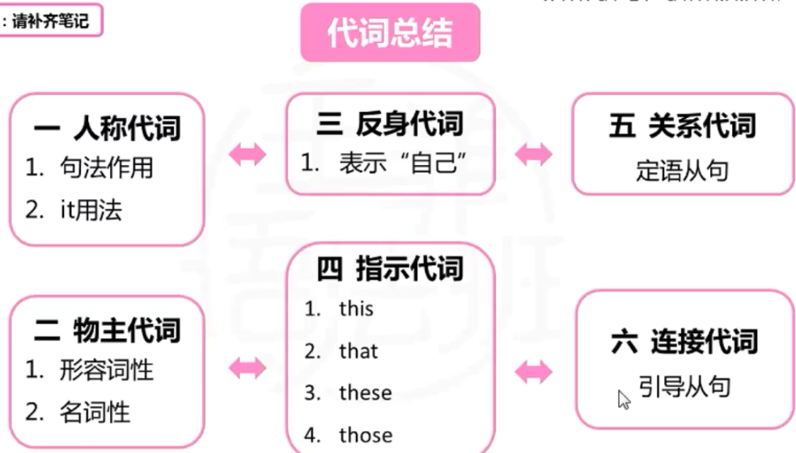

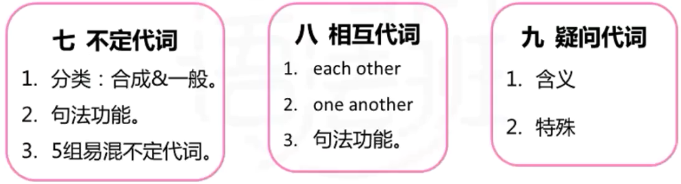

## 三、数词

### 3.1 基数词

1. 表示**个位数词**，即1-10：

   - one two three four five six seven eight nine

2. 表示**“十几”**：

   - 除了 11,12 为 eleven, twelve 之外，在所对应的个位数的词后加 **“-teen”**
     9 nine — 19 nineteen
   - 注意：thirteen, fiften, eighteen 的拼写。

3. 表示**几十**，即 20-90：

   - 在所对应的十位数的整数后加 **“-ty”**

     12 twelve — 20 twenty

     13 thirteen — 30 thirty

     14 fourteen — 40 forty

   - 注意：twenty, thirty, forty, fifty, eighty的拼写。

4. 表示**几十几**，即 21-99：

   - 十位数词加个位数词，

     21— 20+1 — twenty one

     32— 30+2 — thirty two

5. **百位数词**及以上：

   - 100 a/one hundred

     1000 a/one thousand

     10,000 ten thousand

     100,000 a hundred thousand

     1,000,000 a million

     10,000,000 ten million

     100,000,000 a hundred million trillion 万亿

   - 注意：
     - **在100以上的数中， hundred 之后加 and**；
       - 2356 two thousand three hundred and fifty six
       - 1012 one thousand and twelve
       - 56789 fifty six thousand seven hundred and eighty nine
     - **表示整数百时， hundred 后不能加 “s”**
       - two hundreds（ x）
       - two hundred （v）
     - **基数词**可以用来表示**年龄**与**年代**
       - He is his thirties. 
         - 他 30 多岁 
       - 1980’s. 
         - 二十世纪八十年代

6. **数字的写法&念法**

   1. 百位与十位之间加 and；

      十万位和万位，亿位和干万位之间加 and；

   2. 英语大数字**从右向左看**，每隔**三位划一逗号**,

      倒数第一个逗号之前要用 thousand, 

      倒数第二个逗号之前要用 million，

      倒数第三的逗号之前要用 billion 表示

   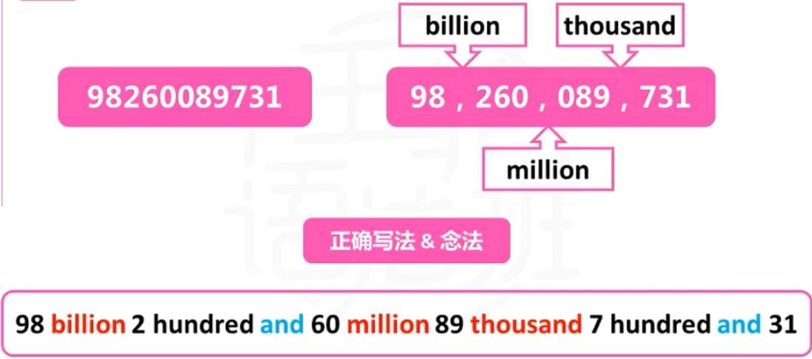

### 3.2 序数词

表示顺序或在某个序列中所处的位置，“第几”

1. 表示 **第1~3**：first, second, third，也可用1st，2nd，3rd 表示

2. 表示 **第4~19**：

   | fourth     | fifth     | sixth     | seventh     | eighth     |
   | ---------- | --------- | --------- | ----------- | ---------- |
   | ninth      | tenth     | eleventh  | twelfth     | thirteenth |
   | fourteenth | fifteenth | sixteenth | seventeenth | eighteenth |
   | nineteenth |           |           |             |            |

3. 表示**第几十**：将相应的**基数词尾的 y 变为 i + eth**

   1. 20 twenty = 第20 twentieth
   2. 30 thirty = 第30 thirtieth
   3. 40 forty = 第40 fortieth

4. **第21~99**：**十位数用相应的基数词**，**个位数用相应的序数词**

   1. 第21 twenty + frst = twenty first
   2. 第32 thirty + second = thirty second
   3. 第59 fifty + nine = fifty ninth

5. **第100及以上**

   1. **整数词**：在其相应的**基数词后加th**
      1. 第100：hundredth
      2. 第1000：thousandth
      3. 第1000,000：millionth
   2. **非整数词**：**保留相应的基数词**部分，但是对应的**个位要用序数词**
      1. 第1001：one thousand and first.
      2. 第2356：two thousand three hundred and fifty sixth.
   3. 序数词用来**表示日期**
      1. June 2nd, 6月2号
      2. May 5th, 5月5号

### 3.3 数词的句法作用

数词在句中可以做主语，宾语，表语，同位语，定语以及状语。

1. **做主语**
   - <u>Millions of people</u> live in poverty.
   - <u>Three of his colleagues</u> were sacked yesterday.
2. **作表语**
   - There **were** <u>two hundred people</u> at the meeting.
3. **作定语**; 后面有名词修饰
   - We encompassed the city with <u>two</u> **divisions**.
     - 我们用两个师包围了这座城市。
   - She ticked off <u>three</u> **items** on the list.
     - 她用记号标出表格上的三个项目。
4. **作同位语**; 对 名词/代词 的解释说明
   - <u>They four</u> tried to climb the mountain.
     - 他们四个努力爬上山顶。
   - <u>We three</u> finish the task together.
     - 我们三个完成了这项任务。
5. **做宾语**
   - The children **arrived in** <u>twos and threes</u>.
     - 孩子们三三两两地到了。
   - The museum **was opened** on <u>25th June 2008</u>.
6. **做状语**; 单独存在/修饰动词
   - It's **happened** <u>hundreds of times</u>.
     - 这件事发生了几百次。
   - He **came** <u>tenth</u> in the new york marathon.
     - 纽约马拉松他得了第10名。

## 四、冠词

### 4.1 冠词的基本含义及用法

- 冠词分为定冠词，不定冠词以及零冠词。
  - After <u>the</u> long day, <u>the</u> cup of tea tasted particularly good.（定冠词）
  - After <u>a</u> long day, <u>a</u> cup of tea tastes particularly good.（不定冠词）
  - like to play basebal.（零冠词）

1. **定冠词**

   1. 特指

      1. 表 “**这个，那个**”；替代 “this, that”;
      2. **特指** 某个名词；
      3. 后可 + 单数名词, 复数名词, 不可数名词。
         - Please give me the nail.

   2. 表 上文已提到的人或物。

      - The girl's eight and the boy's fourteen.

   3. 地球上具体地理位置点。

      - the north pole 北极
      - the equator 赤道

   4. 某些江河湖海

      - the nile 尼罗河
      - the pacific 太平洋
      - the Yangtze River 长江

   5. 唯一存在的事物

      - the sun太阳
      - the wind风
      - the world世界
      - the earth地球
      - the white house白宫

      注意：如果提到上述的**唯一事物的具体情况**时，应使用**不定冠词**。

      - I could hear <u>the wind</u>.
      - There's <u>a cold wind</u> blowing.
      - What are your plans for <u>the future</u>？
      - She has <u>a promising future</u> ahead of her.

   6. 最高级前使用 the；

      表强调时使用 the

      - The great Wall is <u>the place</u> to go.
      - You dont mean you met <u>the Tony Blair</u>.
      - He is <u>the strongest</u> among students.

   7. 乐器前加 the

      - play the piano 弹钢琴
      - play the flute 吹长笛

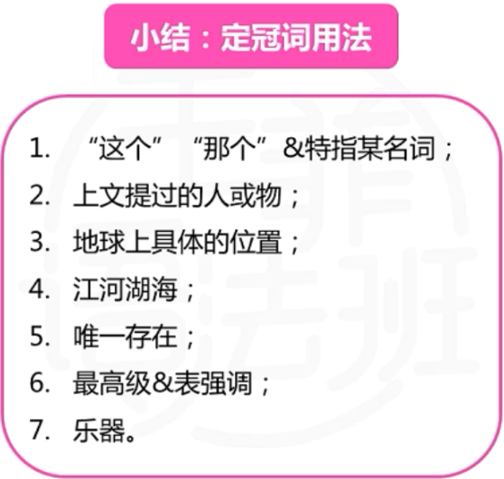

**定冠词 the 的用法**

1. 表特指的人或事物
   - <u>The man</u> with a flower in his hand is jack.
     - *the man* 特指这个男人
     - *with a flower in his hand* 介词短语充当定语，修饰名词
2. 复述前面提到过的人或物
   - There is a man under the tree. <u>The man</u> is called Robert.
     - *a man* 泛指一个人
     - *the man* 特指前面提到过的人
3. 表独一无二的事物
   - <u>The earth</u> turns around the sun.
     - *the earth* 独一无二的事物
     - *turns* 动词表现时态
4. 用在表示方位的名词前面
   - There will be strong wind to <u>the south</u> of the Yangtze River.
     - *the south* 方位
     - 这里经常刮大风：*there will be* 改成 *there is* 
5. 在序数词和形容词最高级的前面
   - Who is <u>the first</u> one to go?
     - *the first* 序数词前
   - Of all the stars , the sun is <u>the nearest</u> to the earth.
     - *the stars* / *the sun* / *the earth* 独一无二的事物
     - *the nearest* 形容词最高级前
6. 用在江河、海洋、山脉等名称的前面
   - I have never been to <u>the Himalaya Mountains</u>.
     - *the Himalaya Mountains* 山脉
     - *have never been to* 现在完成时
7. 用在 <u>含有普通名词的专有名词</u> 的前面
   - He is from <u>the United States of America</u>.
     - *the United States of America* 专有名词
8. 用在姓氏之前表示一家人
   - <u>The Greens</u> are going to Mount Emei next month.
     - *the Greens* 格林一家人
     - *are going to* 一般将来时
9. 固定短语搭配
   - at the same time (与此同时) ；make the bed (铺床) ；
   - in the end (最后) ；all the time (一直)；
   - by the way (顺便说一下) ；on the way (在路上) ；
10. 乐器名称前
    - He began to play <u>the violin</u> at the age of 5.
      - *the violin* 乐器

### 4.2 不定冠词 a/an

1. 泛指人或物，后**加单数可数名词**。
2. 第一次提到某人/物之前。
3. 不与代词连用
   - My shirt is dirty.（v）
   - The My shirt is dirty （x）
   - This car is expensive.（v）
   - This the car is expensⅳve.（×）
   - One person is in the reception. （v）
   - The one person is in the reception.（×）
4. 和名词连用**作表语或同位语**，**表职业**。
   - She is a student.
     - 她是个学生。
   - am an English teacher.
     - 我是一个英语老师。
   - am a builder.
     - 我是一个工人。
5. 用于**价格、速度、频率短语**。
   - sⅸ kilometers an hour 
     - 每小时60公里
   - 4 times a day 
     - 每天四次
6. 固定短语
   - take a break 休息一下; 
   - as a matter of fact 事实上;
   - have a good time 玩得开心;
   - in a word 总而言之; 
   - make a IIving 谋生;

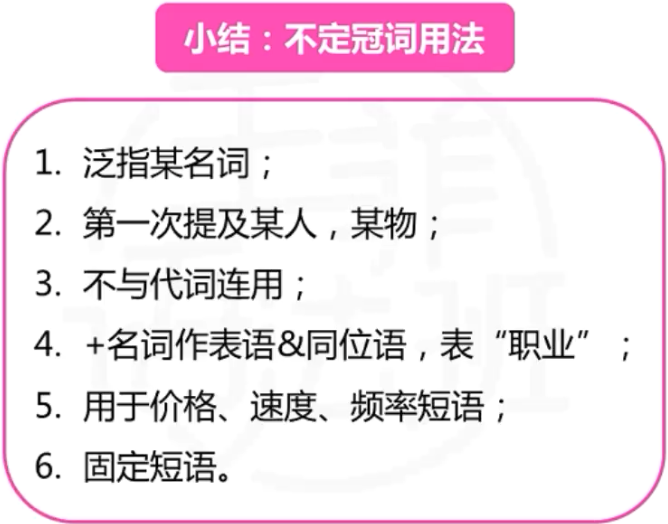

**不定冠词 a / an 的用法**

1.  不定冠词 a / an 用在单数名词的前面
2.  a 用在辅音开头的词前面
3.  an 用在元音开头的词前面

**具体用法：**

1. 泛指某一个人或物

   - There is <u>a dog</u> lying on the ground.

     - *There is* 符合主谓一致的就近原则 

     - *lying on the ground* 非谓语动词作定语来修饰 *dog*
     - *a* 泛指一只狗

2. 表示类人或物，区别于其它种类

   - <u>An elephant</u> is much stronger than <u>a man</u>.
     - 元音 e 前面用 *an* ，辅音 m 前用 *a*
     - *An elephant， a man* 表示类别
     - 比较结构 *much stronger than*

3. 表示“一”这个数量

   - There is <u>a table</u> and four chairs in that dining-room.
     - *a table* 一张桌子  
     - *four chairs* 四把椅子
     - *there be* 句型 就近原则：根据后面名词是复数则用 *are* 单数用 *is*

4. 用不定冠词的习惯用语

   > a bit (一点)	a little (一点)	a few (几个)	a lot (许多)
   >
   > a kind of (一种)     a pair of (一副、一双)    a number of (大量的)
   >
   > a piece of (一片)    half an hour (半小时)    have a good time (玩的开心)
   >
   > have a cold (感冒)    make a noise (发出噪音)    have/take a rest (休息一下) 等

### 4.3 零冠词

1. 广义的概念

   - Religion is an important issue.
   - Mexican food is spicy.
   - People are worried about rising crime.
   - Information is important to any organization.

2. 人名，书名，剧名

   - I have read Romeo and juliet.
   - Shakespeare.

3. 某些城镇，城市，州或国家名

   - Cape Town.
   - Vietnam.

   注意：含有 state（s）， kingdom, republic, union的国名除外。

   - The USA, The UK, The Netherlands, The Czech Republic, The Philippines

4. 某些湖泊，单独岛屿，大洲或山名

   - Lake victoria 
   - Jamaica 
   - Asia 
   - Mt Fuji

5. 星球

   - Mars 火星
   - Jupiter 木星
   - Saturn 土星

6. 球类：棋类：语言：学科

   - 例如：soccer, tennis
   - i like to play baseball.
   - My sister was always good at math.
   - i have studied french for 3 years.

7. 早中晚餐; 季节；日期

   - 例如：breakfast, lunch, dinner, supper等
   -  Let's go out for dinner tonight.
   - It' s August 28th.
   - Winter is coming.

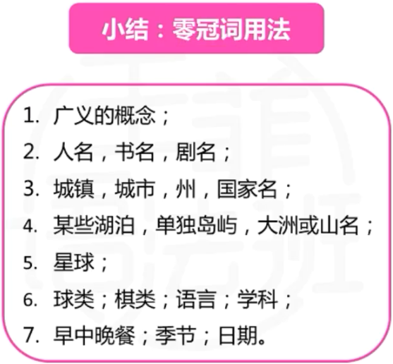

**零冠词**

1. <u>专有名词</u> 和 <u>第一次使用一些不可数名词</u> 时前面通常不用
   - <u>China</u> is a very large country.
     - *China* 专有名词
   - Man needs <u>air and water</u>.
     - *air and water* 第一次使用不可数名词
2. 名词前已有指示、物主或不定代词 作定语修饰时不用
   - <u>My pen</u> is <u>much more expensive than</u> yours.
     - *my pen* 物主代词
     - *much more expensive than* 比较级
3. 周名、月名、日期 或 季节名前不用
   - He <u>was born</u> on <u>Monday</u> , <u>February</u> <u>18</u> , <u>1995</u>.
     -  *Monday , February 18 , 1995*  周名/月名/日期
     -  *was born* 一般过去时的被动语态
   - They usually plant trees in the hills in <u>spring</u>.
     - *spring* 季节； *the spring* 表特指不是零冠词
4. <u>第一次使用</u> 复数名词表示人或事物的 <u>类别</u> 时不用
   - <u>Men</u> are cleverer than <u>monkeys</u>.
     - 特指可以加 the
5. 三餐、学科前不用
   - We <u>have breakfast</u> at home <u>and lunch</u> at school.
     - *and lunch* 省略了 *we have*
   - We all like <u>English</u>.
6. 节假日前不用
   - <u>On Children's Day</u> the boys often get presents from their parents.
     - *On Children's Day* 介词短语作时间状语
     - *often* 一般现在时
7. 球类前不用
   - The children <u>play football</u> <u>on Saturday</u> afternoons.
     - *play football* 球类不用
     - *on Saturday* 日期不用
8. 一些习惯用语中不用（查询中文并背诵）
   1. at / to / from /out of / after / for school ;
   2. in / to / for / after class ;
   3. in / to / for /out of / into bed ;
   4. after / at / from /out of /to work ;
   5. at / to sea ;
   6. in / from / down / to town ; 
   7. at / from home ;
   8. at / for / to breakfast / lunch / supper ;
   9. at night / noon / midnight ;
   10. on foot ;
   11. go to school / bed ;
   12. on top of ;
   13. in front of ;
   14. on show / display / duty / watch ;
   15. in / out of hospital ;
   16. at all ;
   17. on / in time ;
   18. at first / last / once ;
   19. in Chinese / English ;
   20. take care of ;
9. 序数词作副词时前面不用
   - He <u>came first</u> in the race. Work must <u>come first</u>.
10. 头衔、职位、称呼前一般不用
    - This is <u>Doctor Li</u>.
    - The guards took the American to <u>General Lee</u>.

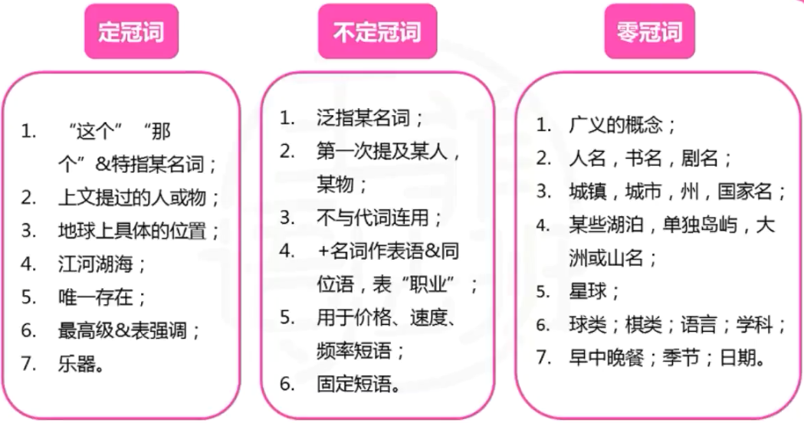

## 五、形容词、副词

### 5.1 形容词

- 形容词常见形容词后缀（阅读并背诵）

| -able, -ible | comfortable, inevitable, incredible, invisible |
| ------------ | ---------------------------------------------- |
| -al, -ial    | normal, industrial, official, beneficial       |
| -ful         | beautiful, harmful, peaceful, wonderful        |
| -ic          | economic, heroic, romantic                     |
| -ical        | aeronautical, political, economical            |

#### 5.1.1 形容词的分类

1. **属性形容词**：表示人或物所具有的属性

   | active     | 主动的, 活跃的 |
   | ---------- | -------------- |
   | adaptable  | 适应性强的     |
   | adroit     | 灵巧的, 机敏的 |
   | aggressive | 有进取心的     |
   | alert      | 机灵的         |
   | ambitious  | 有雄心壮志的   |

   - **属性形容词前可加 “rather” 或 “very” 修饰。**
     - Actually, i did <u>rather well</u> in my exams.
     - The situation is <u>very serious</u>.

2. **类属形容词**：指明事物所属的类别

   | financial  | electric     | classic  | central     | modern    | international |
   | ---------- | ------------ | -------- | ----------- | --------- | ------------- |
   | economic   | intellectual | historic | proper      | legal     | internal      |
   | annual     | alternative  | blind    | social      | local     | eternal       |
   | domestic   | considerable | ideal    | rural       | separate  | empty         |
   | industrial | official     | basic    | traditional | potential | inevitable    |

   1. 表示国籍的词属于类属形容词
      1. British island 英国岛屿
      2. American people 美国人
   2. **类属形容词没有比较级与最高级**，且前可**不加 “rather” 或 “very“ 修饰**。

3. **颜色形容词**：

   | blue   | green | purple | yellow | red   |
   | ------ | ----- | ------ | ------ | ----- |
   | pink   | brown | black  | grey   | white |
   | orange |       |        |        |       |

   1. 表示**浅色**可在颜色形容词前加 **“light”**
   2. **深色**可在颜色形容词前加 **”dark”** 或 **“deep”** 另外可用 “pale, bright” 等词。
      - light brown 浅褐色
      - light green 浅绿色
      - dark blue 深蓝色

4. **强调形容词**：强调作用

   1. **常见：absolute, utter, total, entire, sheer等。**
      - We have absolute confidence in victory.
      - This is a sheer fabrication.

5. **-ing&-ed 形容词**

   1. 某人，某事或某个情景的性格或特点。表 “…ing, **令人感觉…”**

   2. 形容感觉或情感，表 “…ed, **自己感觉…**”

      - He is bored.
        - He is boring.
      - I am confused.
        - I am confusing.

   3. **常见 -ing 与 -ed 形容词（建议阅读并背诵）**

      | alarmed -alarming       | charmed -charming           |
      | ----------------------- | --------------------------- |
      | amused -amusing         | confused -confusing         |
      | annoyed - annoying      | convinced - convincing      |
      | astonished- astonishing | depressed- depressing       |
      | astounded -astounding   | disappointed -disappointing |
      | challenged -challenging | discouraged-discouraging    |

      

6. **复合形容词**：两个单词构成的形容词，用连字符连接

   1. **复合形容词常见形式**
      1. 形容词 + 名词 + -ed
      2. 形容词/副词 + 过去分词
      3. 形容词/副词/名词 + 现在分词
      4. 名词 + 形容词
         - He is a <u>well-known</u> writer.
         - That was a <u>record-breaking</u> jump.
         - She is a <u>world-famous</u> singer.
         - It was a <u>last-minute</u> decision

#### 5.1.2 形容词词序

- (限定词+程度副词) + 描绘性形容词+表大小 (长短、高低形状+表状态的形容词+表年龄 (新旧) 的形容词+表颜色的形容词+表图案形容词+表国籍或产地的形容词+表物质材料的形容词+表类别或用途的形容词+名词。

1. 限定词
   - a, an, the, my your, four, those, some等。
2. 描绘性形容词
   - beautiful, boring stupid, delicious, useful, lovely comfortable等。
3. 大小
   - big, small, tall huge, tiny
4. 形状，重量，长短
   - round, square, circular, skinny fat, heavy straight, long short
5. 状态
   - broken, cold, hot wet, hungry, rich, easy, difficult, dirty
6. 年龄
   - old, young, new, ancient, antique
7. 颜色
   - green, white, blue, reddish purple
8. 图案
   - striped, spotted checked, flowery
9. 国籍
   - American British Italian eastern Australian Chilean
10. 物质材料
    - gold wooden, silk paper, synthetic, cotton woolen
11. 类别或用途
    - sleeping（bag）， wedding（dress）

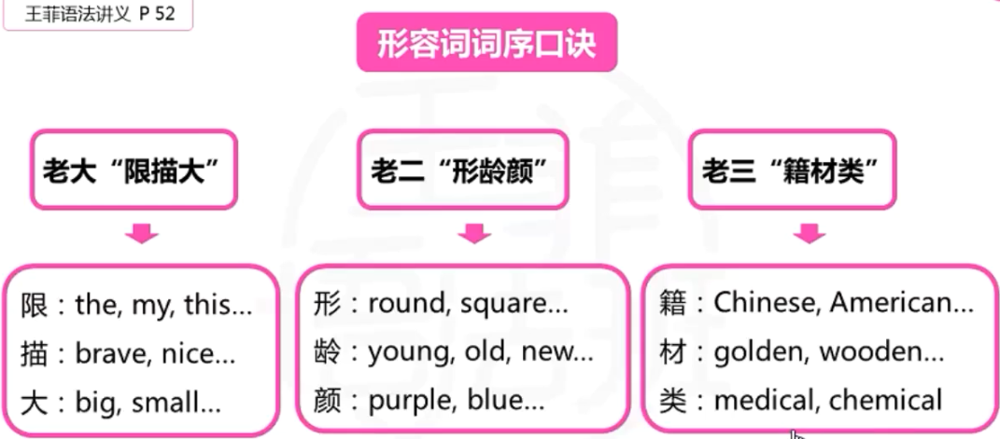

- 练习
  - **一个紫色漂亮的大木桌子**
    - a beautiful big purple wooden desk
    - **（限定词+描述性+大小+颜色+材质+名词）**
  - 个旧的漂亮的黑色的日本的方形木制小写字桌。
    - a pretty little square old black Japanese wooden writing desk
    - 限定词+描述词1+描述词2+形状词+颜色+国籍+材质+类别+名词

#### 5.1.3 句法作用

1. **作定语**
   - It is big fat dog.
   - The car is big enough.
2. **作表语**
   - The news is exciting.
   - The garden is completely dry.
3. **作补语**
   - Money doesnt always make us <u>happy</u>.
   - Noises drive me <u>crazy</u>.
   - The was found <u>open</u>.
4. **作状语**: 有没有修饰名词, 没有就是状语, 表状态
   - He arrived home, <u>hungry</u> and <u>tired</u>.
   - Hard to say, he is a <u>mild</u> boy.
5. **“The + 形容词”** 表某一类人
   - the rich 
   - the poor 
   - the old 
   - the young

#### 5.1.4 原级、比较级与最高级

1. 规则变化

   |                         规则                         |    原级    |     比较级     |      最高级      |
   | :--------------------------------------------------: | :--------: | :------------: | :--------------: |
   | **单音节词**及少数双音节词的比较级直接后加 -er，-est | clean warm | cleaner warmer | cleanest warmest |
   | **元音+辅音** 字母结尾，**辅音字双写**后加 -er，-est |  hot big   | hotter bigger  | hottest biggest  |

2. 不规则变化

   |   原级    |     比较级      |      最高级       |
   | :-------: | :-------------: | :---------------: |
   | good/well |     better      |       best        |
   |    bad    |      worse      |       worst       |
   | many/much |      more       |       most        |
   |  little   |      less       |       least       |
   |    far    | farther/further | farthest/furthest |
   |    old    |   older/elder   |   oldest/eldest   |

#### 5.1.5 比较级的用法

1. 单独使用，前**可加修饰语**

   - a lot, much, a little, a bit 及表数量的词。
     - You should be <u>more careful</u>.
     - The city is <u>a lot more crowded</u> these days.
       - 这个城市这几天过于拥挤。

2. **与 than 连用**, 表两者的对比

   - It is <u>more stressful than</u> simultaneous interpreting.
     - 它比同声传译压力更大。
   - It was <u>much further</u> to the town center <u>than</u> I remembered.
     - 去市中心的路比我印象中要长得多。

3. 其他特殊结构

   1. **more and more “越来越…”**

      - The weather is getting <u>hotter and hotter</u>.
        - 天气越来越热。
      - The country is becoming <u>more and more prosperous</u>.
        - 这个国家越来越繁盛了

   2. **the more…the more + 句子(主谓)**

      - <u>The longer</u> the war lasts, <u>the more</u> the people suffer.
        - 战争持续越久，人们受难就越多。
      - <u>The thicker</u> a mammal's skin is, <u>the less</u> hair it has.
        - 哺乳动物的皮越厚，毛发越稀疏。

   3. **more than** 用法

      1. **more than + 名词 = not only**
      2. **more than + 数词 = over** 
      3. **more than + 形容词 = very**

      - Hibernation is <u>more than sleep</u>.
        - 冬眠不仅仅是睡觉。
      - <u>More than 10 million</u> has witnessed tremendous changes.
        - 超过1000万人见证了巨大的变化。
      - They are <u>more than happy</u> to see us.
        - 见到我们，他们非常高兴。

   4. **more … than **

      1. **比 … 多 **
      2. **与其 … 不如…**

      - The book is <u>more useful than</u> that one.
        - 这本书比那本书有用。
      - She is <u>more a singer</u> <u>than an actress</u>.
        - 与其说她是个演员，不如说是个歌唱家。

   5. no more than 与 not more than

      1. **no more than;**      **仅仅, 只有**
      2. **not more than;**     **不超过, 不多余**

      - She has <u>no more than</u> three books.
        - 她只有3本书。
      - She has <u>not more than</u> three books.
        - 她至多有3本书。

   6. no more than 与 not more than

      1. **no more … than;** = either … nor ; **既不…也不**
      2. **not more … than;**  = not so … as ; **不如, 不及**

      - He is <u>no more</u> a musician <u>than</u> a painter.
        - 他既不是音乐家，也不是作家。
      - She is <u>not more</u> diligent <u>than</u> he is.
        - 她不如他勤奋。

   7. **less than “少于”**

      - The interest for music had lasted for <u>less than</u> two years.
        - 对音乐的兴趣维持了不到两年。

   8. **no less than “多达”**

      - We ran <u>no less than</u> three miles.
        - 我们跑了3英里之远。

   9. **no less…(形容词/副词)than** ; 和…一样 ;

      = **as…(形容词/副词)as;** 

      = **the same as (名词);**

      = **the identical with (名词);**

      - He is <u>no less clever than</u> you.
        - 他跟你一样聪明。

   10. **not less than;** 不少于

       - He has <u>not less than</u> seven cars.
         - 他至少有七辆车。

   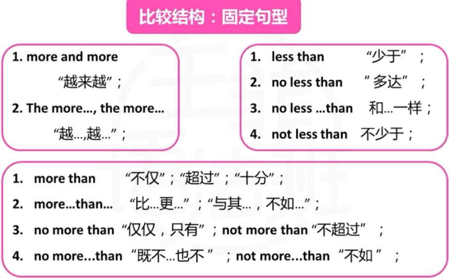

#### 5.1.6 最高级的用法

1. **前一般加 the**

   - He is <u>the strongest</u> student in his class.
   - What is <u>the least</u> expensive way of travelling in UK？

2. **可单独使用**

   - Mary is my best friend.
   - She's the youngest musician in the piano.

3. 最高级前**可以添加修饰语**

   - far, mostly, almost, by far, very, much, quite 等。
     - This method is by <u>far the least</u> complicated.
       - 这个方法是目前为止最简单的。
     - This is <u>quite the most</u> irresponsible behavior i have ever seen.
       - 这是我见过的最不负责任的行为。
       - ir-responsible : **ir- 否定前缀**
       - im-m/p/b = 否定前缀
       - il- 否定前缀

4. **at + 形容词最高级** ; 表 “处于最….的状态”

   - I knew she was <u>at her worst</u>.
     - 我知道她这时情绪最糟。

   - The game was <u>at its peak</u>.
     - 游戏正是高潮的时候。

5. **“a most + 形容词”** 时，意为 “非常” = **very** = **more than**

   - It is <u>a most important</u> occasion.
     - 这是一个非常重要的时刻。
   - It was <u>a most beautiful</u> morning.
     - 那是个十分美丽的早晨。

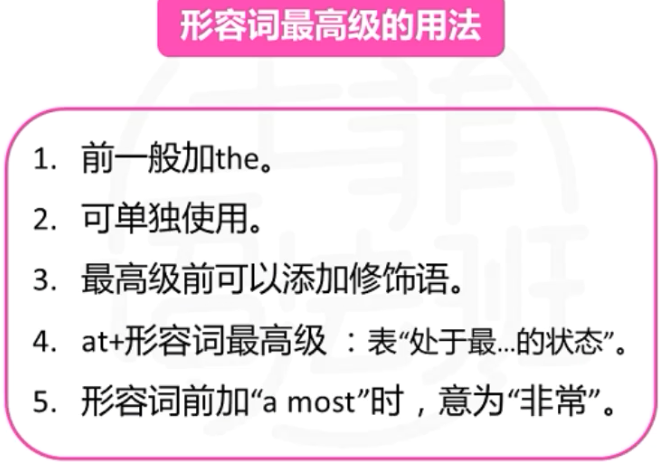

#### 5.1.7 易混淆形容词辨析（阅读并背诵）

| 英文                                        | 中文                                                         | 英文                                                      | 中文                                                         |
| ------------------------------------------- | ------------------------------------------------------------ | --------------------------------------------------------- | ------------------------------------------------------------ |
| historic   historical                   | 历史上著名的,有历史意义的 历史的,有关历史的              | economic  economical                                  | 经济的,经济上的   省钱的,节约的                          |
| industrial  industrious                 | 工业的   勤劳的,勤奋的                                   | considerable  considerate                             | 相当多(大)的,可观的   体贴的,周到的                      |
| sensible  sensitive                     | 明智的   敏感的                                          | intense  intensive: deep and thorough                 | 强烈的,剧烈的   密集的,集中的,加强的                     |
| respectable  respectful  respective | 值得(别人)尊重的 表示尊敬(别人) 分别的,各自的        | intelligent  intelligible  intellectual           | 有才智的,聪明的 易懂的 智力的,脑力的                 |
| contemptible  contemptuous              | 可卑的,卑劣的  轻视的,轻蔑的                             | credible  credulous  editable: that brings credit | 可信的,可靠的 轻信的,易上当的 值得称赞的,可信的      |
| alternate  alternative                  | 轮流的,交替的 选择的,两者选一的                          | comparable  comparative                               | 可替代的,可烘选择的 比较而言的,相当的                    |
| beneficial  beneficent                  | 有益的 行善的,慈善的                                     | official  officious                                   | 官方的 爱指手画脚的,自以为是的                           |
| confident  confidential                 | 自信的 机密的                                            | negligent  negligible                                 | 疏忽的,失职的 微不足道的,可忽略的                        |
| momentary  momentous                    | 瞬时的,片刻的 重大的,重要的                              | social  sociable                                      | 社会的 善社交的                                          |
| distinct  distinctive                   | 明显的,显著的 与众不同的,独特的,特别的                   | classic  classical                                    | 经典的;优秀的;一流的 古典的                              |
| comprehensible  comprehensive           | 可理解的,易于理解的 全面的,综合的                        | disinterested  uninterested                           | 客观的,公平的 冷漠的,不关心的                            |
| effective  efficient  effectual     | 有效的 效率高的;有能力的;有效的;生效的 卓有成效的,有效的;奏效的 | ingenious  ingenuous                                  | (人)灵巧的;(物品等)制作精巧的;(方法等)巧妙的 天真的      |
| regretful  regrettable                  | 感到遗憾的 使人悔恨的;令人遗憾的;不幸的;可悲的           | spiritual  spirituous                                 | 精神的,心灵的 含有酒精的                                 |
| temporal  temporary                     | 世间的,世俗的,现世的 暂时的,临时的                       | alive  live living lively                     | 活着的,作表语,作定语时后置 活的,现场直播的 活着的,作定语可前可后,可修饰人也可修饰物 活泼的,栩栩如生的 |

- We watched the live broadcast of the opera on TV.
  - 我们通过电视观看了这部歌剧的直播
- There was a tank of live lobsters in the restaurant.
  - 饭馆里有一箱活龙虾
- Who is the world's greatest living architure?
  - 谁是现在还健在的世界上最伟大的建筑学家?
- She is a lively young girl.
  - 她是个活泼可爱的小姑娘

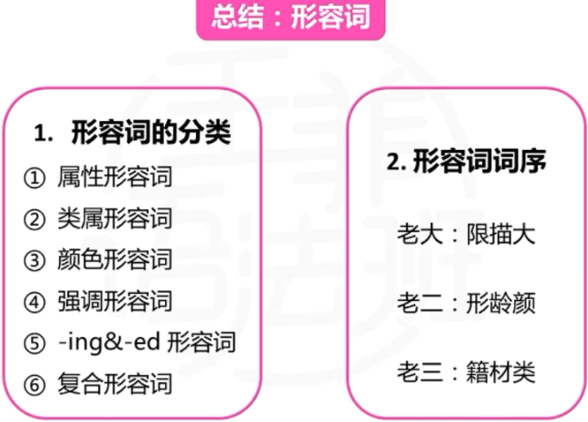

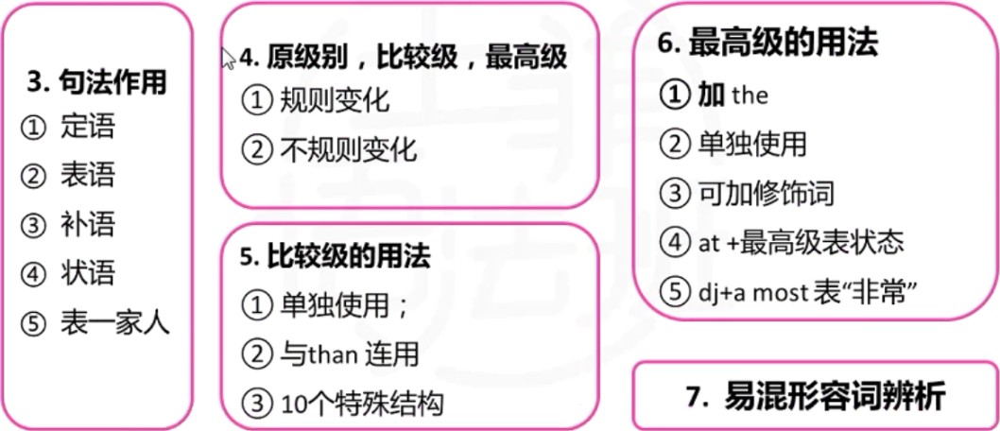

### 5.2 副词

#### 5.2.1 副词分类

1. **时间副词**

   1. 表示时间

      **tomorrow, now, this year, next week, soon, then, yesterday, lately, recently, immediately**

      - I will see you <u>tomorrow</u>.
      - I never get up <u>early</u> at the weekends.

   2. **频度副词:** 表示频繁程度

      **always, sometimes, never, once a week, hourly, every day, once a month twice a year, four times a day, every other week, daily, monthly**

      - I <u>always</u> go to bed before 11 p.m.
      - I'm <u>usually</u> home by 6 o'clock.

      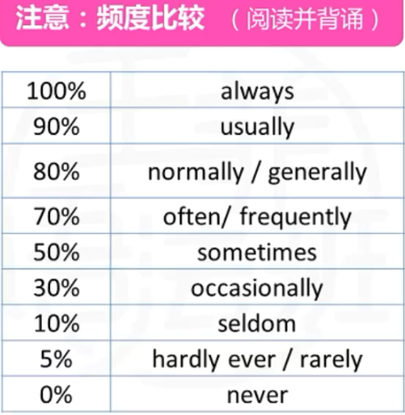

2. **地点副词**: 表示地点

   **here, there, everywhere, inside, outside, home, upstairs, downstairs, across, along, round, around, in out, above, below, up, down, back, forward**

   - you should go <u>upstairs</u> and do your homework
   - The author's name was printed <u>below</u> the title.
     - 作者的名字登在标题之下.(介词)
   - The cars <u>below</u> looked like insects.
     - 下面的汽车像昆虫一样.(副词)
   - They live in that old house <u>on</u> the hill.
     - 他们住在山上的那间旧农舍里.(介词)
   - It's very cold so put a coat <u>on</u>.
     - 天很冷,穿上一件外套吧.(副词)

3. **方式副词**: 表明方式行为

   **carefully, slowly, loudly, suddenly, fast, well, calmly, politely, proudly, soft**

   - Can you move it <u>carefully</u>?
   - Walk <u>slowly</u>.
   - The boring speech finished and everyone clapped <u>politely</u>.
     - 这个无聊的演讲结束了,每个人礼貌地鼓了鼓掌.

4. **程度副词**: 表示动作的程度

   **very, extremely, rather, almost, nearly, too, fully, absolutely slightly, simply**

   - He was conscious that he was talking rather too much.
     - 他意识到他说的太多了
   - The bottle's nearly empty.

5. **疑问副词**: 构成特殊疑问句

   **how, when, where, why**

   - How does it work?
   - When can i see you?

6. **强调副词**: 强调动词,形容词

   **absolutely, completely, entirely, just, perfectly, purely, quite, really, totally, utterly, really, especially, mainly, particularly, generally, largely, only**

   - The lecture was not <u>particularly</u> interesting.
     - 这次的课不是特别有趣.
   - I love Rome, <u>especially</u> in the spring.
     - 我喜欢罗马,尤其是春天的罗马.
   - This behavior is <u>totally</u> unacceptable.
     - 完全不能接受这样的行为.

7. **连接副词**

   1. **how, when, where, why** 引导**主语从句, 宾语从句, 表语从句**.

      - Do you remember <u>how</u> the kids always loved going there?
        - 你记得孩子们是怎么样爱上去那里的吗?
      - I wonder <u>where</u> they will take us to.
        - 我在想他们会带我们到哪里去.
      - That's <u>why</u> I left so early.
        - 这就是我为什么早早离开.

   2. 引导并列结构

      then, however, consequently, therefore 等

      - He drank a glass of whisky, <u>then</u> another and then another.
        - 他喝了一杯威士忌,然后一杯接一杯.
      - We thought the figures were correct. <u>However</u> , we have now discovered some errors.
        - 我们认为数字是正确的,然而,我们现在发现了错误.

8. **关系副词**: 引导定语从句

   when, where, why 

   - It's one of the few countries <u>where</u> people drive on the left.
     - 它是少数人们可以左驾的国家之
   - There are times <u>when</u> I wonder why I do this job.
     - 好几次我都想为什么我要做这份工作.
   - The reason <u>why</u> he disappeared is under inspection.
     - 他失踪的原因正在调查中.

9. **句子副词**: 修饰整个句子

   apparently, actually, chiefly, chiefly, interestingly 等

   - <u>Personally</u>, I think the show was great.
     - 个人来讲,我认为这个表演很不错
   - <u>Actually</u>, I've been very busy.
     - 说实话,我很忙.

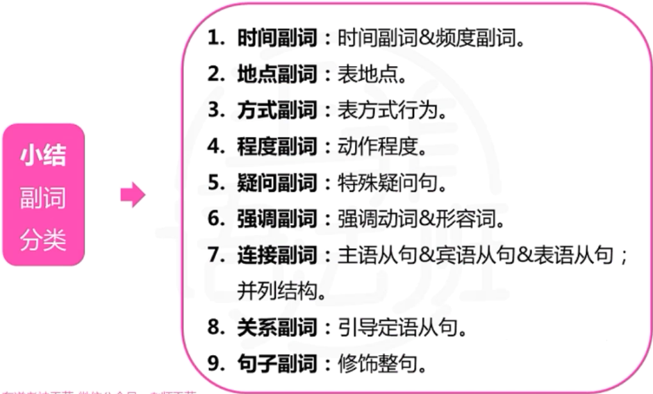

#### 5.2.2 副词的构成

1. **以 -ly 结尾的副词**

   1. 许多副词与形容词有很大的关联,译为"…地", 

      通常 **副词 = 形容词 + ly**, 此类副词词量最大.

      - beautiful→ beautifully 
      - important→ importantly 
      - apparent→ apparently 
      - former→ formerly

   2. **以 -y 结尾**的形容词变为副词, **变 -y 为 i 加 -ly** 

      - easy→ easily 
      - busy→busy 
      - lucky→ luckily

   3. **以元音 +e 结尾**的直接**加 -ly** 

      - definite→ definitely 
      - unfortunate - unfortunately 
      - extreme→ extremely 
      - absolute→ absolutely

2. **-wards, -wise 结尾**的副词

   - -wards: inwards, eastwards, upwards, downwards
   - -wise: clockwise, lengthwise, likewise

3. **形容词副词同形**的词

   - **traight, tight, fast, hard, early, late, high, low, right, wrong, straight, long, daily, weekly, monthly, yearly** 
     - Adam has a <u>fast</u> car.(形容词)
     - Adam speak**s** <u>fast</u>.(副词) 
       - 找动词的三种形态, 动词后面是副词

4. **与形容词无关的副词**

   - just, quite, so, soon, too, very

   **注意:**

   - 由于发音的关系, **-ly 结尾的形容词不可变为副词** 
   - friendly, manly, womanly, brotherly, sisterly, wifely, comradely husbandly, homely, worldly, early, silly, ugly

#### 5.2.3 副词的用法

1. 副词的位置

   1. 句首

      - <u>Quickly</u> , I changed my opinion.
        - 很快我就改变了主意.
      - <u>Suddenly</u> , I felt afraid.
        - 突然间我感觉害怕

   2. **句尾** (单个副词,建议放句尾, 两个首尾各一个)

      - He speaks <u>clearly</u>.
        - 他说的很清楚.
      - She drinks <u>quickly</u>.
        - 她喝的很快.

   3. 句中

      - He <u>normally</u> gets good marks in exams.
        - 他通常会在考试中取得好成绩.
      - I put the china <u>carefully</u> on the table/
        - 我把陶器小心地放在桌子上.

      注意:

      - **谓语动词与宾语之间不可以加入副词.**

        - I put carefully the china on the table. ( x )

      - **地点副词**置与**否定副词**置于**句首**时, 句子**要倒装**, 详见"倒装句".

        |   类型   |                             位置                             |                             例子                             |
        | :------: | :----------------------------------------------------------: | :----------------------------------------------------------: |
        | 方式副词 |   1.置于句末 2.句子宾语过长时, 用在主语与谓语动词之间    | I read the book **quickly**. I **quickly** read the book and play games. |
        | 地点副词 |                          句首或句末                          | **Here** she is.  **Outside**, where was a small garden. |
        | 时间副词 |                          句首或句末                          | **Yesterday** I met her. will go to London **tomorrow**. |
        | 频度副词 | 句首,句中,句末均可,遵守上述规则. 注意: always, seldom, rarely, hardly, ever never 不可用于句首. | I **usually** get up late on weekends.  **Sometimes** I go by car. |
        | 强调副词 |                             句中                             | Fame is often **simply** a matter of being in the right place at the right time. |
        | 句子副词 |                   单独使用, 句首或句末                   |   **Frankly**, I couldn 't care less what happens to him.    |

2. 副词的句法

   1. **作状语**
      - We could only get seats <u>at the back</u>.
        - 我们只能拿到后面的位置.
      - Walk across the road <u>carefully</u>!
        - 过马路小心点.
   2. **作表语**
      - Do you stay <u>home</u>?
        - 你待在家里吗?
      - Is Mary <u>around</u>?
        - 玛丽在附近吗?
   3. **作定语**
      - The letter was sent to the <u>above</u> address.
        - 此信件已被送往上述地址.
      - Do you usually wear your skirts <u>above or below</u> the knee?
        - 你通常穿露膝裙还是过膝裙?
   4. **作宾补**
      - I saw him **back**.
        - 我看见他回来了.

3. **副词的比较级与最高级**

   1. 规则类
      - quickly
        - -more quickly-(the )most quickly 
      - beautifully
        - -more beautifully-( the )most beautifully 
      - carefully
        - -more carefully-( the )most carefully
   2. 其他类
      - soon-sooner-soonest 
      - fast -faster-fastest 
      - late -later- latest
   3. 不规则类
      - far-farther/further- farthest/furthest 
      - well-better-best 
      - little-less-least 
      - much-more-most 
      - badly-worse-worst

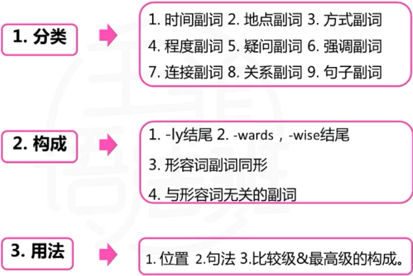

## 六、介词

### 6.1 介词的分类

1. **单个介词**

   | about   | beside  | near     | to         |
   | ------- | ------- | -------- | ---------- |
   | above   | between | of       | towards    |
   | across  | beyond  | off      | under      |
   | after   | by      | on       | underneath |
   | against | despite | like     | unlike     |
   | along   | down    | opposite | until      |
   | among   | during  | out      | up         |
   | around  | except  | over     | via        |
   | as      | for     | past     | with       |
   | at      | from    | round    | since      |
   | before  | in      | through  | than       |
   | behind  | inside  | beneath  | below      |

2. **合成介词**

   - within, without, onto, into, upon, out of, alongside, toward, outside,throughout

3. **分词介词**

   - concerning, considering, following, regarding, including, excluding

4. **短语介词**

   | ahead of   | except for     | instead of    | owing to  |
   | ---------- | -------------- | ------------- | --------- |
   | apart from | in addition to | near to       | such as   |
   | as for     | in front of    | on account of | thanks to |
   | as well as | in place of    | on top of     | up to     |
   | because of | in spite of    | out of        |           |
   | due to     | inside of      | outside of    |           |

### 6.2 介词词义分类

1. 表示**时间的介词**

   - **at** 6 o'cock
   - **on** February 9th
   - **in** Spring 
   - **in** the morning 
   - **for** several months几个月
   - **during** 1942在1942年期间
   - 表示**其他时间概念的介词**有 
     - before, after, since, until, till, between, up to,from, prior to等.

2. 表示**地点的介词**

   |             英文             |         中文          |
   | :--------------------------: | :-------------------: |
   |              at              |     表示在小地方      |
   |              in              |     表示在大地方      |
   |              on              | 表示毗邻,接壤,在…上面 |
   |              to              |     表示在…范围外     |
   |       above, over, on        |         在…上         |
   |         below under          |        在…下面        |
   | in front of, in the front of |        在…前面        |
   |            behind            |       在…的后面       |
   |            beside            |      表示在…旁边      |
   |             near             |        在…旁边        |
   |            inside            |        在…里面        |
   |           outside            |        在…外面        |
   |            within            |       在…范围内       |
   |            beyond            |         超越…         |
   |           against            |         靠着…         |
   |           opposite           |        在…对面        |
   |         through/via          |         穿过…         |
   |            along             |         沿着…         |

   - I was sitting **at** my desk.
     - 我坐在我的书桌上.
   - Dublin is **on** the east coast of Ireland.
     - 都柏林位于爱尔兰东海岸线.
   - The apartment **below** is owned by a French couple.
     - 下面的公寓为一对法国夫妇所有.
   - The metro station is right **beneath** the airport.
     - 地铁站位于机场的正下方.

3. 表示**方式的介词**

   - 表示 "方式,方法" 的介词常用 by, with, through 等
   - **by** bicycle 骑自行车
   - **with** scissors 用剪力

4. 表示**原因的介词**

   - 表示原因常用 for, because of, sInce 
   - I wear these old trousers **for** painting.
     - 我穿这些旧裤子是为了画画.

### 6.3 介词短语的构成

介词是一种虚词,表示句中词与词之间的关系,在句中不充当任何成分.介词其后的成分构成介词短语,能构成介词短语的词类如下:

1. **介词 + 名词**
   - What's the reason **for your unhappiness**?
     - 你为什么不开心呢?
   - She did some research **into the causes orack pain**.
     - 她对背部疼痛的原因做了一些调查.
2. **介词 + 代词**
   - I saw you **with her**.
     - 我看到你和她在一起.
   - The boy did not want to play **with them**.
     - 小男孩不愿意和他们在一起玩.
3. **介词 + 动名词/动名词** 复合结构
   - Thank you **for** coming here.
     - 感谢你来到这里.
   - They are good **at** painting.
     - 他们擅长画画.
   - I agree **with** your researching there.
     - 我同意你在这做调研.
4. **介词 + 形容词**
   - **from** young **to** old
     - 从年轻到年老
   - Her behavior is far **from** satisfactory.
     - 她的行为还远远不能让人满意.
5. **介词 + 副词**
   - I’ve changed my mind **since then**.
     - 从那以后我改变了主意.
   - I was unaware of his existence **until recently**.
     - 最近我才知道有他这么个人.
6. **介词 + 动词**
   - Robert accused her **of stealing** his idea.
     - 罗伯特起诉她抄袭他的想法.
   - Getting to the final depends **on winning** the semi-final.
     - 嬴了半决赛才能去决赛.
   - **On arriving** at the city he called up her.
     - 一到城里他就给她打了一个电话.
7. **介词 + 不定式**
   - I had no choice **but to compromise**.
     - 我别无选择只有妥协.
   - It had no effect **except to make** him angry.
     - 除惹他生气外,没产生任何效果.
8. **介词 + 从句**  谓语是动词短语; 宾语从句, 定语从句
   - I am worried **about where** she is going.
     - 我担心她去哪了.
   - The film **at which** I fell asleep was very boring.
     - 电影太无聊了,我睡着了.
9. **介词 + 数词**
   - It's **about** 6 pm.
     - 差不多下午6点.
   - **Over 100** people are at the meeting.
     - 会上有100多人.
10. **介词 + 介词**
    - They've moved **far into** the country.
      - 他们搬到很远的乡下去了.
    - They left the party **just before** us.
      - 他们走的比我们稍早一点.

### 6.4 介词短语的句法作用

1. **作定语**  有被修饰的名词
   - a meeting **in the morning**.
     - 早晨的一个会议
   - the road **to success**
     - 成功的道路
2. **作状语**  没有被修饰的对象
   - She lives **in Beijing**.
     - 她住在北京.
   - They visit the wall **by bike**.
     - 他们骑自行车参观了城墙.
   - The barbecue was canceled **because of rain**.
     - 因为下雨,烧烤被取消了.
3. **作表语**
   - The waiter is **in** a good mood.
     - 那个服务员心情不错.
   - Is it **in** your hand?
     - 在你手里吗?
4. **作补语**
   - Tom put some books **on the table**.
     - Tom放了些书在桌上.
   - Dad left his wallet **in a taxi**.
     - 爸爸把钱包忘在了一辆出租车里
   - He worked **as a consultant**.
     - 他的工作是一名咨询师.
5. **作定语**
   - It's story **about the pilgrim**.
     - 这是关于朝圣的故事.
   - The man **in the house** is my teacher.
     - 屋子里的人是我的老师.
6. **作同位语**
   - **As a teacher**, she is responsible for her students.
     - 作为一名老师,她对她的学生负责.

### 6.5 常见介词的辨析

### 6.6. 介词的常见固定搭配

1. **表示时间 on/in/at**
   1. at
      
      1. 后跟**具体的时刻**;
      2. 一天中**具体的时间点**;
      3. **周末**以及**具体的节庆**.
      
      - at 5 o'clock 
      - at midnight 
      - at the weekend 
      - at the New Year
      
   2. on

      1. 后跟具体的时间.

         即**某年某月某日, 星期几**.

      - On August 24, 2017
      - On Monday 
      - On your graduation day

   3. in

      1. 后跟**年,月**;
      2. **早,中,晚;**
      3. **季节.**

      - in2017
      - in September 
      - in the morning 
      - in Spring 
      - in the 21 century

2. **表示地点 on/in/at**
   1. at
      
      1. 某个**具体的位置;**
      2. **工作地点或商店**;
      3. 后加**小地点**
      
      - Tom lives at No 12 Woodville Road 
      - He works hard at Netease 
      - at bus station
      
   2. in
   
      1. 后接**大地点** 或 **班级**
   
      - in London 
      - What is in the wrapped box?
        - 包装过的盒子里是什么?
      - He found it difficult to concentrate in class
        - 他觉得自己很难在课堂上集中注意力
   
   3. on
   
      1. 表在某物**表面上**
      2. 后加**楼层**.
   
      - The office is on the 15 th floor
        - 办公室在15层.
   
3. **表示方位 on/in/to** (易错点)
   
   **in: 表A在B的内部;** 
   
   **on: 表AB接壤;** 
   
   **to: 表AB不接壤.**
   
   1. in
      - Chengdu lies **in** the southwest of China.
        - 成都位于中国的西南部.(成都在中国内部)
      - Shanxi lies **to** the east of Liaoning.
        - 山西在辽宁东边.(山西与辽宁不接壤)
      - Canada lies **on** the north of America.
        - 加拿大位于美国北部.(加拿大与美国接壤)
      
   2. to
   
      1. 还可表**方向**
   
      - He drives the car **to** the south.
        - 他开车朝着那边去.
   
   3. on
   
      1. 在**左边**; 在**右边**
   
      - **on** the left, **on** the right
   
4. **in front of / in the front of**

   1. in front of: 表在某物**范围外**的前面; 
   2. in the front of: 表在某物**范围内**的前面.

   - There is a tall tree **in front of** the house.
     - 房子前面有一棵大树.
   - We sit **in the front of** the bus.
     - 我们坐在公共汽车的前部.

5. **in / into**

   1. in 静态概念
      
      1. in: **表在里面**/内部; 
      
      - She' s gone for a walk in the garden.
        - 她在花园里散步.
      - She walked into the garden.
        - 她走进了花园.
      
   2. into 动态

      1. into: 常与动词连用, **表动作**朝着里面去.
      2. 有些动词两个介词均可 put, fall, jump,dive

      - Can you **put** the milk **in/into** the fridge?
        - 你能把牛奶放进冰箱吗?

6. **on / onto**

   1. on / upon : 表示**在某物的表面上**; 静态
      - Your keys are on the table.
        - 你的钥匙在桌子上
      - The cat climbed onto the roof.
        - 猫爬上了屋顶
      
   2. onto : 通常与动词连用, 表动作**朝着…之上**; 动态
      - The hotel is on the road opposite the beach.
        - 酒店的海滩对面的路上.
      - The path leads onto the main road.
        - 这条路一直到主路上.
      
   3. 表示**在河流, 道路**等之上时用 on;

      表示**沿着河流, 道路**朝着某个方冋时用 onto.

7. **below / under / beneath**

   均表 "在…之下"

   1. under 表示**在…之下**, below 表示某物**低于某物**;
      - The metro station is right beneath the airport.
        - 地铁站就在机场下面.
      - His shoes were under his bed.
        - 他的鞋在他的床下.
      - There was a big clock below the painting.
        - 画下面有一口大钟.
   2. 表示某物**接触或覆盖**某物时, 用 **under** 不用 below;
      - Under a white coat, she wore an amazing red dress. (v)
        - Below a white coat, she wore an amazing red dress. (x)
   3. 表**时间, 重量**时, 用 **under**; 表**温度**高低时, 用 **below**.
      - We finished the proje ct in **under a year**.(√)
        - We finished the project in below a year. ( x)
      - The roof of the new building is just **below the height** of the schoo.(v)
        - The roof of the new building is just under the height of the scnool.(x)
   4. **below, under 后可加数字, beneath 不可加.**
      - We buy it for just **under 300** pounds. (v)
        - We buy it for just beneath 300 pounds.(x)
      - The temperature was **below 10** on that day. (V)
        - The temperature was beneath 10 on that day. (x)
   5. 表能力, 地位, 期望低时, **用 beneath; 抽象概念**
      - The job is **beneath** my expectations.

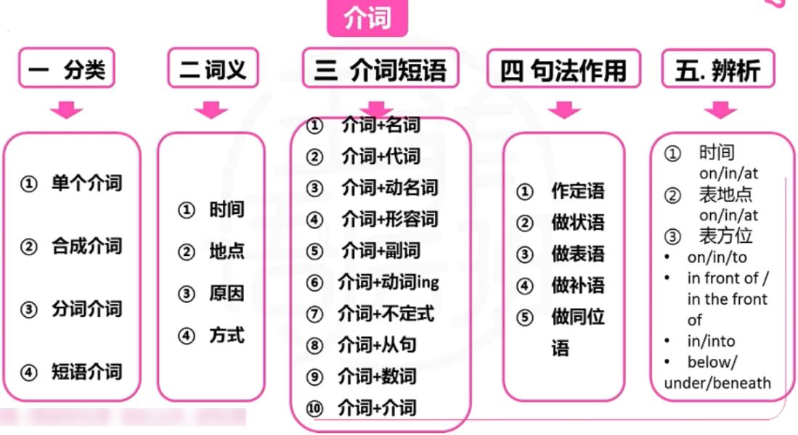

## 七、动词

### 7.1 动词的分类

#### 7.1.1 实义动词 (行为动词)

1. 用来表示动作
2. 分及物动词与不及物动词
   - Cats meow loudly.
     - 猫叫的很大声.
   - Students learn new material.
     - 学生们学习新的材料.

**及物动词**

1. bring, send, owe, contain, buy, show, take, tell, verify, check, get, wash, finalize, annoy, lay, lend, offer, edit, make, phone 等词**后面必须跟宾语**.
   - His constant joking **was beginning** to annoy her.
     - 他不停的嘲笑渐渐惹恼了她.
   - He **offered** some useful advice.
     - 他提供了一些有用的建议.

**不及物动词**

1. come, explode, laugh, sit, rise,excel, respond, run, cough, swim, emigrate, smile, act, cry, immigrate, lie arrive, continue, die, go 只能充当不及物动词.
   - If she **continues** to be late for work the boss will fire her.
     - 如果她继续迟到,老板就会开除她.
   - The bomb **exploded** in the city center.
     - 炸弹在市中心爆炸.

**及物动词&不及物动词**

1. 很多词既能充当及物动词,也能充当不及物动词.
   set, leave, give, study, sit, grow, smell, dance, sing, write, teach burn, eat, paint, drive, manage, stop, climb, run, check, cost, go, pay, Improve 等.
   - The actress **wiped** <u>the tears</u> from her eyes.
     - 女演员把眼泪从眼中擦掉.(有宾语)
   - The windshield wipers **wiped** <u>across the windshield</u>.
     - 风挡刮水器在挡风玻璃上刮来刮去.(无宾语)

#### 7.1.2 助动词和情态动词

①协助主要动词构成谓语的词叫助动词;
②**没有实际意义, 不可单独使用**
③**构成时态, 语态, 否定句, 强调句, 疑问句**
④主要有: have/do/be

1. 基本助动词

   1. **be 动词** 构成**进行时** & **被动语态**
      
   - He **is** always **spilling** things. 
        - 他总是洒东西.
      
   - This sentence **was** **written**. 
        - 这个句子被写.
      
   **注意:**
      
   be 动词作**系动词**, 引表语 & 表语从句
      
   - He **is** in horrible pain. 
        - 他很痛.
      - China **is** not no longer what it used to be. 
        - 中国不再是过去的样子.
      
   2. have **现在完成时** / **完成进行时**
      
   - I **have** read many, many books. 
        - 我已经读了很多很多的书.
      
   - Jerry **has** bought a new shirt. 
        - 杰瑞买了一件新衬衫.
      
   **注意:**
      
   have 作实义动词, 意为"有";
      有时, have 与 eat, drink 意义相同.
      
   - He **has a large coffee** stain on his shirt. 
        - 他的衬衫上有一大片咖啡渍.
      - Let's **have a cup** of tea. 
        - 我们喝杯茶. 
      
   3. do **疑问句** & **否定句** & **强调句**

      - He **didn't** put his coffee in a cup with a lid. 
      
      - 他没把咖啡倒进有盖的杯子里.
      
      - Why **did** you do that?
        - 你为什么那么做?
   - **Do** come with us.
        - 请一定要和我们一起去.

      **注意:**
      
      do作实义动词 "做,干"
      
      - We will **do** what we can to help.
        - 我们会做我们能做的事情来帮忙.

2. **情态动词**: 有含义, 和<u>**动词原形**</u>一起构成谓语.

   1. **can / could** 表"推测" "允许" "能力;
      - I **could** fly via Amsterdam <u>if</u> I leave the day before.
        - 如果我昨天能出发的话, 我可以飞过阿姆斯特丹
      - You **could** take the tour <u>of</u> the castle tomorrow.
        - 你可以带明天城堡的团.
   2. **may / might** 表"推测" "允许" "请求" "祝愿;
      - You **may** start your exam now.
        - 你现在可以开始答题了.
      - We'd better phone tomorrow; they <u>**might** be eating</u> their dinner now.
        - 我们最好明天打电话,他们现在可能在吃晚饭.
   3. **must** 表"命令" "肯定推测";
      - You **must** have a passport to cross the border.
        - 你必须有护照才能通过边境.
   4. **should/shall/ought to** 表"义务,要求" "推测" "征求意见";
      - **Shall** I help you with your luggage?
        - 我可以帮你提行李吗?
      - I think we **should** check everything again.
        - 我认为我们应该再检查一遍所有的东西.
      - You **ought to** have your car serviced before the winter.
        - 你应该在冬天之前保养你的车.
   5. **would/will** 表"意愿" "请求"; 
      - **I'll** do that for you if you like.
        - 如果你喜欢,我可以为你做.
      - **Would** you mind if I brought a colleage ith me?
        - 你介意我带一位同事和我一起吗?
      - **Would** you prefer tea or coffee? "-"I'd like tea please
        - "你想要茶还是咖啡"?—"茶."
      - When I was a child, I **would** spend hours playing with my train set.
        - 我小的时候, 我经常花大量的时间玩玩具火车.

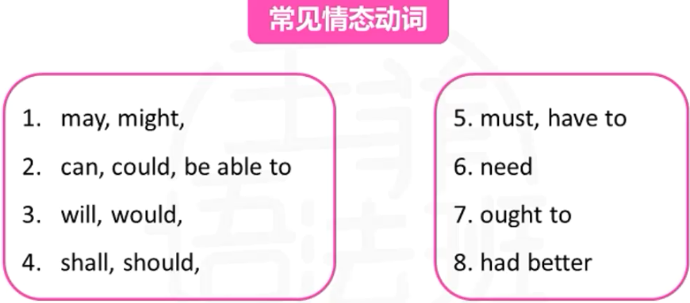

# 7.1.3 静态动词

- 表示思想的词

  - believe, doubt, know, understand

- 表示拥有的词

  - have, own,want, contain

- 表示感觉的词

  - hear,see, smell

- 表示情感的词

  - ove, hate, want, need
    - I like ice cream.
    - I know a lot of English words.
      - 我知道很多英语词汇.
    - I hear music coming from his apartment.
      - 我听到音乐从他的公寓传来.
    - He has a Mercedes.
      - 他有一辆奔驰.

- 其他**常见静态动词(填写中文含义且阅读并背诵)**

  |       英文       | 中文 |     英文     | 中文 |
  | :--------------: | :--: | :----------: | :--: |
  |      adore       |      |    agree     |      |
  |   appear(seem)   |      |  appreciate  |      |
  |    be(exist)     |      |   believe    |      |
  |    belong to     |      |   concern    |      |
  |    consist of    |      | contain cost |      |
  |       deny       |      |  depend on   |      |
  |     deserve      |      |    detest    |      |
  |     disagree     |      |   dislike    |      |
  |      doubt       |      |    equal     |      |
  |       feel       |      |     hate     |      |
  | have(possession) |      |     hear     |      |
  |     imagine      |      |   include    |      |
  |     involve      |      |     know     |      |
  |       lack       |      |     like     |      |
  |      loathe      |      |  look(seem)  |      |
  |       love       |      |    matter    |      |
  |       mean       |      |   measure    |      |
  |       mind       |      |     need     |      |
  |       owe        |      |     own      |      |
  |     possess      |      |   promise    |      |
  |     realize      |      |  recognize   |      |
  |     remember     |      |   resemble   |      |
  |     satisfy      |      |     see      |      |
  |       seem       |      |    smell     |      |
  |      sound       |      |   suppose    |      |
  |     surprise     |      |    taste     |      |
  |  think(opinion)  |      |  understand  |      |
  |       want       |      |    weigh     |      |
  |       wish       |      |              |      |

#### 7.1.4 动词短语

1. 构成: 
   - **动词 + 介词** 或 **动词+副词**;
2. 通常**与原动词含义不同**.
   - Be sure to put on a life jacket before getting into the boat.
     - 坐船之前请确定穿上了救生衣.
   - I'm having some trouble working out the solution to this equation.
     - 我在找这个等式的解决方法上陷入了困难.
   - We're going to have to put off our vacation until next year.
     - 我们得把假期推到明年.
   - Take off your shoes before you walk on the carpet.
     - 你走到地毯上之前脱掉鞋子.

### 7.2 动词的形式

#### 7.2.1 动词原形

- do,have,make,work等

#### 7.2.2 动词的第三人称单数

- ①一般现在时中
  ②主语为第三人称单数;
  ③谓语动词要用第三人称单数形式.

1. 直接动词**词尾加 -s**
   - ask---asks
     work---works
     get---gets
     stay---stays
2. 以字母 **s, x, ch, sh或 o 结尾的动词, 词尾加 -es**
   - watch-watches
     wish---wishes
     fix— fixes
     do---does
     go-goes
     pass---passes
3. **辅音字母 -y, 变 y 为  i 加 -es;**
   - try-tries
     study -studiestry-tries
     study -studies
4. **不规则变化**
   - be - am, is, are
     have- has

#### 7.2.3 动名词与现在分词

1. 直接**词尾加 ing**
   - play-playing
     cry-crying
     bark-barking
2. **词尾为 -e, 去掉 e 加 ing**
   - slide-sliding
     ride -riding
3. **词尾为 ie, 变 e 为 y 加 ing**
   - die-dying
     tie-tying
4. **辅音+元音+辅音, 双写词尾加 ing**
   - beg-begging
     begin-beginning

#### 7.2.4 过去式与过去分词

1. ①规则动词的过去式加"ed
   ②以e结尾的动词的词尾直接加"-d

   - play→ played
     listen→ listened
     love→ loved

2. 不规则动词的过去式

   |   动词    |  过去式  | 过去分词 |
   | :-------: | :------: | :------: |
   |   arise   |  arose   |  arisen  |
   |  babysit  | babysat  | babysat  |
   |    be     | was/were |   been   |
   |   beat    |   beat   |  beaten  |
   |  become   |  bacame  |  become  |
   |   bend    |   bent   |   bent   |
   |   begin   |          |          |
   |    bet    |          |          |
   |   bind    |          |          |
   |   bite    |          |          |
   |   bleed   |          |          |
   |   blow    |          |          |
   |   break   |          |          |
   |   breed   |          |          |
   |   bring   |          |          |
   | broadcast |          |          |
   |   build   |          |          |
   |    buy    |          |          |
   |   catch   |          |          |
   |  choose   |          |          |
   |   come    |          |          |
   |   cost    |          |          |
   |    cut    |          |          |
   |   deal    |          |          |
   |    dig    |          |          |
   |    do     |          |          |
   |   draw    |          |          |
   |   drink   |          |          |
   |   drive   |          |          |
   |    eat    |          |          |
   |   fall    |          |          |
   |   feed    |          |          |
   |   feel    |          |          |
   |   fight   |          |          |
   |    fly    |          |          |
   |  forbid   |          |          |
   |  forget   |          |          |
   |  forgive  |          |          |
   |  freeze   |          |          |
   |    get    |          |          |
   |   give    |          |          |
   |    go     |          |          |
   |   grow    |          |          |
   |   hang    |          |          |
   |   have    |          |          |
   |   hear    |          |          |
   |   hide    |          |          |
   |    hit    |          |          |
   |   hold    |          |          |
   |   hurt    |          |          |
   |   keep    |          |          |
   |   know    |          |          |
   |    lay    |          |          |
   |   lead    |          |          |
   |   leave   |          |          |
   |   lend    |          |          |
   |    let    |          |          |
   |    lie    |          |          |
   |   light   |          |          |
   |   lose    |          |          |
   |   make    |          |          |
   |   mean    |          |          |
   |   meet    |          |          |
   |    pay    |          |          |
   |    put    |          |          |
   |   quit    |          |          |
   |   read    |          |          |
   |   ride    |          |          |
   |   ring    |          |          |
   |   rise    |          |          |
   |    run    |          |          |
   |    say    |          |          |
   |    see    |          |          |
   |   sell    |          |          |
   |   send    |          |          |
   |    set    |          |          |
   |   shake   |          |          |
   |   shine   |          |          |
   |   shoot   |          |          |
   |   show    |          |          |
   |   shut    |          |          |
   |   sing    |          |          |
   |   sink    |          |          |
   |    sit    |          |          |
   |   sleep   |          |          |
   |   slide   |          |          |
   |   speak   |          |          |
   |   spend   |          |          |
   |   spin    |          |          |
   |  spread   |          |          |
   |   stand   |          |          |
   |   steal   |          |          |
   |   stick   |          |          |
   |   sting   |          |          |
   |  strike   |          |          |
   |   swear   |          |          |
   |   sweep   |          |          |
   |   swim    |          |          |

   |    动词    | 过去式 | 过去分词 |
   | :--------: | :----: | :------: |
   |    take    |        |          |
   |   teach    |        |          |
   |    tear    |        |          |
   |    tell    |        |          |
   |   think    |        |          |
   |   throw    |        |          |
   | understand |        |          |
   |    wake    |        |          |
   |    wear    |        |          |
   |    win     |        |          |
   |  withdraw  |        |          |
   |   write    |        |          |
   |   swing    |        |          |

   

3. 三大变形金刚

   1. 名词/代词: (单复数; 主格/ 宾格/ 属格/ 反身代词)
   2. 形容词/副词: (比较级/ 最高级)
   3. 动词: (单三/ **现在分词**/ <u>过去分词</u>/ **动名词**/ <u>过去式</u>)

### 7.3 动词的语法 - 时态

|          |        现在时        |     过去时      |           将来时            |           过去将来时           |
| :------: | :------------------: | :-------------: | :-------------------------: | :----------------------------: |
|   一般   |       ask/asks       |      asked      |       shall/will ask        |       should/ would ask        |
|   进行   |  am/is/ are asking   | was/were asking |    shall /will be asking    |     should/would be asking     |
|   完成   |    have/has asked    |    had asked    |    shall/will have asked    |    should/would have asked     |
| 完成进行 | have/has been asking | had been asking | shall/will have been asking | should/ would have been asking |

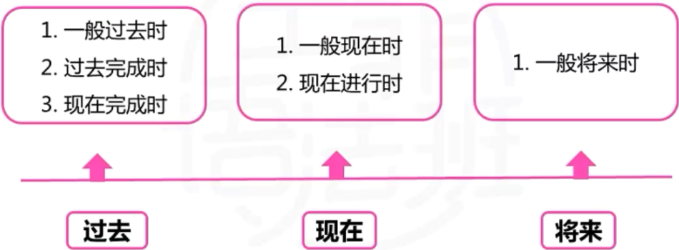

#### 7.3.1 一般现在时

1. 形式
   - ①肯定形式: **第三人称单数**的 "三单变化"; 其他用**动词的原形**
   - ②否定形式: 主语 + **do/does + not** + 谓语**动词原形**
   - ③疑问形式: 疑问词 + **do/does** + 主语 + 谓语**动词原形**
2. 用法
   - **现在**时段发生的动作.
     - I **feel** great!
   - **习惯性动作**&常发生的动作.
     - I never **drink** coffee before 12.00.
       - 部分否定 : 肯定一部分, 否定一部分; all / both / every + not
       - 全部否定 : 否定, 肯定谓语动词+否定意义的单词
       - 双重否定 : 否定 + 否定
     - Every monday and thursday I **go** to the gym.
   - 表示**客观真理**
     - The earth **goes** round the sun.
     - Water **is** liquid at room temperature.
     - Gold **isn't** liquid at room temperature.
   - 用于**电影, 赛事, 时间的评论, 独白, 报道**等.
     - The picture **shows** us how they built the road last year.
   - 谈论**时间表,日程表**
     - The train **leaves** at half past four
     - The course **starts** on 1 July
   - **一般现在时表将来**
     - 当主句为将来时态或表将来意义时,时间和条件的状语从句必须用一般现在时表将来
     - I'Il write to her when I **have** time.
       - 主将从现

#### 7.3.2  一般过去时

1. 形式
   - ①肯定形式: **主语 + 动词过去式**
     ②否定形式: **主语 + did not + 动词原形**
     ③疑问形式: **疑问词 + did + 主语 + 动词原形**
     - I **lived** in London ten years ago.
     - We **didn't** like the film.
     - Where **did** they meet richard?
2. 用法
   - 表过去发生的动作
     - Last night I **played** my guitar loudly and the neighbors **complained**.
     - They **didn't** study so they **didn't** pass the test.

#### 7.3.3  一般将来时

1. 形式
   - ①肯定形式:主语+ will + **动词原形**
     ②否定形式:主语+ won't(will not) + **动词原形**
     ③疑问形式:疑问词+ Will + 主语 + **动词原形**
   - They **won' t see** Jane when she comes back from India
2. 用法
   - 表还没发生,未来发生的行为,动作,事件
     - We **won't** meet them at the station
     - I **will** learn a new language
   - 其它表将要发生
     - **be going to**
     - **be to do**
     - **be about to do**

#### 7.3.4 现在进行时

1. 形式
   - ①肯定形式:主语+ be动词 +**动词ing**
     ②否定形式:主语+ be动+not +**动词ing**
     ③疑问形式:疑问词+ be动词 +主语 +**动词ing**
   - You **are cooking**.
2. 用法
   - ①说话的时刻正在发生的动作
     - **I'm watching** a film on TV now.
   - ②**常与 always, constantly, continually, forever, repeatedly等词连用**; 含有**抱怨语气**.
     - Her husband **is always complaining** about his health.
       - 她老公总是抱怨他的健康.
   - ③**现在进行时表示将来, 多用于已经安排好的事情**
     - My son **is taking** his girlfriend to dinner **tonight**.
   - ④ **be going to** 很快就要发生
     - 计划, 安排的动作
       - We **are going to** sing at the party
     - 确定将来会发生的事情
       - Look at that car it **is going to** crash into the yellow one
   - 注意
     有些动词**不能用于现在进行时**, 用一般现在时
     1. **情感类**: love, hate, prefer
     2. **所属类**: have, own, want, belong
     3. **感官类**: see, hear, smell, seem
     4. **思想类**: know, believe, remember
     5. **测量类**: contain, consist, fit

#### 7.3.4 现在完成时

1. 现在完成时

   - ①肯定形式:主语+ have/has +**过去分词**
   - ②否定形式:主语+ haven' t(have not) hasnt( has not) +**过去分词**
   - ③疑问形式:疑问词+ have/has +**过去分词**
     - They **have finished** the letter.
     - **Has** he/she **finished** the letter.

2. 用法

   - ①表**过去完成**的动作;

     - 这个动作对现在造成影响或与现在有关
     - 常与 **still, yet, already, always**连用.
       - **Has** he **repaired** the lawn-mower yet?
         - 你修除草机了吗?

   - ②讨论**个人的经历**.

     - I **haven 't seen** her this month.
     - **I've** already **moved** house twice this year.

   - 过去已经开始的动作**一直延续到现在**,;

     甚至有**可能继续延续**下去;

     常与 **before, since, for, already, many times, so far,yet**连用.

     - He has driven a car since 2002
     - They've sold 110 so far.
       - 到目前为止他们已经卖了110

#### 7.3.4 过去完成时

1. 形式
   - ①肯定形式:主语+**had+过去分词**
     ②否定形式:主语+ **hadn't( had not)+过去分词**
     ③疑问形式:疑问词+had+主语+**过去分词**
     - They **had** already **met** Sarah before the party.
       - 在聚会前,他们早己见过萨拉.
     - I **hadn't met** Sarah before the party.
       - 在聚会前,我没见过萨拉.
     - **Had** he **met** Sarah before the party?
       - 聚会前他见过萨拉吗?
2. 用法
   - ①表过去的某个动作之前发生的动作
     - She said she **had** **written** three letters the day before.
       - 她说那天之前她已经写了3封信.
     - They **had** **lived** in york before they moved to Liverpool.
       - 在他们搬去利物浦之前,他们住在纽约.
   - ②与 **after, as soon as, the moment that, unti** 连用.
     - After she **had moved** out , I found her notes.
       - 他搬出去之后,我找了她的笔记.
     - I didn't say anything until she **had finished** talking.
       - 知道她说完了之后我才讲了一些.
   - ③与 **before,when, by the time**连用.
     - Before I knew it, she **had** **run** out the door
       - 我知道之前,她已经跑出了家门.
     - I washed the floor when the painter **had** **gone**
       - 画家离开之后我才拖了地.
     - By the time he phoned her, she **had** **found** someone new
       - 他给她电话之时,她已经有了新的人选.

### 7.4 动词时态 - 语态

1. 定义

   1. 1
      - Monkeys adore bananas
        猴子喜欢香蕉.
      - The dog chased the squirrel
        狗追松鼠.
   2. 2
      - After the earthquake, aid was sent to the people of Haiti.
        - 地震后,救援被送到了海地人民手里.
      - The electricity was cut off because the bill hadn’t been paid.
        - 因为没缴费,所以电被切断了.
      - Whales must be protected by an international ban on whaling.
        - 鲸鱼应该受到国家禁止扑杀鲸鱼的保护.

2. 主动改被动步骤

   1. He gave the book to me
      The book was given to me by hi
   2. Someone broke into the pet shop
      The pet shop was broken into
   3. They looked for the baby.
      The baby was looked for
   4. Someone shouts at the man
      The man is shouted at.
   5. They listen to the music.
      Music is listened to

3. 各个时态的被动语态

   |           时态           |                    助动词+过去分词                     |                             举例                             |
   | :----------------------: | :----------------------------------------------------: | :----------------------------------------------------------: |
   |        一般现在时        |                    am, is, are+made                    |                        Wine is made.                         |
   |        现在进行时        |                 am, is, are+being+sent                 |                 The document is being sent.                  |
   |        一般过去式        |                   was, were+invited                    |                        I was invited.                        |
   |        过去进行时        |              was, were+ being +washed              |                Their cars were being washed.                 |
   |        一般将来时        | will be +signed am, is, are+ going to be+built | The contract will be signed. The houses are going to be built. |
   |        现在完成时        |                  has, have+been+sold                   |                  The business has been sold                  |
   |        过去完成时        |                     had+been+hired                     |                The new manager had been hired                |
   |        将来完成时        |                will+have been+finished                 |                The car will have been loaded                 |
   | 情态动词 can/should must |                  情态动词+be+ issued                   |                a passport can only be issued                 |
   |         have to          |         have to, has to had to+be+arranged         | His party has to be arranged His plans have to be arranged |

   

### 7.5 动词语法 - 非谓语动词

#### 7.5.1 动名词

1. 形式

2. 用法

   1. Jogging is a hobby of mine
      慢跑是我的爱好.
      Reading helps you learn English
      阅读帮你学习英语.

   2. He quit smoking a year ago
      他一年前戒烟了.

      I look forward to helping you paint the house
      我期待帮你刷房子.

      注意:
      It is no use telling him not to worry.
      告诉他别担心没有用.(i作形式主语)

      此类动词还包括betr, wonderful, enjoyable, interesting, foolish, difficult
      useless, senseless, worthwhile

   3. My job is teaching
      我的工作是教书.
      Seeing is believing.
      眼见为实.

   4. a swimming pool== a pool for swimming游泳池
      a moving truck搬家汽车= a truck for moving
      drinking water饮用水
      swimming suit游泳衣
      sleeping pil安眠药
      writing paper信纸
      operating table手术室
      reading room阅览室
      washing machine洗衣机
      washing powder洗衣粉
      fishing pole钓鱼杆

3. 以下动词及句型后常跟动名词作宾语(查明词义并背诵)

   |      英文       | 中文 |       英文       | 中文 |
   | :-------------: | :--: | :--------------: | :--: |
   |   be used to    |      |   it’s no use    |      |
   |   can’t help    |      | it’s worthwhile  |      |
   |   can’t stand   |      | look forward to  |      |
   |     end up      |      |    spend time    |      |
   |    feel like    |      |    waste time    |      |
   |     finish      |      |     be busy      |      |
   |   get used to   |      |    don’t mind    |      |
   |     give up     |      |    how about     |      |
   |      go on      |      |  it’s(no) good   |      |
   | have difficulty |      |   it’s no use    |      |
   |  have problems  |      |    there’s no    |      |
   |  have trouble   |      | there’s no point |      |
   |   what about    |      |      afford      |      |
   |      agree      |      |      appear      |      |
   |     arrange     |      |      offer       |      |
   |       ask       |      |       plan       |      |
   |      care       |      |     prepare      |      |
   |     decide      |      |     pretend      |      |
   |     demand      |      |     promise      |      |
   |     expect      |      |      refuse      |      |
   |      fail       |      |     remember     |      |
   |     forget      |      |       seem       |      |
   |      hope       |      |       stop       |      |
   |      learn      |      |    volunteer     |      |
   |     manage      |      |       wait       |      |
   |      mean       |      |       want       |      |
   |      wish       |      |      worth       |      |

   

#### 7.5.2 分词

1. 现在分词

   1. 形式

      | 现在分词 |      主动      |        被动         |
      | :------: | :------------: | :-----------------: |
      |  一般式  |    writing     |    being written    |
      |  完成式  | having written | having been written |

      1. 1
         - Tom came sauntering up the path
           汤姆来了,在路上闲逛.
           Reaching for the flower, I lost my balance
           靠近花朵,我失去了平衡.
           Not being able to win the game, I lost my confidence.
           没能赢得比赛,我失去了信心.
      2. 2
         - Having heard the news, he quickly sold his brothers record collection.
           听完这个消息,他迅速卖了他哥哥收集的磁带.
           Not having finished his work, he could not leave the office.
           还没有完成工作,所以他不能离开办公室.

   2. 句法作用

      1. 1
         - The man carrying the bricks (=who carrying the bricks) is my father
           扛砖的男人是我的父亲.
         - The old woman, thinking all was safe, (=who thinks all was safe
           attempted to cross the road
           认为完全安全的老妇人试图穿过马路
         - There is someone knocking at the door. someone who is knocking)
           有人在敲门.
      2. 2
         - The news is encouraging
           这消息令人鼓舞.
           The present situation is terrifying
           目前形势令人惊恐.
           My job is really tiring. I don' t get home until 10 pm sometimes
           我的工作太累了.有时晚上10点才到家.
           注意:现在分词做表语相当于一个形容词,表示主语的特征,此类词还包括
           amusing, charming, discouraging, exciting, interesting, inviting
           missing, amazing, shocking, surprising amusing, charming,
           discouraging, exciting, interesting, inviting, missing, amazing,
           shocking, surprising 
      3. 现在分词作状语表示调语动词发生的时间、方式、伴随、让步等, 相当于一状语
         从句,现在分词作状语时的逻辑主语就是句子的主语.
         - He was talking to her friend and forgot everything around her.
           =Talking to her friend she forgot everything around her.
           由于和她的朋友聊天,所以她忘记了所有的事情.
           Since we watch the news every day we know what’s going on in the world.
           Watching the news every day we know what’s going on in the world.
           因为我们每天都看新闻,所以我们知道世界上发生了什么.
         - The dog wagged its tail and bit the postman
           -Wagging its tail the dog bit the postman
           狗摇着尾巴,咬了邮递员.
           The man was sitting in the cafe. He was reading a paper.
           -The man was sitting in the cafe reading a paper.
           那个男人坐在咖啡店,读报纸.
         - While she was tidying up her room she found some old photos
           -Tidying up her room she found some old photos
           整理房间时,她发现了一些旧照片.
         - If they do not have enough money they will spend their holidays at home
           ast year.
           Not having enough money they will spend their holidays at home next
           year
           如果没有足够的钱,他们明年就在家度过假期.
         - Carbon burns in oxygen or air, thereby forms carbon dioxide
           Carbon burns in oxygen or air, thereby forming carbon dioxide
           碳在氧气中燃烧,形成二氧化碳.

2. 过去分词

   1. 句法作用
      1. 过去分词作表语,表示谓语动词所处的状态.
         - I was alarmed by the loud bang.
           听到巨大的响声,我受到了惊吓.
         - He was amused to hear his little son singing in the bath
           听到他的小儿子在浴室里低声唱歌,他被逗笑了.
      2. 过去分词做可以置于名词之前做前置定语,也可以构成短语置于名词之后做后置定
         语.过去分词作定语相当于一个定语从句,与其逻辑主语构成被动关系,
         A burnt child(=a child who is burnt )dreads fire
         烧伤的男孩害怕火.
         The musicians stood up, surrounded by thunderous applause. (=who is
         surrounded by thunderous applause
         音乐家们站起来,受到雷鸣般的掌声.
         This is the last photograph taken of my grandmother. which is taken of my
         grandmother
         这是最后一张给奶奶照的照片.
      3. 过去作状语表示谓语动词发生的时间,方式,伴随,让步等,相当于一个状语从句,
         过去分词作状语时的逻辑主语就是句子的主语.
         - Battered by the wind, John fell to his knees
           Because he was battered by the wind, John fell to his knees
           由于受到大风猛吹,约翰跪倒在地.
           Deceived by his friends, he committed suicide
           -since he was deceived by his friends, he committed suicide.
           受到朋友欺骗,他自杀了.
         - Seen from the hill, the town looks magnificent.
           =when it is seen from hill, the town looks magnificent.
           从山上看,这座城市非常美.
         - Given another chance, I will do better
           如果再给我一次机会,我会做的更好.
         - Exhausted by the working, they went on studying at night
           尽管工作已经很累了,他们还是坚持在晚上学习.

#### 7.5.3 动词不定式

1. 形式

   |            |        主动        |       被动        |
   | :--------: | :----------------: | :---------------: |
   |   一般式   |       to do        |    to be done     |
   |   进行式   |    to be doing     |                   |
   |   完成式   |    to have done    | to have been done |
   | 完成进行式 | to have been doing |                   |

2. 动词不定式的句法作用

   1. 1

      - To learn is very important
        学习非常重要.
        To drive in the right is not allowed here
        右驾在这里不被允许.
        To go to college is a good idea.
        去上大学是一个好主意.

      注意

      - it is/was +adj. +to do
        - It was difficult to answer the question
          很难回答这个问题.
      - it is/was+n. +to do
        - It's a big house to clean.
          有个大房子要清理.
      - it is/was tadj +for something/somebody+to do
        - It is necessary for this door to be locked
          锁门很重要.
      - it is/was+adj +of sb+to do
        - It is very kind of you to help me
          能帮我你太好了.
      - n, +adj +to do
        - He was ashamed to speak to her again
          再次和她说话,他感到很羞愧.

   2. 2

      - The most important thing is not to give up
        最重要的事情是不要放弃.

   3. 3

      - I want to swim in the pool
        我想在泳池游泳
        The question was difficult to answer.
        这个问题很难回答.
        A good translator is hard to find
        很难找到一个好的翻译.

   4. 4

      - Give him an ornament to polish.
        给他件装饰品擦亮
      - I need a volunteer to take the minutes
        我需要一位志愿者做记录.

   5. 

      - The officer returned to help
        工作人员返回来帮忙.
        le will complete the mission to set an example
        他会完成任务,做表率.
        I am going to the store to buy a 100-watt light bulb
        我打算去商店买一个100瓦特的灯泡.
      - My parents will be happy to meet you
        见到你我父母很开心.
        He was ashamed to speak to her again
        再次和她说话,他感到很羞愧

   6. 常见带to不定式

      |     英文     | 中文 |        英文        | 中文 |      英文       | 中文 |
      | :----------: | :--: | :----------------: | :--: | :-------------: | :--: |
      |    afraid    |      |       amazed       |      |     anxious     |      |
      |   ashamed    |      |       bound        |      | careful certain |      |
      |   content    |      |     delighted      |      |   determined    |      |
      |    eager     |      | eligible fortunate |      |      glad       |      |
      |    happy     |      |      hesitant      |      |     liable      |      |
      | likely lucky |      |      pleased       |      |      proud      |      |
      |    ready     |      |     reluctant      |      |   sad shocked   |      |
      |    sorry     |      |     surprised      |      |      like       |      |
      |     love     |      |       prefer       |      |      begin      |      |
      |    start     |      |       agree        |      |       try       |      |
      |   attempt    |      |       choose       |      |    continue     |      |
      |    intend    |      |      propose       |      |     desire      |      |
      |     wish     |      |        want        |      |      hate       |      |
      |   dislike    |      |        hope        |      |     expect      |      |
      |   promise    |      |       refuse       |      |      fear       |      |
      |   remember   |      |       forget       |      | learn and offer |      |

3. 省略to的不定式

   - I felt her heart beat
     我感觉到她的心跳.
     I saw it happen
     I watched it happen
     I'll have her copy the document right away
     Our boss let us leave early.
     That film made me cry.
   - 注意:
     (1)
     (2)
     I often help my friends( to )to buy food on the Internet
     我经常帮我的朋友在网上买食物.
     The college's aim is to help students
     r aspirations
     大学意在帮助学生实现志向.
     I want to lie down and sleep
     我想躺下睡觉.

**总结一 动名词与现在分词的区别**

**总结二 现在分词与过去分词的区别**

- the rising sun正在升起的太阳
  the risen sun升起的太阳
  falling leaves正在落的叶子
  fallen leaves落下叶子
  boiling water正在沸腾的水
  boiled water烧开了的水

**总结三 动名词与动词不定式的区别**

1. begin, continue, hate, intend, like, love, prefer, start

2. 1

   |        英文        |         中文         |
   | :----------------: | :------------------: |
   |  forget to do sth  |  表示忘记要去做某事  |
   |  forget doing sth  |     忘记做过某事     |
   | remember to do sth |    记得要去做某事    |
   | remember doing sth |     记得做过某事     |
   |   stop to do sth   | 停下来去做另外一件事 |
   |   stop doing sth   |   停下正在做的事情   |
   |  regret to do sth  |    遗憾要去做某事    |
   |  regret doing sth  |     遗憾做过某事     |
   |   try to do sth    |      努力做某事      |
   |   try doing sth    |      试验做某事      |
   |   mean to do sth   |      打算做某事      |
   |   mean doing sth   |       意味着…        |

   

**总结四 现在分词作定语**
现在分词作定语,我们必须注意以下三点:

- The teacher criticized the student having broken the window
  The teacher criticized the student who had broken the window
  Do you know anyone having lost a car
  Do you know anyone who have lost a car
  Anybody being outside after ten o clock will be criticized
  Anybody who is outside after ten o' clock will be criticized.
  he boy bringing us milk everyday is my brother
  The boy who brings us milk everyday is my brother.

**总结五 现在分词作状语**
现在分词作状语,我们必须注意以下四点:

- The secretary worked late into the night, preparing a long speech for the president.

  He sent me an E-mail, hoping to get further information.

  Having suffered from heart trouble for years, Professor White has to take some medicine with him whenever he goes.

  Having finished his homework, the boy went out to play football

- Looking out of the window of our hotel room, ye ould see lots of mountains around

  They came into the classroom, talking and laughing.

  Mr.Smith being absent, the meeting had to be put off.

  It being a fine day, we all wanted to go outing.

- When talking to you, I always feel happy.
  Be careful while crossing the street.
- Having been told many times, but he still couldn 't understand it.
  Having been told many times, he still couldnt understand it.

### 7.6. 动词语法 - 虚拟语气

1. 语气

   1. 1
      - I saw something today that really annoyed me
        我今天看见了一些让我非常生气的东西.
        That is a beautiful painting
        那是一幅漂亮的画作
        How much wood does a woodchuck chuck?
        如果土拨鼠会扔木头那它会扔多少木头?
        Keep reading
        接着读.
        Do not forget your homework
        别忘了你的作业.
   2. 2
   3. 3

2. 虚拟语气

   - If I were a rich man, then I would have all the money in the world.
     如果我是一个有钱人,我就会拥有世界上所有的钱
   - Had the man been driving carefully, he would not have crashed into the
     如果这个人开车时谨慎点,那他就不会撞上树了.

   1. if 引导非真实条件句

      |                           |              主句谓语动词               | 从句谓语动词                                                 |
      | :-----------------------: | :-------------------------------------: | :----------------------------------------------------------- |
      | 表示与现在 相反的情况 |    should/would/ might/could+do     | ①一般过去时 ②be动词用were                                |
      | 表示与过去 相反的情况 | should/would/might/ could+have done | had done                                                     |
      | 表示与将来 相反的情况 |    should/would/ might/could+do     | ① were to do ② should+do ③动词一般过去式(be动词用were) |

      1. 表示与现在相反的情况
         If I read six books at once, I would confuse all the plots and characters.
         如果我现在同时读6本书,我会把所有的情节和人物混淆.
         Even if he had a million dollars, he still would complain about not having enough.
         即使他有现在有一百万,他还是会抱怨钱不够.

      2. 表示与过去相反的情况
         If her mother had taken the doctor's advice, she would/might have got well earlier.
         如果她妈妈当时采纳了医生的建议,她就会好得更早.

         If you had worked harder, you would have got through the exams.
         如果你当时努力学习,你当时就会通过考试了.

         If I had won the lottery, I would have built a house in the country
         如果我当时中了彩票,我当时就会在乡下建一座房子

      3. 表示与将来相反的情况
         If I were to win the lottery, I finally would buy a new car.
         如果我将来中了彩票,我到时候就会买一辆新车.
         If he were to be the next Picasso, I would be very happy to have known
         him for so long
         如果我将来成为下一个毕加索,认识他这么长时间我会非常开心.
         If he were rich, he'd buy a house
         如果他将来变得富有,他就会买一栋房子.
         注意
         If it rains tomorrow, we won' t go to a park
         如果明天下雨,我们就不去公园了.

   2. if 引导的非真实条件句的倒装

      - If it were rain tomorrow, our picnic would be canceled
        变为
        Were it to rain tomorrow, our picnic would be canceled
      - If it had not been for the storm we would have arrived in time.
        变为
        Had it not been for the storm we would have arrived
      - If the earth should stop running, what would happen?
        变为
        Should the earth stop running, what happen?

   3. 错综时间条件句

      - If she had taken the doctor's advice, she might still be alive
        如果她当时采纳了医生的意见,她现在可能还活着.
        If I were you, I would have accepted their terms
        如果我是你,我当时就会接受他们的条件.
        If I hadn ' t stood under the ladder to catch you when you fell, you wouldn' t be
        miling now
        当你掉下来时,如果不是我在梯子下面把你接住,恐怕你现在就不会笑了.

   4. 无引导的虚拟语气

      1. 1
         - Without air, there would be no living things
           没有空气,就没有活的物体.
           But for your help, I couldn t have done it
           要不是你的帮助,我就不可能完成它.
           We didn't know his telephone number, otherwise we would have tele-
           honed hi
           我们不知道他的电话,否则,我们就给他打电话了.
           In that case we could have achieved our goal
           要是那样的话我们肯定就达成目标了.
           Under that condition we could have lived more comfortably
           如果在那种情况下我们本可以过的很舒适.
      2. 2
         1. 1
            - I wish I were a bit taller
              我个子再高一点就好了.
              I wish I hadn' t eaten so much
              我真希望自己没吃那么多.
         2. 2
            - I suggested that he implement a budget cut in March
              我建议3月他开始缩减预算.
              I demand that you be at school on time
              我要求你按时上学.
              I recommend that Sammi do her homework at home
              我建议萨米在家做作业.
              They insisted that all swear words be deleted from the article
              他们坚决要求删除文章中所有皙言相关的话语.
              注意:
              He suggests that I am not suited for the job
              他暗示我不适合这份工作.
              He insisted that he was innocent
              他坚持说自己是无辜的.
         3. 3
            - Id rather you came another time
              我宁愿你下次来.
              She would rather he werent so angry.
              她情愿他不那么生气.
              I would just as soon you had told me the truth yesterday.
              我宁愿你昨天告诉我真相.
         4. 4
            1. 1
               - It is necessary that the issue be addressed
                 必须解决这个问题.
                 It is proper that law should govern any one of the citizens
                 法律应制裁以下的任何人.
            2. 2
               - It is high time you started off
                 是你该动身的时候了.
                 It's high time that we left.
                 是我们该走的时候了.
            3. 3
               - If only we could just get on and read it and forget about all the other stuff.
                 要是我们能够继续读下去并且忘记所有其他的员工就好了.
                 If only I knew the answer, I'd tell you
                 要是我知道答案,我就告诉你.
                 If only I had revised more, I would have done better on my exam
                 倘若我做更多的修正,我考试成绩就会更好.
               - He talks as if he knew her.
                 他说话的样子,好像他认识她.
                 It looks as if it might rain.
                 看起来好像要下雨了.
            4. 4
               - I shouldn't have interfered
                 我不应该打断.(事实上已经打断了)
                 You should have taken my advice
                 你本应该采纳我的意见.(事实上没有采纳)

## 八、连词

We were wet and tired
我们浑身透湿,精疲力竭.
She's very hard-working but not very imaginative.
她工作很努力,但缺乏想象力.
She walked home by herself although she knew that it was dangerous
她一个人步行回的家,尽管她知道那样做很危险.

### 8.1 并列连词

1. 第一,表示"和,同,或"
2. 第二,表示转折意义"但是"
3. 第三,表示"否则"
4. 第四,表示因果关系

### 8.2 从属连词