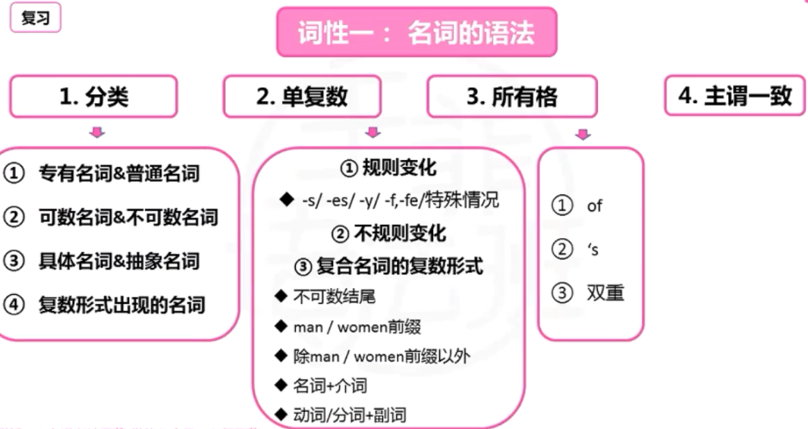

# 王菲英语语法 第十四季

## 语法基础概念（10+9+8完美语法体系）

### <u>十种</u>词性

1. 介词
2. 冠词
3. 名词
4. 代词
5. 数词
6. 副词
7. 形容词
8. 动词
9. 连词
10. 感叹词（只有叹词没有语法内容）

### <u>九种</u>句子成分

1. 主语
2. 谓语
3. 宾语
4. 表语
5. 双宾
6. 同位语
7. 宾补
8. 定语
9. 状语

### <u>八种</u>句式

- **<u>五种</u>基础简单句**
  1. 主 + 谓 + 宾
  2. 主 + 系 + 表
  3. 主 + 谓 + 双宾
  4. 主 + 谓 + 宾补
  5. 主 + 谓
- **<u>三种</u>高级复合句**
  1. 名词性从句
  2. 定语从句
  3. 状语从句

### 王菲语法树

1. **名词**：
   1. 单复数 
   2. 所有格 
   3. 主谓一致
2. **代词**：
   1. 形式 
   2. 含义 
   3. 用法
3. **数词**： 
   1. 基数词 
   2. 序数词
4. **冠词**：
   1. 定冠词 
   2. 不定冠词 
   3. 零冠词
5. **形容词，副词**：
   1. 三级 
   2. 固定句型
6. **介词**：
   1. 用法 
   2. 分类 
   3. 功能 
   4. 固定搭配
7. **动词**：
   1. 时态 
   2. 语态 
   3. 非谓语动词
   4. 虚拟语气
   5. 独立主格结构
8. **连词**：
   1. 并列连词
   2. 从属连词（三大从句）
9. **其它**：
   1. 强调句 
   2. 倒装句 
   3. 反义疑问句

### 基本概念 - 简单句（重要）

1. **陈述句（五种句型）**

   1. **主语 + 系动词 + 表语**（系动词后面叫表语）
      - London is the capital of England.
      - 系动词: 
        - be 动词 
        - 感官动词（与五官相关单词）
   2. **主语 + 谓语**（动词是**不及物动词**，不能加宾语）
      - I get up early in the morning.
   3. **主语 + 谓语 + 宾语**
      - I love watermelon.
      - 表语/宾语本质相同
        - **动词后面叫宾语**
        - 两种特殊动词后面叫表语
   4. **主 + 谓 + 双宾**（直接宾语+间接宾语）
      - The rabbit showed *us* a *carrot*.
      - 改成被动句，会出现两个被动句
        - us 和 carrot 都可以做被动语态的主语
   5. **主 + 谓 + 宾语 + 宾补**
      - They elected *Martin* their monitor.
      - 改成被动句只有一个被动句
        - 只有 Martin 能做被动语态主语

2. **陈述句形式**

   1. **肯定式**
      - Honesty is the best policy.
   2. **否定式**
      - She will not listen to me.
      - l don' t think it right.
      - 在助动词后面加 not , 不能直接加动词后面

3. **一般疑问句**

   - 可以用 yes/no 回答
   - 陈述句变一般疑问句有**三种类型**
     1. **提前系动词**
        - 陈述句: 主语 + 系动词 + 表语
        - 疑问句: 系动词 + 主语 + 表语
        - You were coming with us. 
        - Were you coming with us？ -Yes
     2. **提前助动词**
        - 陈述句: 主语 + 谓语 + (宾语)
        - 疑问句: 助动词 + 主语 + 动词原形 + 其它
          - **助动词**: 帮助动词的动词 (完成**语态/时态/疑问/否定**) 无词义
        - You *have found* a new job. 
        - *Have* you *found* a new job yet？
          - Yes, I have/No, I haven 't.
     3. **提前情态动词**
        - 陈述句: 主语 + 情态动词 + 动词原形 + 其它
        - 疑问句: 情态动词 + 主语 + 动词原形 + 其它
          - **情态动词**和**助动词**都**不能**单独充当**谓语**, 必须和动词放在一起充当谓语
          - **情态动词**: 有词义; **助动词**: 无词义
        - You *can solve* this problem 
        - *Can* you *solve* this problem？
          - Yes I can/No, l can’t.

4. **特殊疑问句**

   1. 以特殊疑问词开头；

   2. 对句中某一成分提问；

   3. 不能用 Yes/No 进行回答

      | Who - 提问人          | Where - 提问地点         |
      | --------------------- | ------------------------ |
      | Whose - 提问所属      | Why - 提问原因           |
      | Whom - 提问宾格人     | How - 提问方式或数量     |
      | What - 提问事情或属性 | How much/many - 提问数量 |
      | When - 提问时间       | Which - 提问选择         |

      特殊疑问句 例句1

      - Who were you on the phone with？
      - Jim.

      特殊疑问句 例句2

      - Whom is he dating？
      - He is dating Anna.

5. **选择疑问句**

   1. 选择疑问句**用 or 连接**；

   2. 提出两个或两个以上的句式供选择；

   3. 选择疑问句不能用 Yes/No 回答。

      选择疑问句 例句1

      - Do you like chocolate or vanilla better？

      选择疑问句 例句2

      - Are you going to drive or do you want me to？

6. **反义疑问句**

   1. 陈述句部分是**肯定句**，疑问句部分用**否定句**；

   2. 陈述句部分是**否定句**，反意疑问句用**肯定句**。

      **前肯后否；前否后肯**

      **反义疑问句** 例句

      - He is your teacher, isn’t he?
      - You found the key in the bedroom, didn’t you？
      - The boy has to clean his room, doesn’t he?

   1. **感叹句**的反义疑问句
      - 一律用**否定式提问**
      - What a clever boy, isn’t he?
      - What a lovely day, isn't it？

   2. **祈使句**的反义疑问句
      - 用 **will you**
      - Let’s 开始, 用 **shall we**

   3. **含 must** 的反义疑问句
      - **表“必须”**：反意疑问句为 mustn't…？/ needn't…?
        - He <u>must</u> study hard at English, mustn 't he？/neednt he?
      - **表推测“一定，肯定”**：反意疑问句与 must 后面的**动词**呼应
        - You <u>must</u> be joking, aren't you?

   4. **含否定词**的反义疑问句
      - 常见否定词：hardly; never; seldom; little; few; nowhere; nothing 等
      - 反意疑问句用**肯定提问**。
        - Frank <u>hardly</u> goes to parties, does he?
        - He has <u>few</u> triends, has he?
   5. **复合句**的反义疑问句
      - 复合句的反意疑问句都**对主句提问**。
        - 复合句: 两个以上句子构成, 从句连词的三大从句
      - <u>He was punished</u> *because* he violated the regulation, wasn 't he？
      - You never told me *that* you had been ill, did you?
   6. **宾语从句**的反义疑问句
      - I don' t think/ suppose/ believe/ imagine 引导的**宾语从句**，反意疑问句应**与从句的主语，谓语部分一致**，用**肯定式的提问**。
        - 中英文否定词位置不一致, 否定词转移
      - I don' t <u>suppose anyone</u> will volunteer, will they?
        - 我相信没人会做 否定词属于后面从句
      -  I don' t <u>believe she</u> has done it, has she?
        - 我相信她没做这件事, 否定词属于后面从句

7. **感叹句**

   1. **What 感叹句**
      1. What + a/an + 形容词 + **可数名词单数** + [主语 + 谓语]！
      2. What + a/an + **名词** + 主语 + 谓语！
      3. What + 形容词 + **不可数名词/复数名词** + [主语 + 谓语]！
         - What a marvelous sight!
   2. **How 感叹句**
      1. How + **形容词/副词** + [主语 + 谓语]！
      2. How + **形容词** + a/an + 可数名词单数 + [主语 + 谓语]!
         - How noble of him to do that !
         - How intelligent you are！
   3. **语气词/感叹号**
      - Oh, I am depressed!
      - I cannot survive without you!

8. **祈使句**

   **没有主语, 通常用动词开头**

   1. 表示命令
      - Please sit down.
      - Leave this place at once.
   2. 表示请求或祝愿
      - Have a safe trip！
      - Let's go for a walk.

## 一、名词

### 1.1 名词的分类

#### 1.1.1 专有名词&普通名词

1. **专有名词**：特定的某人、地方或机构等专有的名称。

   1. 人名：Tom, Smith, Jackie, Wang

   2. 地名：Beijing, Virginia, London.

   3. 国家名：China, Rusa, Pakistan.

   4. 单位名：the State Council, the Ministry of Foreign Affairs, the Ministry of Finance.

   5. 组织名：IMF ASEAN EU OPEC

   6. 大型活动或事件：The Belt and Road, BCIKS

      注意专有名词第一个字母要大写

2. **普通名词**

   1. **可数名词**
      1. **个体名词**
         - aunt, uncle 
         - 表个体
      2. **集体名词**
         - class, army 
         - 表人或事物的总称
   2. **不可数名词**
      1. **物质名词**
         - Coffee, water
         - 无法分为个体的事物
      2. **抽象名词**
         - interesting, pleasure
         - 表性质 / 状态 / 情感 等抽象概念
         - 前一般不加定冠词
      3. **语言名词**
         - Chinese, French
         - 表语言名称

#### 1.1.2 可数名词&不可数名词

1. 例句
   - 可数: Most <u>classrooms</u> have <u>computers</u>.
   - 不可数: They left <u>the house</u> to go for a walk after <u>tea</u>.
2. 注意:
   1. 不可数名词, 不可数字计算
   2. 不可数名词, **不加不定冠词 ** (a/an) 与数词；
   3. 不可数名词, 可**加定冠词** (the)
      - 家具（furniture）
        We have too much furniture.
      - 设备（ equipment）
        The plant was dismantled of all its equipment and furniture.

#### 1.1.3 具体名词&抽象名词

1. **具体名词**：指可以看到，听到，闻到，触摸到的事物。
   1. 人物：man, Mrs. Jones
   2. 地点：river, London
   3. 事物：book, mountains, sports car
2. **抽象名词**：指代情感，观念，想法等无形的事物的名词。
   1. 例: love, happiness, intelligence, anger, excitement

#### 1.1.4 复数形式出现的名词

|         单词         | 例句                                             |
| :------------------: | :----------------------------------------------- |
|    scIssors 剪刀     | There are three pairs of scissors in the drawer. |
|    tweezers 镊子     | Could you pass me those tweezers？               |
|  binoculars 望远镜   | She gave me some binoculars.                     |
|     glasses 眼睛     | I've lost my glasses!                            |
|     clothes 衣服     | She put her clothes in the suitcase.             |
| congratulations 祝贺 | Many congratulations!                            |

### 1.2 名词的单复数

1. **规则名词**的复数形式

   1. -s 例如：大多数名词在单数名词后加 -s
      - desk→ desks day→days house→ houses
   2. -es 例如：**以 o, s, x, ch, sh 结尾的单数名词后加 -es**
      - hero→ heroes, bush→ bushes, fox→ foxes
   3. **以 -y 结尾**的名词
      1. **辅音 +y 的名词，变 y 为 i 加 -es**
         - city> cities 
         - country→> countries
      2. **元音 +y 的名词，加 -s**
         - boy→>boys 
         - donkey >donkeys
   4. **-f, -fe 结尾**的名词
      1. **变 f 为 v 加 -es**
         - half, life, leaf, loaf, knife, shelf, wife
      2. **直接加 -s** （没规律只能背诵）
         - belief, grief, cliff, gulf, roof, proof
   5. 特殊情况
      1. **-ch 结尾发 /k/ 音, 加 -s**
         - monarch（君主）→ monarchs 
         - stomach（胃）→ stomachs
      2. **“元音+o” 或 “oo” 结尾的词，加 “-s”**
         - bamboo → bamboos 
         - portfolio → portfolios
      3. **注意:**
         1. **有的 “o” 结尾，加 “es”, 辅音结尾**
            - cargo, echo, embargo, hero, tomato, veto
         2. **有的 “o” 结尾，加 “-s”, 辅音结尾**
            - memento, concerto, piano, solo, photo, quarto, kilo, largo
         3. **有的 o 结尾，加 “es” 或 “s” **
            - zero, volcano, mango, archipelago banjo, grotto, halo

2. **不规则名词**的复数形式

   | man-men     | child-children |
   | ----------- | -------------- |
   | woman-women | fish-fish      |
   | goose-geese | deer-deer      |
   | foot-foot   | sheep-sheep    |
   | tooth-teeth | mouse-mice     |

   

3. **复合名词**的复数形式

   1. **不可数名词-结尾，无复数形式**
      - home<u>work</u>, news<u>paper</u>
   2. **man 或 woman为前缀的，前后名词都变复数**
      - woman doctor → women doctors 
      - man waiter → men waiters
   3. **两个名词构成**的（前面的名词为man或 woman除外），**后面名词变复数**。
      - boy friend → boy <u>friends</u> 
      - paper bag → paper <u>bags</u>
   4. “**可数名词 + 介词**（短语）” **前面名词变复数**。
      - father-in-law → <u>fathers</u>-in-law : 岳父
   5. **动词/过去分词 + 副词**，**副词加s**。
      - grown-up → grown-<u>ups</u>, 
      - stand-by → stand-<u>bys</u>

### 1.3 所有格

- 英语名词有三个格，即主格、宾格和所有格。(名词的主格宾格相同)
- 它分 “s” 所有格和 “of“ 印所有格两种形式。
- 表所属关系，即“…的”。

1. **‘s 所有格** (中英语序一致)
   1. 构成
      - **单数名词**/复数名词**非 s 结尾**，后加 ‘s; 
      - **复数名词 s 结尾**, 加 ‘
        - boys' school 男子学校
        - the Smiths'car 史密斯家的小汽车
        - the boss's plan 老板的计划
      - 带**词尾 -s 的单数名词**后，通常仍加 -‘s。
        - the boss's plan老板的计划
      - 用 and 连接的**并列名词的所有格**要分两种情况。
        - 表示**各自的所有关系**时，要分别在并列名词后加 ‘s
        - 表示**共同的所有关系**时，只在最后一个名词后加 ‘s
          - Tom's and Jim‘s rooms. 汤姆和吉姆（各自）的房间。
          - Tom and jim’s room. 汤姆和吉姆（共同）的房间。
   2. 用法
      1. **时间后**
         - this month’s schedule 这个月的日程表
         - 10 day‘s holiday 十天的假期
      2. **国家或城市后**
         - China‘s policy 中国的政策
         - the town’s population 这个镇的人
      3. **组织机构后**
         - the station' s waiting-room 车站候车室
         - the newspaper' s editorial policy 这家报纸的编辑方针
      4. **度量衡后**
         - a kilo’s weight 1千克的重量
         - 1000 pound‘s price 1000磅的价钱
      5. **天体后**
         - the moon‘s light 月光
         - Jupiter’s size 木星的大小
2. **of 所有格** (中英语序相反)
   1. 修饰前面的名词;
   2. 表两个名词间的所属关系。
      - The content of the website.
      - A friend of mine told me that all of the tickets have already sold out.
3. **双重所有格**
   1. of + 名词 ′s 所有格;
   2. of + 名词性物主代词
      - He is a friend of mine.
      - This is a photo of my mother.
      - This is a photo of my mother’s.

### 1.4 主谓一致

1. 集合名词做主语

   1. 表**整体概念**，**谓语动词用复数**；
   2. 表**个体概念**，**谓语动词用单数**。
      - The whole <u>family</u> is active. 个体概念
      - The <u>family</u> have met their various obligations. 整体概念

2. **单复数同形名词**做主语：**根据句义**，判断谓语动词的单复数。

   - We need to find some other means of transportation. 
     - 我们得找其他交通工具了。

3. **国名、组织机构、书名、报刊名**等复数形式的专有名词作为整体对待，谓语**用单数**

   - <u>The United Nations</u> has passed a resolution to lift sanctions against Iraq.
     - 联合国通过了解除对伊制裁的决定。
   - <u>The Times</u> reports the news of the strike.
     - 时代杂志报导了罢工的消息。
   - <u>Great Expectations</u> was written by Dickens in 1860.
     - 《远大前程》是狄更斯于1860年写的。

4. **由 and 或 both… and… 连接两个单数名词**作主语时，指代复数概念，谓语动词**用复数**。

   - <u>She and her friends</u> are at the fair.
     - 她和她的朋友在会上。
   - and 连接的两个词**指同一个人**、同一事物或同一概念，且两个名词**共用一个冠词**，谓语动词必须**用单数**。
     - <u>The teacher and writer</u> is her friend.
       - 这位教师兼作家是她的朋友
   - and 连接**单数主语**前如有 **every, each, no, many a** 修饰时，谓语动词**用单数**。
     - No smoking or drinking is allowed. <u>Every man and woman</u> is required to check in.
       - 不许抽烟、饮酒。按要求，毎位男性及女性需要登记。

5. **时间，距离，金钱，价格**等常**作为整体**看待时，谓语动词**用单数**形式

   - <u>Five dollars</u> is a lot of money.
   - <u>Fifteen miles</u> is not a long way.

6. **就近原则**

   1. there (客观存在, 有) / here be 句型 (倒装结构, 谓语在前, 主语在后)
      - <u>There are</u> many possible candidates.
      - <u>Here are</u> some stones.
   2. or, either...or…(二选一)， neither... nor…(两者都不)，not only... but（also）连接并列成分作主语。
      - His friends <u>or</u> **the boy** <u>runs</u> every day. 
      - <u>Neither</u> gray <u>nor</u> **white** <u>is</u> my favorite color.
      - <u>Either</u> Grandpa <u>or</u> my **sisters** <u>are</u> going to the park.

7. **就远原则**

   - as well as (…和…, 除了…还有…); 
   - together / along / combined with; 
   - rather than; except; besides; including; 
   - in addition to; apart from.
     - **The politician**, <u>along with</u> the newsmen, <u>is</u> on the meeting. 
     - **Excitement**, <u>as well as</u> nervousness, <u>is</u> the cause of her shaking.

8. **some of, plenty of, a lot of, lots of, most of, the rest of, all of, half of, part of，分数、百分数 + of + 名词短语作主语**，谓语动常**与 of 后的名词保持数的一致**。

   - All of the **chicken** <u>is</u> gone.
   - Most of the **cookies** <u>were</u> eaten.

9. 在**四则运算**中，谓语动词多**用单数**。

   - 18 minus 12 <u>is</u> 6.
   - Two and two <u>is</u> four.
   - Four times four divided by two <u>is</u> eight.

10. “a number of + 可数名词复数” 谓语动词**用复数**； 许多,大量

    “the number of + 可数名词” 谓语动词**用单数**。…的数量

    - **A number of** students <u>were</u> late for class.
    - **The number of** students in the class <u>is</u> fifteen.

11. "**each, one, no one, some(any, no, every) + body(one 或 ething)**” 作主语或作限定词，谓语动词**单数**。

    - **Each** <u>gets</u> a trophy for playing.
    - **Somebody** will <u>pay</u> for this.

12. “one and a half + 复数名词”作主语，谓语动词**用单数**。大于等于 2 用复数

    - **One and a half** <u>apples is</u> left on the table.
    - **One and a half** <u>hours is</u> not enough.

13. “a/an + **单数名词** + or two” 作主语，谓语动词**用单数**。

    one or two + **复数名词**作主语，谓语动词**用复数**。

    - **A student** or two <u>has</u> failed the exam.
    - One or **two suggestions** <u>were</u> recommended.

14. many <u>a</u>…或 more than <u>one</u> + 名词作主语，谓语动词**用单数**。用单数名词代表许多,大量

    - **Many a** man <u>thinks</u> life <u>is</u> meaningless without purpose.
    - **More than one** student <u>has</u> tried this.

15. “one + of + 复数名词” 结构中，谓语动词**用单数**动词。群体中之一

    - **One of** the students in our class <u>is</u> from the UK. 
    - **One of** their daughters <u>has</u> just had a baby.

16. few, many, several, all, some后加名词作主语，谓语动词**用复数**。

    1. **Both** <u>are</u> qualified for the job.
    2. **Many** went to the beach and got sunburned.
    3. **Few** know what it really takes to get ahead.

## 二、代词

### 2.1 人称代词

### 2.2 物主代词

### 2.3 反身代词

### 2.4 指示代词

### 2.5 关系代词

### 2.6 连接代词

### 2.7 不定代词

### 2.8 互相代词

### 2.9 疑问代词

## 三、数词

### 3.1 基数词

### 3.2 序数词

### 3.3 数词的句法作用

## 四、冠词

### 4.1 冠词的基本含义及用法

### 4.2 不定冠词 a/an

### 4.3 零冠词

1. 定冠词
2. 不定冠词
3. 零冠词

#### （一）不定冠词 a / an 的用法

1.  不定冠词 a / an 用在单数名词的前面
2.  a 用在辅音开头的词前面
3.  an 用在元音开头的词前面

**具体用法：**

1. 泛指某一个人或物

   - There is <u>a dog</u> lying on the ground.

     - *There is* 符合主谓一致的就近原则 

     - *lying on the ground* 非谓语动词作定语来修饰 *dog*
     - *a* 泛指一只狗

2. 表示类人或物，区别于其它种类

   - <u>An elephant</u> is much stronger than <u>a man</u>.
     - 元音 e 前面用 *an* ，辅音 m 前用 *a*
     - *An elephant， a man* 表示类别
     - 比较结构 *much stronger than*

3. 表示“一”这个数量

   - There is <u>a table</u> and four chairs in that dining-room.
     - *a table* 一张桌子  
     - *four chairs* 四把椅子
     - *there be* 句型 就近原则：根据后面名词是复数则用 *are* 单数用 *is*

4. 用不定冠词的习惯用语

   > a bit (一点)	a little (一点)	a few (几个)	a lot (许多)
   >
   > a kind of (一种)     a pair of (一副、一双)    a number of (大量的)
   >
   > a piece of (一片)    half an hour (半小时)    have a good time (玩的开心)
   >
   > have a cold (感冒)    make a noise (发出噪音)    have/take a rest (休息一下) 等

#### （二）定冠词 the 的用法

1. 表特指的人或事物
   - <u>The man</u> with a flower in his hand is jack.
     - *the man* 特指这个男人
     - *with a flower in his hand* 介词短语充当定语，修饰名词
2. 复述前面提到过的人或物
   - There is a man under the tree. <u>The man</u> is called Robert.
     - *a man* 泛指一个人
     - *the man* 特指前面提到过的人
3. 表独一无二的事物
   - <u>The earth</u> turns around the sun.
     - *the earth* 独一无二的事物
     - *turns* 动词表现时态
4. 用在表示方位的名词前面
   - There will be strong wind to <u>the south</u> of the Yangtze River.
     - *the south* 方位
     - 这里经常刮大风：*there will be* 改成 *there is* 
5. 在序数词和形容词最高级的前面
   - Who is <u>the first</u> one to go?
     - *the first* 序数词前
   - Of all the stars , the sun is <u>the nearest</u> to the earth.
     - *the stars* / *the sun* / *the earth* 独一无二的事物
     - *the nearest* 形容词最高级前
6. 用在江河、海洋、山脉等名称的前面
   - I have never been to <u>the Himalaya Mountains</u>.
     - *the Himalaya Mountains* 山脉
     - *have never been to* 现在完成时
7. 用在 <u>含有普通名词的专有名词</u> 的前面
   - He is from <u>the United States of America</u>.
     - *the United States of America* 专有名词
8. 用在姓氏之前表示一家人
   - <u>The Greens</u> are going to Mount Emei next month.
     - *the Greens* 格林一家人
     - *are going to* 一般将来时
9. 固定短语搭配
   - at the same time (与此同时) ；make the bed (铺床) ；
   - in the end (最后) ；all the time (一直)；
   - by the way (顺便说一下) ；on the way (在路上) ；
10. 乐器名称前
    - He began to play <u>the violin</u> at the age of 5.
      - *the violin* 乐器

#### （三）零冠词

1. <u>专有名词</u> 和 <u>第一次使用一些不可数名词</u> 时前面通常不用
   - <u>China</u> is a very large country.
     - *China* 专有名词
   - Man needs <u>air and water</u>.
     - *air and water* 第一次使用不可数名词
2. 名词前已有指示、物主或不定代词 作定语修饰时不用
   - <u>My pen</u> is <u>much more expensive than</u> yours.
     - *my pen* 物主代词
     - *much more expensive than* 比较级
3. 周名、月名、日期 或 季节名前不用
   - He <u>was born</u> on <u>Monday</u> , <u>February</u> <u>18</u> , <u>1995</u>.
     -  *Monday , February 18 , 1995*  周名/月名/日期
     -  *was born* 一般过去时的被动语态
   - They usually plant trees in the hills in <u>spring</u>.
     - *spring* 季节； *the spring* 表特指不是零冠词
4. <u>第一次使用</u> 复数名词表示人或事物的 <u>类别</u> 时不用
   - <u>Men</u> are cleverer than <u>monkeys</u>.
     - 特指可以加 the
5. 三餐、学科前不用
   - We <u>have breakfast</u> at home <u>and lunch</u> at school.
     - *and lunch* 省略了 *we have*
   - We all like <u>English</u>.
6. 节假日前不用
   - <u>On Children's Day</u> the boys often get presents from their parents.
     - *On Children's Day* 介词短语作时间状语
     - *often* 一般现在时
7. 球类前不用
   - The children <u>play football</u> <u>on Saturday</u> afternoons.
     - *play football* 球类不用
     - *on Saturday* 日期不用
8. 一些习惯用语中不用（查询中文并背诵）
   1. at / to / from /out of / after / for school ;
   2. in / to / for / after class ;
   3. in / to / for /out of / into bed ;
   4. after / at / from /out of /to work ;
   5. at / to sea ;
   6. in / from / down / to town ; 
   7. at / from home ;
   8. at / for / to breakfast / lunch / supper ;
   9. at night / noon / midnight ;
   10. on foot ;
   11. go to school / bed ;
   12. on top of ;
   13. in front of ;
   14. on show / display / duty / watch ;
   15. in / out of hospital ;
   16. at all ;
   17. on / in time ;
   18. at first / last / once ;
   19. in Chinese / English ;
   20. take care of ;
9. 序数词作副词时前面不用
   - He <u>came first</u> in the race. Work must <u>come first</u>.
10. 头衔、职位、称呼前一般不用
    - This is <u>Doctor Li</u>.
    - The guards took the American to <u>General Lee</u>.

## 五、形容词、副词

### 5.1 形容词

#### 5.1.1 形容词的分类

#### 5.1.2 形容词词序

#### 5.1.3 形容词的句法作用

#### 5.1.4 形容词的原级、比较级与最高级

#### 5.1.5 形容词比较级的用法

#### 5.1.6 形容词最高级的用法

#### 5.1.7 易混淆形容词辨析（阅读并背诵）

### 5.2 副词

#### 5.2.1 副词分类

#### 5.2.2 副词的构成

#### 5.2.3 副词的用法

## 六、介词

### 6.1 介词的分类

### 6.2 介词词义分类

### 6.3 介词短语的构成

### 6.4 介词短语的句法作用

### 6.5 常见介词的辨析

### 6.6. 介词的常见固定搭配

## 七、动词

### 7.1 动词的分类

### 7.2 动词的形式

### 7.3 动词的语法 - 时态

### 7.4 动词时态 - 语态

### 7.5 动词语法 - 非谓语动词

### 7.6. 动词语法 - 虚拟语气

## 八、连词

### 8.1 并列连词

### 8.2 从属连词