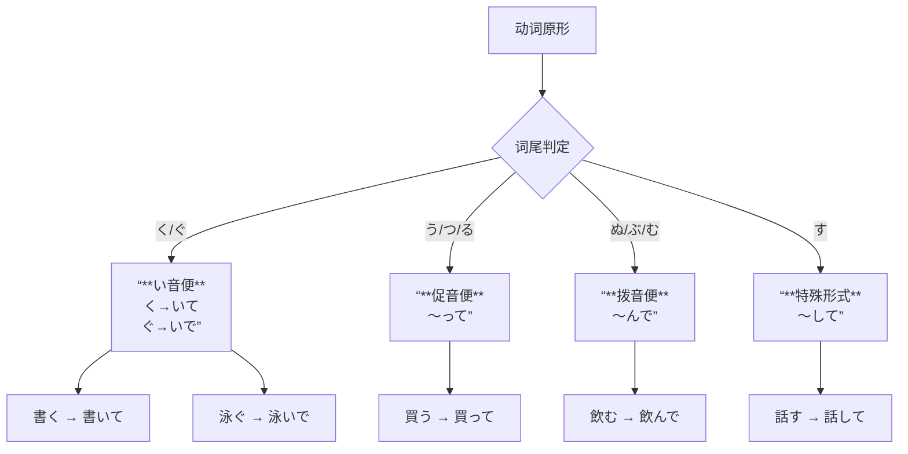

## 一、李さんは中国人です

### 背单词技巧

日语当中绝大部分单词是汉字词
汉字词要分开字和字的读音
先记字形然后记字的读音

```
に　ほん　じん
日　本		人
```


### 文法

#### ～は～です（肯定）


#### ～は～では　ありません（否定）


#### ～は～ですか（疑问）


#### ～の～（所属）


### 人称代词

#### 第一人称

| 人称                     | 第一人称               |
| ------------------------ | ---------------------- |
| 一般用语　いっぱんようご | 私　わたし             |
| 男性用语　だんせいようご | 俺　おれ<br />僕　ぼく |
| 女性用语　じょせいようご | あたし                 |

#### 第二人称

| 人称                     | 第二人称                                     |
| ------------------------ | -------------------------------------------- |
| 一般用语　いっぱんようご | 貴方　あなた<br />君　きみ<br />お前　おまえ |

#### 第三人称

| 人称                     | 第三人称                                     |
| ------------------------ | -------------------------------------------- |
| 一般用语　いっぱんようご | 彼　かれ（男性）<br />彼女　かのじょ（女性） |

### 自我介绍（自己紹介　じこしょうかい）

おはようございます。こんにちは。こんばんは。

初めまして、私は楊です、どうぞよろしく　お願いします。

### 本文　出迎え（でむかえ）

### 練習（れんしゅう）

## 二、これは本です

### あの人は誰ですか

| 特点           | 人称疑问词       |
| -------------- | ---------------- |
| 普通　ふつう   | だねですか。     |
| 礼儀　れいぎ   | どなたですか。   |
| 尊敬　そんけい | どちら様ですか。 |

# 动词变形

好的，同学！这个问题问得非常好，**「て形」** 的变形规则确实是初级阶段最重要的基础，也是考试的高频考点。你提到的“什么时候变 **で**”正是其中的一个关键点。

我们来彻底搞懂它！

---

### **「て形」变形规则与「で」的使用时机**

**核心要点：** 「で」是「て」的**浊化形式**，它的出现与动词原形的词尾有直接关系。

为了更直观地记忆，请先看下面的总结图，它涵盖了一类动词（五段动词）的所有音变规则：



#### **规则详解**

**一类动词（五段动词）**

这是记忆的重点，需要根据动词词尾来记。请对照上面的图表一起看：

1.  **词尾是「く」或「ぐ」**
    *   **规则**：发生 **“い音便”**。
    *   **「く」 → 「いて」**
        *   書**く**（写） → 書**いて**
        *   歩**く**（走） → 歩**いて**
    *   **「ぐ」 → 「いで」**  ← **【这里就是用「で」的情况！】**
        *   泳**ぐ**（游泳） → 泳**いで**
        *   急**ぐ**（急忙） → 急**いで**
    *   **记忆口诀**：**“く、ぐ” 变 “い” ，ぐ后要浊化。**

2.  **词尾是「う」、「つ」、「る」**
    *   **规则**：发生 **“促音便”**（即变成小っ）。
    *   **～う、～つ、～る → 「って」**
        *   買**う**（买） → 買**って**
        *   待**つ**（等待） → 待**って**
        *   帰**る**（回去） → 帰**って**

3.  **词尾是「ぬ」、「ぶ」、「む」**
    *   **规则**：发生 **“拨音便”**（即变成ん）。
    *   **～ぬ、～ぶ、～む → 「んで」**  ← **【这里也是用「で」的情况！】**
        *   死**ぬ**（死） → 死**んで** （这是唯一以「ぬ」结尾的常用动词）
        *   遊**ぶ**（玩耍） → 遊**んで**
        *   飲**む**（喝） → 飲**んで**
    *   **记忆口诀**：**“ぬ、ぶ、む” 变 “ん” ，后面跟着で。**

4.  **词尾是「す」**
    *   **规则**：**“す” → 「して」**
        *   話**す**（说） → 話**して**
        *   押**す**（推） → 押**して**

**唯一特例：行く**
*   “行く” 不遵循“く → いて”的规则，它是特例，必须记住：
*   **行く → 行って**（而不是“行いて”）

---

#### **二类动词 & 三类动词**

这两类非常简单，没有音变。

*   **二类动词（一段动词）**
    *   **规则**：**去掉词尾「る」 + 「て」**
    *   食**べる** → 食**べて**
    *   起**きる** → 起**きて**
    *   見**る** → 見**て**

*   **三类动词（カ变/サ变）**
    *   **する** → **して**
    *   **来る** → **来（き）て**

---

### **重点与考点总结**

1.  **什么时候用「で」？**
    *   **当动词词尾是「ぐ」时**（如：泳ぐ → 泳い**で**）
    *   **当动词词尾是「ぬ」、「ぶ」、「む」时**（如：飲む → 飲ん**で**）
    *   可以记忆为 **“ぐ、ぬ、ぶ、む”** 这四位“好朋友”后面要接浊音的「で」。

2.  **必考特例：**
    *   **行く** → **行って**（这是N5、N4、N3所有考试中100%会出现的考点）

3.  **「て形」的核心用途：**（N3水平需要掌握的）
    *   **连接句子**（表先后顺序、方式、原因等）：朝ご飯を**食べて**、学校へ行きます。
    *   **表示进行时**：**～ている**（正在...）
    *   **表示状态**：窓が**開いている**（窗户开着）。
    *   **表示请求/命令**（轻微）：ちょっと待ってください。
    *   **表示许可**：**～てもいいです**（可以...）

### **例句**

1.  **（一类动词）毎日、日本語を**勉強して**います。**（我每天在学习日语。）
    *   “勉強する”是三类动词，变“して”。

2.  **（用「で」）音楽を**聞いて**、宿題を**しています**。**（我一边听音乐，一边写作业。）
    *   “聞く”是“く”结尾，变“聞いて”。

3.  **（用「で」）電車が混んで**いました。**（电车很拥挤。）
    *   “混む”是“む”结尾，变“混んで”。

4.  **（二类动词）もう**寝て**ください。**（请睡觉吧。）

把上面的规则和口诀记牢，然后多找一些动词来练习，很快就能熟练于心了！加油！


## 12种动词变形

---

### **日语动词变形全攻略（N5-N3）**

在学习具体变形前，我们必须先掌握最基础的概念：**动词分组**。

#### **第一步：动词的三种分组（重中之重！）**

所有动词变形都基于这个分组，一定要记牢！

1.  **一类动词（五段动词）**
    *   **特点**：词尾在「う」段上，变形时词尾会在「あいうえお」五段中变化。
    *   **例**：書**く**、飲**む**、話**す**、待**つ**、死**ぬ**、遊**ぶ**、買**う**

2.  **二类动词（一段动词）**
    *   **特点**：词尾一定是「る」，而且「る」前面的假名在「い」段或「え」段上。
    *   **例**：食**べる**（え段+る）、起**きる**（い段+る）

3.  **三类动词（变格动词）**
    *   **特点**：只有两个词，需要死记硬背。
    *   **する**（做）
    *   **来る**（来）

**小窍门**：有一些看起来像二类动词，但实际上是一类动词的常用词，需要特别注意：**知る、入る、走る、帰る、切る、要る**等。

---

#### **第二步：12种动词变形规律表**

下面这个表格是所有变形的核心，请务必理解并记忆。

| 变形名称               | 作用与含义                     | 一类动词（五段）                                             | 二类动词（一段）                                             | 三类动词                 |
| :--------------------- | :----------------------------- | :----------------------------------------------------------- | :----------------------------------------------------------- | :----------------------- |
| **1. ます形（敬体）**  | 礼貌、正式的表达               | 词尾 → **い段 + ます**<br>書**く** → 書**き**ます            | **去掉「る」+ ます**<br>食**べる** → 食**べ**ます            | **します／来ます**       |
| **2. ない形（否定）**  | 表示“不...”                    | 词尾 → **あ段 + ない**<br>書**く** → 書**か**ない<br>※特殊：う段 → **わ**+ない<br>買**う** → 買**わ**ない | **去掉「る」+ ない**<br>食**べる** → 食**べ**ない            | **しない／来ない**       |
| **3. て形（连接）**    | 连接句子，表中顿、方式、请求等 | **这是重点！**<br>**「く→いて、ぐ→いで」**<br>書**く** → 書**いて**<br>泳**ぐ** → 泳**いで**<br>**「す→して」**<br>話**す** → 話**して**<br>**「ぬ/ぶ/む→んで」**<br>死**ぬ** → 死**ん**で<br>遊**ぶ** → 遊**ん**で<br>飲**む** → 飲**ん**で<br>**「う/つ/る→って」**<br>買**う** → 買**っ**て<br>待**つ** → 待**っ**て<br>帰**る** → 帰**っ**て | **去掉「る」+ て**<br>食**べる** → 食**べ**て<br>起**きる** → 起**き**て | **して／来（き）て**     |
| **4. た形（过去式）**  | 过去、完了、确认               | **变形规则与「て形」完全一样**，只是把「て」换成「た」，「で」换成「だ」。<br>書く → 書い**た**<br>泳ぐ → 泳い**だ**<br>話す → 話し**た**<br>飲む → 飲ん**だ**<br>買う → 買っ**た** | **去掉「る」+ た**<br>食**べる** → 食**べ**た                | **した／来（き）た**     |
| **5. 可能形（能够）**  | 表示“能、会”                   | 词尾 → **え段 + る**<br>書**く** → 書**ける**<br>飲**む** → 飲**める**<br>**（变成二类动词！）** | **去掉「る」+ られる**<br>食**べる** → 食**べ**られる        | **できる／来られる**     |
| **6. 受身形（被动）**  | 表示被动“被...”                | 词尾 → **あ段 + れる**<br>書**く** → 書**か**れる<br>※特殊：う段 → **わ**+れる<br>買**う** → 買**わ**れる | **去掉「る」+ られる**<br>食**べる** → 食**べ**られる        | **される／来られる**     |
| **7. 使役形（使让）**  | 表示“让、使”                   | 词尾 → **あ段 + せる**<br>書**く** → 書**か**せる<br>※特殊：う段 → **わ**+せる<br>買**う** → 買**わ**せる | **去掉「る」+ させる**<br>食**べる** → 食**べ**させる        | **させる／来させる**     |
| **8. 命令形**          | 命令（语气强硬）               | 词尾 → **え段**<br>書**く** → 書**け**！<br>飲**む** → 飲**め**！ | **去掉「る」+ ろ**<br>食**べる** → 食**べ**ろ！              | **しろ／来（こ）い**     |
| **9. 禁止形**          | 禁止“不许...”                  | **字典形 + な**<br>書く**な**！                              | 字典形 + **な**<br>食べる**な**！                            | する**な**／来る**な**   |
| **10. 意向形（意志）** | 表示“让我们...吧”              | 词尾 → **お段 + う**<br>書**く** → 書**こ**う<br>飲**む** → 飲**も**う | **去掉「る」+ よう**<br>食**べる** → 食**べ**よう            | **しよう／来（こ）よう** |
| **11. 条件形（ば形）** | 表示“如果...”                  | 词尾 → **え段 + ば**<br>書**く** → 書**け**ば<br>飲**む** → 飲**め**ば | **去掉「る」+ れば**<br>食**べる** → 食**べ**れば            | **すれば／来（く）れば** |
| **12. 被动使役形**     | 表示“被迫做...”                | **使役形 + 被动形**<br>書かせる + られる → 書か**せられる**<br>（常约音为：書か**される**） | **させる + られる**<br>食べさせる + られる → 食べ**させられる** | **させられる**           |

---

### **核心考点与例句精讲**

这里挑几个N3考试中极易出错的点进行讲解。

**1. て形 （N5基础，N3综合运用的核心）**
*   **考点**：一类动词的音变是难点，必须背熟口诀。
*   **例句**：
    *   私は毎日、日記を**書いて**います。（我每天写日记。）【表持续】
    *   これを**食べて**みてください。（请尝尝这个。）【表尝试】

**2. た形 （N5基础，N3语法关键）**
*   **考点**：规则与「て形」完全一致。它是很多N3语法的基础，如「～たことがある」（有过...经历）、「～たほうがいい」（最好...）。
*   **例句**：
    *   日本へ**行った**ことがあります。（我去过日本。）
    *    もっと野菜を**食べた**ほうがいいですよ。（你最好多吃点蔬菜。）

**3. 可能形 vs られる形**
*   **考点**：二类动词和三类动词的可能形与被动形形态一样（～られる），需要根据上下文判断意思。
*   **例句**：
    *   私は餃子が**作れます**。（我能包饺子。）【一类动词可能形】
    *   私はピアノが**弾けます**。（我会弹钢琴。）【一类动词可能形】
    *   弟はいつも母に**起こられます**。（弟弟总是被妈妈叫醒。）【二类动词被动形】
    *   私は早く**起きられます**。（我能早起。）【二类动词可能形】

**4. 被动使役形 （N3难点）**
*   **考点**：表示“不情愿、被迫做某事”，带有负面情绪。
*   **例句**：
    *   昨日、お酒をたくさん**飲まされました**。（昨天被迫喝了很多酒。）
    *    子供の頃、毎日ピアノを**練習させられました**。（小时候，被迫每天练习钢琴。）

---

### **给你的复习建议**

1.  **每天抄写**：每天把这12种变形规则表抄写一遍，坚持一周，形成肌肉记忆。
2.  **分组练习**：不要只背规则。找10个常用动词（涵盖一、二、三类），把它们的所有变形都写出来。
    *   例：**書く（一类）、食べる（二类）、する（三类）**
3.  **造句输出**：对每一个变形，尤其是N3的重点变形（可能、被动、使役、被动使役），都要造1-2个句子。
4.  **真题应用**：做N3真题时，遇到不认识的语法，回头查查它是由哪种变形构成的，这样能加深理解。

不要害怕忘记，学习语言就是一个“忘了背，背了忘，忘了再背”的过程。你现在正在经历的，正是突破瓶颈的关键阶段！把这份大纲保存好，遇到想不起来的变形就打开看看。

加油！老师相信你一定能顺利通过N3考试！頑張ってください！

