# 新标日初级上

[toc]

人間は恋と革命のために生まれて来たのだ

人間は恋と革命のために生まれて来たのだ

にんげん　は　こい　と　かくめい 　の　ため　に　まなれ　て　きたのだ

## 书本介绍

### 书本结构

1. 上、下册各设6个"基本单元"，每个单元由4课构成。

   上册另设"入门单元"

2. 入门单元

3. 基本单元

   1. 寒暄用语
   2. 人物介绍
   3. 单元结构
   4. 单元扉页
   5. 单元末
      - 阅读文
      - 实用场景对话
      - 词语之泉
      - 日本风情

4. 模拟试题

5. 附录

   - 为了整理学习项目，在上、下册的卷末都设置了附录。附录内容包括：课文译文”“练习
     Ⅱ、模拟试题参考答案”“练习、模拟试题录音内容”“数、量词搭配使用表”“动词一览表”
     “句型、表达索引”“总词汇表”“关联词语范畴一览表”“专栏日语译文”“图画词典”等。
     ●“总词汇表”中的动词以基本形的形式给出。
     ●¨数、量词搭配使用表”只收入上册附录。
     ●图画词典用插图和对译的方式介绍基本的动词、一类形容词等，只收入下册附录

### 各课结构

1. 基本课文 和 应用课文

   1. 基本课文: 一二两个部分
      1. 单句突出句型
      2. 对话再现句型
   2. 应用课文: 实用会话

2. 语法解释 与 表达及词语讲解

   “语法解释”和“表达及词语讲解”并置于“基本课文”和“应用课文”之间，以引导学习者加深对本课所学句型、语法项目以及相关表达的理解。关于学习顺序和方法，请参照本书的使用方法一例”（p.XI)

   1. 语法解释

      主要解释基本课文中出现的句型和语法项目。有时也涉及应用课文中有关项目，这时候用[人物]表示。

      - 标题：语法解释”中的标题用以下方式简明扼要地标出。

      下面是标题形式”与其“内容与含义”的对照表。

      | 标题形式     | 内容与含义      |
      | :----------- | :-------------- |
      | 名           | 名词            |
      | 名[场所]     | 表示处所的名词  |
      | 名[人]       | 表示人的名词    |
      | 名[物]       | 表示物的名词    |
      | 名[时间]     | 时间名词        |
      | 名[交通工具] | 交通工具名词    |
      | 名[工具]     | 工具\手段的名词 |
      | 名[数量]     | 数量的名词      |
      | 名[次数]     | 次数            |
      | 名[附着点]   |                 |
      | 名[目的地]   |                 |
      | 名＋の       | 名词 + の       |

      | 形     | 一类形容词和二类形容词 |
      | ------ | ---------------------- |
      | 一类形 | 一类形容词             |
      | 二类形 | 二类形容词             |

      | 动                | 动词         |
      | ----------------- | ------------ |
      | 一类动            | 一类动词     |
      | 二类动            |              |
      | 三类动            |              |
      | 自动              | 自动词       |
      | 他动              | 他动词       |
      | 动(基本形)        | 动词的基本形 |
      | 动(た形)          |              |
      | 动(て形)          |              |
      | 动(ば形)          |              |
      | 动(意志形)        |              |
      | 动(基本形/ない形) |              |
      | 动(否定)          |              |
      | 动(简体形)        |              |

      | 小句                    | 复句中的小句           |
      | ----------------------- | ---------------------- |
      | 疑问词小句              | 包含疑问词的小句       |
      | 小句(简体形)            | 以简体形结尾的小句     |
      | 小句(动词简体形)        | 以动词简体形结尾的小句 |
      | 小句(一类形/二类形/名)  |                        |
      | 小句(动词基本形/ない形) |                        |
      | 小句(动词た形/ない形)   |                        |

   2. 表达及词语讲解

      - 对基本课文及应用课文中出现的需要注意的表达方式、词汇的用法进行讲解说明。应用课文中的有关项目用[人物]表示。讲解说明的原则是密切结合课文的具体内容进行，而不包罗该项目的全部意义和内容。另外，讲解时充分照顾到文化方面的因素。
        所有例句中的日语汉字都注假名，附汉语翻译。例句当中重要的部分用黑体标出。

3. 练习

   1. 替换\改变说法等练习巩固基本功. 不设答案
   2. 听解\读解\填空\中译日. 有答案

4. 生词表

   - 生词的选择与排列：
     - 除独立词外，寒暄表达、惯用短语以及量词等附属词也一并列出。排列顺序是先将**独立词**按照词类集中排列，然后是**寒暄表达**、**惯用短语**以及**量词**等**附属词**。二者之间用虚线隔开。
     - 独立词依据**词类集中排列**，词类相同的尽量将意思相近以及有关联的单词集中处理，以利于学习者联想、记忆。专有名词按照人名、地名、公司名称的顺序排列。
   - **标出项目**：
     - 独立词以“读法、声调、书写法、词类、汉语翻译”的形式标出。寒暄表达、惯用短语除不标词类一项之外，标出方式和独立词相同。
   - **声调**：
     - 如上所示，声调用线条表示。（参照：上册“人门单元”D.14）。
     - 声调的标注方法参考了NK放送文化研究所幅《NHK日本語凳音了夕七>卜辞典》。
   - **书写法**：生词的书写法在（）内给出。
     - 整个单词全部可以用汉字标出的在（）里标出汉字，如上面的“（社員）”。生词的一部分为汉字，一部分为平假名时在（）内两者一起标出，如“（书母）”。另外，“勉強L主寸”等三类动词，用“八老上5L主寸（勉強~）”的形式表示。
   - **词类**：词类及其缩略语如下。
     - 名词=名，代词=代，疑问词=疑，一类动词=动1，二类动词=动2，三类动词=动3，一类形容词=形1，二类形容词=形2，副词=副，连体词=连体，连词=连，叹词=叹，专有名词=专
   - **汉语翻译**：对于多义词一般只给出与课文内容相应的译词。

### 语法体系

1. 与¨学校语法”的对应

   本书采用了不同于“学校语法”的语法体系，以下归纳本书使用的语法术语。

   [动词活用对照表]

   

   

   

   

   

### 符号

关于书写

- 上册采用分写的方式，下册采用一般的方式。
- 因日文正式书写规则不用"？”“！”，本书也尽量避免使用该类符号，疑问句后面一般也使用“。”。但在一部分简体句中，为了有效地体现说话人的情感、感觉，也有使用了“?”“！”的地方。

### 书本使用方法

## 入门单元

### 1.五十音图

### 2.元音

1. 单元音
2. 元音的连续
   - 长短轻重相同
3. 元音的清化
   - **い和う**容易出现清化
   - 夹在 **k s t h p 行中间的元音**, 或是含有这些行辅音的音节出现在**词尾**时, 其**最后的元音**容易发生清化现象

### 3.辅音

1. 清音

   - 清音和浊音, 清音类似于汉语送气音

     - k s t n h m y r w p

     

     

2. 浊音

   - g z d b
   - 发浊音时，声带开始颤动的时间比发清音早。

### 4.拗音

- 拗音是辅音"K"”“s”“t"“n“h”“m"r"”“p"“g”“z”"b”加半辅音ˇy"和元音“a”"u”“o
  - 但要注意日语拗音中的y”发音短而且比较弱。

### 5.拨音\促音和长音

日语中还有不单独发音的拨音（用”ん”表示），促音（用小“つ”表示）和长音(用元音表示)

1. 拨音
   - 
2. 促音
   - 
3. 长音
   - 

### 6.外来语专用音节

### 7.声调和语调

1. 声调

   1. ①单词的第一个音节和第二个音节的音高一定不同。**第一个音节低，则第二个就高，第个音节高，则第二个就低**。
   2. ②一个单词的声调中，或**没有下降，或只有一处下降**。

   下面介绍名词声调的四种类型。由于后续助词时有些词声调下降，而有些不下降，所以，以后续助词“か”为例加以说明。

   

   1. ①平板型：第一个音节低，后面的都高。
   2. ②头高型：第一个音节高，后面的都低。
   3. ③中高型：第一个音节低，第二个以后的某个音节降下来。
   4. ④尾高型：第一个音节低，然后一直高到最后，在后续助词的地方降下来。

   这种类型中没有一个音节的词，四个音节以上的词也不多，而两个和三个音节的词较多但是无论音节多少都要在后续助词的地方降下来。请注意不要在此之前下降。

2. 语调

   1. 短语和陈述句的语调
      1. 汉语中每个字都有各自的声调，而且在句子中受其他要素的影响较小。日语中无论是短语还是陈述句都有开始高，往后则整体音高逐渐降低的倾向。先来看短语的语调。
   2. 疑问句的句尾语调
      1. 疑问句的句尾读升调。

课件制作老师: 早道日语 迷加老师

输入日语小写时先输入L（l），可切换大小写

每阶段固定时间

单词 25分钟

语法+阅读 50分钟

听力 30分钟

alt+~切换字母和日语输入

## 初级上

### 背单词的方法：

1. 预习，过一遍所有单词。
2. 一两小时把所有单词过一遍。边读边写，听写，默写。
3. 熟知的单词不再重复，难背的单词小本子记下来单独背。
4. 平时看到东西就想用日语描述。

### 第一课 小李是中国人

| 会社員（かいしゃいん） | 会社（かいしゃ） | 社員（しゃいん）         | 会員（かいしゃいん）     | 社会（しゃかい）   |
| ---------------------- | ---------------- | ------------------------ | ------------------------ | ------------------ |
| 学生（がくせい）       | 大学（だいがく） | 留学生（りゅうがくせい） | 研修生（けんしゅうせい） | 先生（せんせい）   |
| 課長（かちょう）       | 会社（かいしゃ） | 社長（しゃちょう）       | 店員（てんいん）         | 店長（てんちょう） |
| 教授（きょうじゅ）     | 企業（きぎょう） | 授業（じゅぎょう）       |                          |                    |

#### １．～は～です

##### 文法｜ぶんぽう

句子中的两种单词类型：

- A 体言：名词、代词、助词、数量词。
- B 用言：动词、形容词

李さん　は　中国人です

- A　は　B　です

##### 用例｜ようれい

- 私　は　ミカです
- キムさん　は　留学生です
- スミスさん　は　アメリカ人です

##### 練習｜れんしゅう

- 中村さんは教授です
- 父は中国人です
- キムさんは韓国人です
- 林さんは銀行の店員です
- 林さんは会社員です
- 先生は日本人です

#### ２．～は～では　ありません

##### 文法｜ぶんぽう

森さん　は　学生では　ありません

- A　は　Bでは（じゃ）　ありません
  - では（否定，不是...）　ありません
  - じゃ　ありません（じゃない）

##### 用例｜ようれい

- 林さんは中国人ではありません
- あの人は社長ではありません
- 私は森じゃありません

##### 練習｜れんしゅう

- キムさんは中国人ではありません
- 中村さんは店員ではありません
- スミスさんはフランス人ではありません
- 林さんは教授ではありません
- かちょは日本人ではありません

#### ３．～は～ですか

##### 文法｜ぶんぽう

林さんは　日本人ですか

- Aは　Bですか
  - か：表示疑问，“...是吗？”
  - 応える｜いらえる③②
    - はい、～です。　いいえ、～ではありません。
    - はい、そうです。　いいえ、そうではありません。
    - いいえ、ちがいます。

##### 用例｜ようれい

- 小野さんは課長ですか。
  - はい、課長です。　いいえ、課長ではありません。
  - はい、そうです。　いいえ、そうではありません。
  - いいえ、ちがいます。

#### ４．～の～

##### 文法｜ぶんぽう

李さんは　JC企画の　社員です

- Aの　B

##### 用例｜ようれい

- スミスさんは北京大学の先生
- キムさんは北京旅行社の社員です

#### 課文｜かぶん

- 甲：私は李です。小野さんですか。
- 乙：はい、そうです。小野です。
- 甲：森さんは学生ですか。
- 乙：いいえ、学生ではありません。会社員です。
- 甲：吉田さんですか。
- 乙：いいえ、ちがいます。森です。
- 甲：李さんはJC企画の社員ですか。
- 乙：はい、そうです。

#### 百家姓对应日文

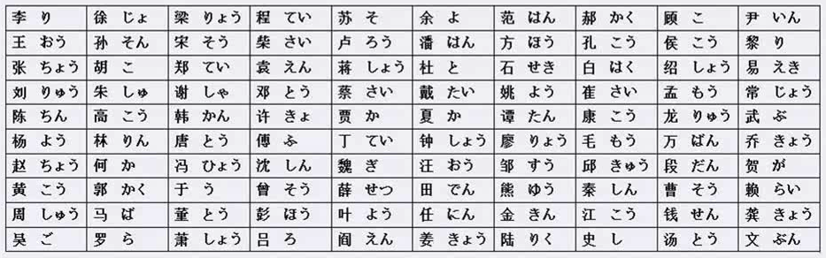

#### 数字

数数用后面的读音

0 ゼロ（れい）

| 一（いち） | 二（に）         | 三（さん） | 四（し　よん）   | 五（ご）     |
| ---------- | ---------------- | ---------- | ---------------- | ------------ |
| 六（ろく） | 七（しち　なな） | 八（はち） | 九（く　きゅう） | 十（じゅう） |

零到一百读音

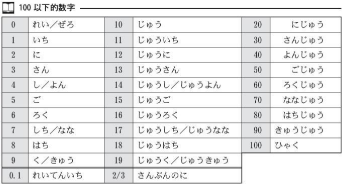

与时间挂钩的读第一个读音，7点、9点、7月、9月

一百以上读音

### 第二课 这是书

#### 単語｜たんご

- ノート
- 手帳
- パーソナルコンピューター　（ピュア　纯粹的）
- かぎ
- 机　｜　テーブル
- 新聞　｜　ニュース
- カメラ　＝　デジカメ　＝　デジタルカメラ
- 一眼レフカメラ　＝　一眼レフ　单反相机
- 電話　＋　自転車　＝　電車

#### 亲属称呼

| 自己的亲属                 | 别人的亲属 | 自己的亲属                         | 别人的亲属 |
| -------------------------- | ---------- | ---------------------------------- | ---------- |
| 祖父／外祖父　祖父（そふ） | おじいさん | 兄弟／兄弟姐妹　兄弟（きょうだい） | ご兄弟     |
| 祖母／外祖母　祖母（そぼ） | おばあさん | 哥哥　兄（あに）                   | お兄さん   |
| 父母　両親（りょうしん）   | ご両親     | 姐姐　姉（あね）                   | お姉さん   |
| 父亲　父（ちち）           | お父さん   | 弟弟　弟（おとうと）               | 弟さん     |
| 母亲　母（はは）           | お母さん   | 妹妹　妹（いもうと）               | 妹さん     |
| 儿子　息子（むすこ）       | 息子さん   | 伯伯／叔叔／舅舅／姑父　おじ       | おじさん   |
| 女儿　娘（むすめ）         | 娘さん     | 伯母／婶婶／姑姑／舅妈　おば       | おばさん   |

- 直接称呼自己的亲属时，如“お父さん”“ババ（爸爸）”等，有多种多样的称谓。但称呼弟弟或妹妹时，一般直呼其名。
- 描述我亲属用左边不加敬语, 称呼或者描述别人的亲属时都要敬语

#### 语法解释

##### 1．これ／それ／あれ　は　～です

##### ２．誰ですか／何ですか

- これは何ですか。这是什么？
- それは何の雑誌ですか。那是什么杂志？
- 日本語の辞書はどれですか。日语字典是哪个？

##### ３．～の～

- 所属
- 性质、内容
- 产地、来源
- 准体、助词

##### ４．この／その／あの　~は　～です

| これ   | それ   | あれ   | どれ   | mine |
| ------ | ------ | ------ | ------ | ---- |
| この～ | その～ | あの～ | どの～ | my   |

- この車は　日本製です
- これは　日本製の車です

##### ５．どれ／どの

- 日本語の辞書はどの辞書ですか。
  - にほんのじしょはどれですか。
- 旅行の雑誌はどの雑誌ですか。
  - 旅行の雑誌はどれですか。

#### 表达及词语讲解

##### １．～かた（方）

##### ２．询问年龄

- ～おいくつですか。
- ～何歳ですか。

##### ３．どうぞ

##### ４．叹词

##### ５．はい　&　～ええ

##### ６．外来词

##### ７．どうも

### 第三课 这里是百货商店

#### 単語｜たんご

| デパート       | デジカメ                 |
| -------------- | ------------------------ |
| 食堂           | 国                       |
| 郵便局         | 地図                     |
| 銀行           | 隣                       |
| 図書館         | 周辺                     |
| マンション     | 今日                     |
| ホテル         | 水曜日                   |
| コンビニ       | 木曜日                   |
| 喫茶店         | ここ                     |
| 病院           | そこ                     |
| 本屋           | あそこ                   |
| レストラン     | こちら                   |
| ビル           | そちら                   |
| 建物           | あちら                   |
| 売り場         | どこ                     |
| トイレ         | だちら                   |
| 入口           | あのう                   |
| 事務所         | 上海                     |
| 受付           | 東京                     |
| バーゲン会場   | いくら                   |
| エスタレーター | お～／～階／～円／～曜日 |
| 服             |                          |
| コート         |                          |

#### 语法解释

##### １．ここ／そこ／あそこ

##### ２．～は　～です

病院はここです

そこは病院です

##### ３．～は　どこですか

郵便局はどこですか

##### ４．～も　～です

和は用法一样主语是谁就放谁后面。

- 李さんは会社員です。小野さんも会社員です
- 李さんは学生ではありません。李さんは先生でもありません。

两个も表示：～都～

- 吉田さんも森さんも日本人です。
- 吉田さんも森さんも会社員ではありません。

##### ５．～は　～ですか、～ですか

选择疑问句，选前还是选后。

选一个问题肯定作为答案。

- これは一ですか、七ですか。
- それはタブレッド（tablet手写面板，平板）ですか、携帯（けいたい）ですか。
- そのかばんは四千元（げん）ですか、四千円ですか。

##### ６．～は　いくらですか

#### 表达及词语讲解

##### １．一階

| 1階　いっかい        | 6階　ろっかい       |
| -------------------- | ------------------- |
| 2階　にかい          | 7階　ななかい       |
| 3階　さんかい        | 8階　はち／はっかい |
| 4階　よんかい        | 9階　きゅうかい     |
| 5階　ごかい          | 10階　じゅかい      |
| 16階　じゅうろっかい | 20階　にじゅうかい  |

何階　なんがい　なんかい

横　よこ　并排的旁边，有一定距离

隣　となり　紧挨着，没有距离

隔壁的隔壁　となりのとなり

##### ２．谓语的省略

##### ３．礼貌语言

1. ##### こちら／そちら／あちら／どちら

   1. 方向，这边、那边：
      - こちらへどうぞ
   2. 人：
      - こちらはマイク・ミラーさんです
   3. 礼貌形式：
      - お国はどちらですか
      - ご出身（しゅっしん）はどちらですか
   4. 二选一，（我你）哪一边：
      - こちらこそ　よろしく

2. ##### お国は　どちらですか。会社は　何方ですか

##### ４．缩略词

##### ５．あのう

##### ６．～ですか

### 第四课 房间里有桌子和椅子

#### 単語｜たんご

| 部屋                                          | 中                     |
| --------------------------------------------- | ---------------------- |
| 庭                                            | 下                     |
| 家　いえ（House）｜うち（Home）家族（Family） | 前                     |
| 居間　いま②（Living　Room）                   | 後ろ                   |
| 冷蔵庫                                        | 近く                   |
| 壁                                            | 場所                   |
| スイッチ                                      | 教室                   |
| 本棚                                          | 会議室                 |
| ベッド                                        | 図書室                 |
| 猫                                            | 公園                   |
| 犬　ペットです(Pet)                           | 花屋                   |
| 箱                                            | 売店                   |
| 眼鏡                                          | 駅                     |
| ビデオ                                        | 地下鉄　地下室　ちか～ |
| サッカーボール                                | 木                     |
| ビール                                        | 一人暮らし             |
| ウイスキー                                    | あります               |
| 子供                                          | います                 |
| 兄弟                                          | 横浜                   |
| 両親                                          | 名古屋                 |
| 妹                                            | 大阪                   |
| 男                                            | ジェーアール           |
| 女                                            | ご～                   |
| 生徒                                          | ええと                 |
| 上                                            |                        |
| 外                                            |                        |

#### 具体方位词

| 上　うえ   | 下　した     |
| ---------- | ------------ |
| 前　まえ   | 後ろ　うしろ |
| 左　ひだり | 右　みぎ     |
| 中　なか   | 外　そと     |
| 隣　となり | 横　よこ     |
| 間　あいだ | 近く　ちかく |

- 机の下　ドアの後ろ　冷蔵庫の中　家の中
- AとBの間：
  - 辞書は車の雑誌と日本語の本の間です

#### 文法｜ぶんぽう

##### １．場所に　物が　います／あります

- 地点	有	物

あります：无自由行动意志的，比如植物、非生物等。

います：有自由行动意志的，比如人、动物等。

に：存在的地点

が：主语，存在的主体

> 部屋に　机と　椅子が　あります。

- かばんは　ノートと　本が　あります。ペンが　ありません。
- 冷蔵庫に　肉と　魚が　あります。野菜が　全然ありません。
- 学校に　食堂が　ありますか。
- （学校に）食堂が　あります。でも　あまり　おいしくないです。

> 机の上に　猫が　います。

- 椅子の下に　犬が　います。
- 部屋に　誰が　いますか。だれも　いません。
- あの池に　魚が　いません。

> 机に　ねこがいます、靴もあります。

有生命，无生命分开说。

##### ２．～が　います／あります

> 兄弟が　いますか。
>
> 彼女が　いませんよ。
>
> 日本人の　友達が　いますか。
>
> お金が　ありません。
>
> 仕事が　ありません。
>
> 
>
> 時間・用事・・約束が　あります。
>
> 車が　あります。　いいえ、ありません。
>
> 家が　ありますか。　いいえ、家もありません。
>
> 車も　ありません。家も　ありません。
>
> 車も家もありません。

省略地点

##### ３．物は　場所に　います／あります

- 物	在	地点

は：主题，存在的主体

に：存在的地点

> 売店は　駅の　外に　あります。

- メガネは　本棚の上に　ありません。
- 鍵は　かばんに　あります。
- 図書館は　どこに　ありますか。
  - あのビルの　隣に　あります。
  - あのビルの　隣です。

##### ４．人・物は　場所に　います

> 吉田さんは　庭に　います。

- 森さんは　事務室に　いますか。
- いいえ、会社に　いません。
- 犬は　部屋に　いません。庭に　います。
- 先生は　教室に　いますか、事務室に　いますか。

##### ５．～が～／～に～

図書館があります。　図書館にあります。

学校に図書館があります。　辞書は図書館にあります。

車がありません。　車にありません。

##### ６．疑问词做主语时　は→が

誰が部屋にいますか。＝部屋に誰がいますか。（助词相同，句子相同。常用后面的）

誰が吉田課長ですか。

##### ７．～と～

と：并列，列举关系，每个词后面都有と，最后一个会隐藏。

- 本とノート（と）　ノートと本（と）
- かばんに本とノート（と）があります。

AとB　の間（あいだ）在A和B之间

- 本屋は銀行とコンビニの間あります。

- 本屋は銀行コンビニの間です。

##### ８．疑问词+　も　+动词（否定）

- 庭に何もありません。院子里什么也没有。
- 部屋に誰もいません。房间里一个人也没有。

##### ９．ご お的用法

1. お后加训读(日语读音+中国汉字) = 您的 
2. ご后加音读(中文读音+中文汉字) = 您的

#### 表达及词语讲解

##### １．上 所表达的范围

##### ２．ええと

##### ３．ご家族　ご兄弟　ご両親　

##### ４．兄弟

##### ５．ジェーアール　地下鉄

##### ６．一人暮らし

##### ７．なに／なん

か　が　も　前読む（よむ）なに、其余的读　なん

### 第五课 森先生7点起床

#### 単語｜たんご

| いま（今）           | がっこう（学校）                           |
| -------------------- | ------------------------------------------ |
| せんしゅう（先週）   | しけん（試験）                             |
| らいしゅう（来週）   | しごと（仕事）                             |
| こんしゅう（今週）   | ちこく（遅刻）                             |
| きのうう（昨日）     | やすみ（休み）                             |
| あした（明日）       | しゅっちょう（出張）                       |
| あさって             | けんしゅう（研修）                         |
| おととい             | りょこう（旅行）                           |
| まいにち（毎日）     | てんらんかい（展覧会）                     |
| まいあさ（毎朝）     | かんげいかい（歓迎会）                     |
| まいばん（毎晩）     | パーティー                                 |
| まいしゅう（毎週）   | おたく（お宅）                             |
| ごぜん（午前）       | いつ（何時）                               |
| ごご（午後）         | やすみます（休みます）                     |
| にちようび（日曜日） | はたらきます（働きます）                   |
| げつようび（月曜日） | はじまります（始まります）                 |
| かようび（火曜日）   | おわります（終わります）                   |
| きんようび（金曜日） | おきます（起きます）                       |
| どようび（土曜日）   | ねます（寝ます）                           |
| けさ（今朝）         | べんきょうします（勉強します）             |
| こんばん（今晩）     | いつも                                     |
| らいねん（来年）     | ぺきんししゃ（北京支社）                   |
| きょねん（去年）     | おはよう                                   |
| よる（夜）           | ～時／～分／～半／～月／～日／～年／～ごろ |
| ばん（晩）           |                                            |
| あさ（朝）           |                                            |

#### 文法｜ぶんぽう

#### 表达及词语讲解

#### 否定句

#### 日期-时间-星期

##### 时间 星期

～時（じ）　～午前（ごぜん）　～午後（ごご）

##### 前天 明天 后天

##### 日期 月份

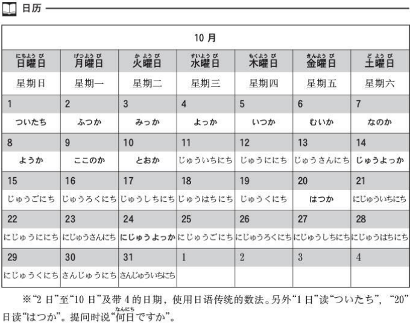

#### に 动作发生的时间点

#### 过去时

#### から　まで用法

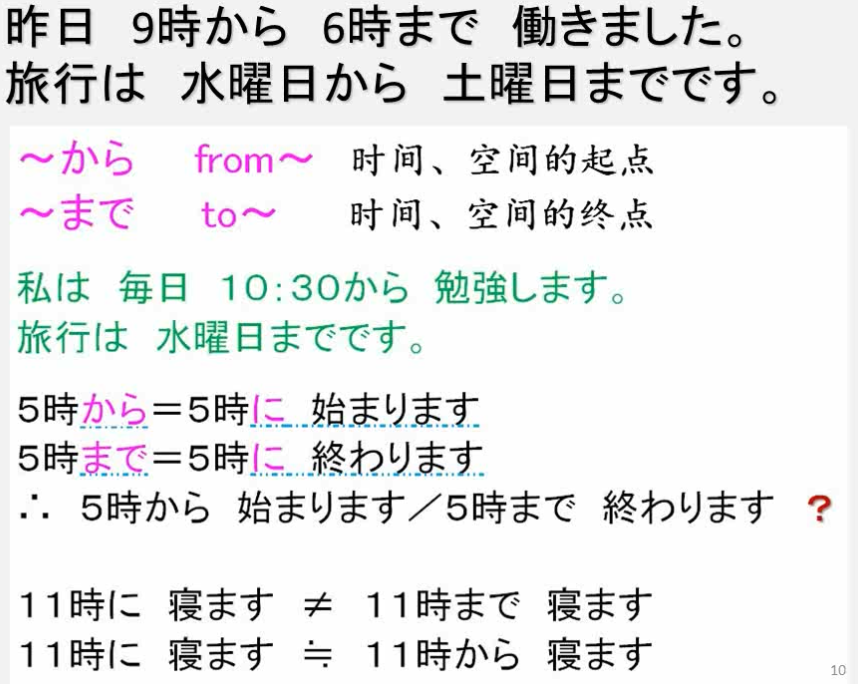

### 第六课 吉田先生下个月去中国

#### へ　动作移动的方向

に：表示方向，目的。

- 表示物体存在的地点和空间。
- 表示动作发生的时间点。

大部分时候可以和へ互换。

- 私たちは秋葉原に行きます。我们会去秋叶原。
- 君はいつ日本に来ますか。你什么时候来日本？
- 温泉に行きますか。去泡温泉吗。（表示目的，只能用に）

#### から 时间\空间的起点

从中国来  != 来到中国

#### と　动作行为共同者

接在人物名词后面，和某人一起

- 昨日はクラスメートと映画に行きました。

#### で　方式\方法

#### 动词变形规律

### 第七课 小李每天喝咖啡

#### を　动作内容的对象

三类动词: ＋します

#### で　动作发生的场所

- 映画に行きます。目的
- 東京へ行きます。方向
- 教室で勉強します。动作发生地点

#### か　选择\或者

#### を　ください　请给我(购物\索要时)

#### ください

わずかでいい　ぼくにあいおください。

- 哪怕一点点也好，请给我你的爱。--日本人也不懂的日语

#### 动词变形规律

### 第八课 小李用日语写信

#### で　方式\方法

#### あげます　给\送

#### もらいました　得到\收到\领取

#### に　动作方向的对象

- 先生に会います。见老师。（以人为对象用に）

如果对象不是个人，而是集团、地点时，也可以使用「へ」或者「から」

### 二单元复习

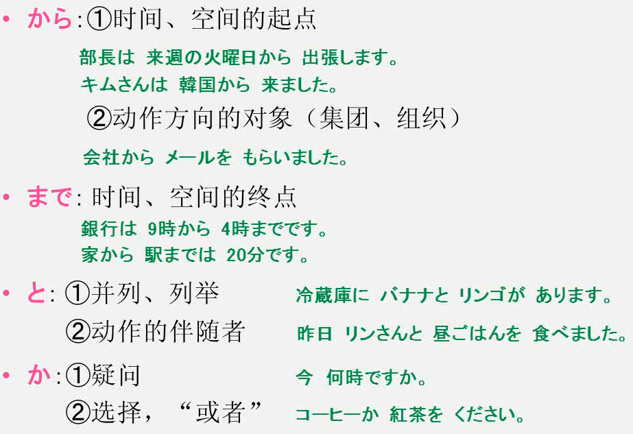

格助词: 标识前面词的成分

日剧《结不上婚的男人》

### 第九课 四川料理很辣

#### 1.一类形容词否定\肯定\过去式

**ない＝ありません**

#### 2.副词肯定\否定

#### 4.形容词作定语

い形容词

### 第十课 京都的红叶很有名

#### 1.二类形容词否定\肯定\过去式

#### 3.二类形容词作定语

な形容词

### 第十一课 小叶女士喜欢唱歌

#### 1.が　助词的用法

汉语中是动词, 日语中是形容词

#### 2.が　助词的用法

他动词 自动词

#### 3.～や～や～（など）不完全列举

#### 4.～から、～　～ですから・だから～　因果关系

**提问-回答**

#### 5.动词变形

#### 6.频率副词

#### 7.大小主语、大主语用は, 小主语用が 

小主语是大主语的一部分时, 大主语用は, 小主语用が 

### 第十二课 小李比森先生年轻

#### 1.～より　比较、ずっと　得多

只能用于肯定句

#### 2.～ほうが　～更

ほうが 固定搭配

和~相比, 还是~好

#### 3.AとBと　どちらが～か　二选一

～と～と　どちら　が　固定搭配

问和回答都要用 が、どちらが、ほうが

#### 4.～ほど　不如, 否定句比较

#### 5.～で～が　一番　最高级

一番+形容词: 最高级

- 
- 寿司は日本料理で一番おいしいです。

#### 6.形容词名称的不同叫法

### 第十三课 桌子上有三本书

#### 1.数词和量词(附录)

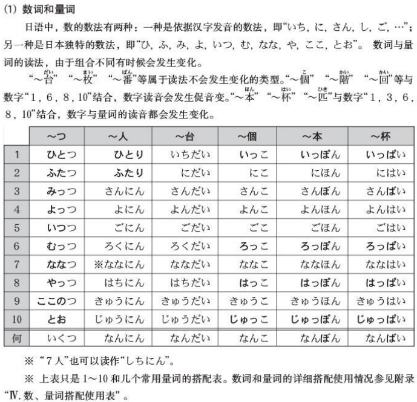

#### 2.数量词+动词

#### 3.时间数量词

#### 4.に　频率的基准

#### 5.に　移动至某地的目的

#### 6.で　限定范围

#### 7.~ぐらい　～ごろ　左右

~ぐらい: 时间段左右, 长点儿

～ごろ: 时间点左右, 多点儿

### 第十四课 昨天去商场买东西了

#### 単語｜たんご

出ます

- 表示从哪里出发
  - **从大学毕业**：大学を出ます
  - 从公司出去：会社を出ます

出かけます

1. 表示外出
   - 去新宿
     - 新宿へ出かけます
     - 新宿へ行きます
2. 可以单独使用
   - 今天不会出门
     - 今日は出かけません

#### 1.て形 动词变形

二类动词词尾通常在 e 段

#### 2.～て、～て、～　强调动作先后顺序

吃完饭去看了电影。

- 食事をして、映画を見に行きました。
- ご飯を食べで、映画を見に行きました。

#### 3.～てから、～　动作前后紧密联系

#### 4.～て　ください　要求/命令

礼貌的要求

#### 5.に　动作的归着点

#### 6.を　动作的起点

#### 7.を　移动经过的场所

### 第十五课 小野女士现正正在看报纸

#### 単語｜たんご

坐船去。（动词表达，强调手段）

- ボートで行きます。

坐船。（词组表达，强调动作）

- ぼーとに乗ります。

坐着船去。

- ぼーとにのって行きます。

気を使います　用心

#### 1.～て　います　进行时

#### 2.～ても　いいです　表示许可

我~可以吗?

#### 3.～ては　いけますん　表示禁止

#### 4.同14课归着点

#### 

### 第十六课 宾馆的房间又宽敞又明亮

#### 1.～て、～て～　い形容词并列

一类形容词: 变く＋て

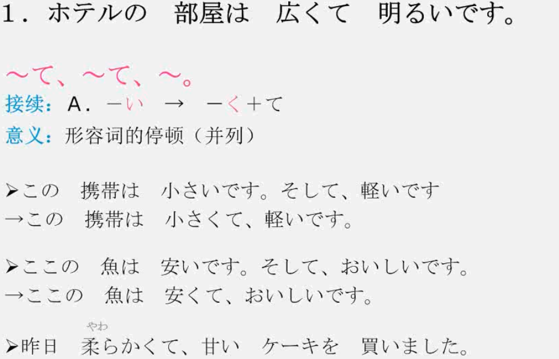

#### 2.～て、～て～　な形容词并列

二类形容词(An/Na):  だ 变 で

#### 3.～て　います　动作结束的状态

使用过去式=过去完成时

#### 4.～が、～　转折关系

~が跟着谁就是 虽然, 后面是 但是

### 四单元复习

#### 数量词

#### で　に　を　助词

#### を　から　有/无意志动作

无意志主语: から

有意志主语, 抽象含义的离开: を

具体的有意识的动作可互换

#### 频率 目的 否定 转折

第五单元

### 第十七课 我想有套新西服

#### 1.～が　欲しい　 想要/愿望

用于第三人称：

- 補充：人は事を**欲しがっています**。
  - ほしい→欲しがる→欲しがって
- 奈奈想要一个玩偶。
  - 奈奈ちゃんは人形を欲しがっています。

#### 2.～たい　想要做

变形类似于一类形容词

を　が　这个句型可以互换

用于第三人称：

- 補充：说话主语为第三人称时一般用**たがる**。
- 鈴木さんは海外旅行に行き**たがる**。
  - 行き**たがって**います。

#### 3.～ませんか　～ましょう　邀请/提议

### 第十八课 手机变小了

#### 1.～く/ に　なります　变得/成为

一类形容词 い　く

二类形容词或名词 だ　に

名を名になります。名词和形容动词一样要在之后加助词に。

这时名词多为时间或身份名词。

- もうすぐ五月になります。马上就要5月/5点了。
- 来年社会人になります。明年我就要成为社会的一员了。
- 来年父になります。明年就要成为父亲了。

#### 2.～く/ に　します　使~变得/决定

一类形容词 い→く

二类形容词或名词 だ→に

表示一种决定

名を名にします。表示名词的主动变化，用法同形容动词，常用到宾格助词を，可以翻译为“把某物做某动作”。

- 時計を九時にしました。把表调到了9点。
- パーチイーをにぎやかにします。把派对变得热热闹闹的。
- 息子を音楽家にします。我要把儿子培养成音乐家。
  

#### 3.他动词和自动词

#### 4.～ほうが　いいです　\~的更\~ 比较好

～ほうが　便利です　更方便

### 第十九课 请别忘了房间钥匙

#### 1.ない形 动词变形,否定

#### 2.～ないで　ください　命令/要求,请不要

#### 3.～なかれば　なりません　不做不行/必须

- い→ければ　如果
- **～なかれば　なりません** 如果不这样做不行 / 必须
  - 缩略体/口语体: **なきや**
- 同 **~ないと　いけません**;  ~ないと
  - 口语: **ないと**
- 同 だめです

#### 4.～なくても　いいです　不做也行/不必

与～なかれば　なりません 相互否定

#### 5.が　谦虚语气

第一次出现用 が 相当于 a

第二次用 は 相当于 the

谦虚语气

### 第二十课 史密斯先生会弹钢琴

#### 1.动词变形规律总结

1. 一类动词（五段动词）
   - 特征：词尾在**う段**（3段）
   - 变形：
     - 词尾在**う段　→　い段+ます**
     - 词尾在３段　→　２段+ます
2. 二类动词（一段动词）
   - 特征：
     - 词尾在**い段\え段+る**
     - 词尾在在**２段\４段+る**
   - 变形：
     - 去**る+ます**
3. 三类动词（变格动词）
   - 特征：
     - サ变动词：する
     - カカ变动词：来る
   - 变形：
     - する　→　します
     - 来る　→　来ます

#### 2.～ことが　できます　可能/能/会

名词+ する =动词

动词原形+ こと =动名词

#### 3.～こと + ～は～ます　…是…　

+ ～は～ことます

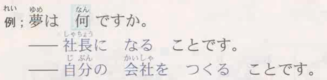

#### 4.～前に　动作的前后顺序, …之前

#### 5.疑问词+か　不确定的名词, 某…

something

somebody

somewhere

sone when 

### 五单元复习

#### 1.两种想要的比较

#### 2.成为/变成/使什么变成

人为变化 を

自然变化 が

#### 3.三种动词变形

#### 4.禁止/允许

#### 5.动词的名词形式

1. ～ことが　できます
   - 能力
   - 条件
   - 允许/禁止
2. ～は～ことます
3. ～前に　动作的前后顺序, …之前

#### 6.～ほうが　いいです　比较级, 还是…好

1. 还是…比较[形容词]

第六单元

### 第二十一课 我吃过日式牛肉火锅

#### 1.た形 动词变形 过去时的简体

#### 2.～ことが　あります　有过…某种人生经历

问经历有没有, あります　不用过去式

#### 3.～後で、～　…之后…

一个动作在另一个动作后

#### 4.～ほうが　いいです　　建议对方,最好… , …更好

ほうが　いいですが我是不是应该　ほうが　いいですね我是不是应该

#### 5.～ましょうか　提议一起做/提议为对方做; 

一起…怎么样? / 我来…做吧/我给你…吧

ます→ましょ

ましょ 没有 ませんか 柔和.

### 第二十二课 森先生每天晚上看电视

#### ~方法 吃法 步法 看法 制作做法 办法 

#### 嗯, 嗯~?

#### 1.动词变形 礼貌体/敬体 普通体/简体 过去时

上下敬体简体表一一对应, 敬体全部可以变成简体

ます→た形→ました 

#### 2.一类形容词变形 敬体/简体

区别: です

特殊: いい　よくない　よかった　よくなった

#### 3.二类形容词/名词的简体/敬体

　描述变化时, 形容词和名词用法相同: なります

**でした＝だった**

じゃ＝では

#### 4.口语表达

1. 简体与敬体
2. 省略
   1. 疑问句时可以省略 か
      - おいしいですか。　おいしい？
   2. 使用简体时，经常省略 だ，特别是女性
      - 明日雨ですか。　明日雨？
      - 今暇ですよ。　今暇よ。
   3. 不会产生歧义的助词，经常被省略
      - 何を食べたいですか。　何を食べたい？
      - 今病院へ行きます。　今病院行く。
   4.  ～ています　的简体 ～ている　中，经常省略 い，只用～てる 
      1. 何をしていますか。　何してる？
      2. テレビを見ています。　テレビ見る。
3. 其它表达
   1. 自言自语
      - 明日雨かな。
   2. 如果对方在场时，则表达自己对这个信息也不十分确定
      - 銀行は今日休みかな。
   3. 对方在场时，向对方提出委婉的请求
      - 森君、こね、コピーしてくねるかな。
   4. 对方在场时，表达一种不太同意对方观点，不太相信对方的话，但是也不想为此争论的语气。“是么？”“…么？”
      - ディズコーランド、おま白いかな。
      - へえ？おいしいかな。
      - 本当かな。
   5. の　解释说明
      - そんなにまずいの？
      - 今勉強してるの。
   6. ～って　引用，传闻
      - 旅行って、とこへ行く？
   7. ～けど、～　表示转折「～が、～」的口语体
      - 早く出かけましたが、遅刻しました。

**尽量使用简体练习对话**

### 第二十三课 周末或节假日, 有时散步, 有时买东西

日语中是动词, 汉语中是形容状态的词, 那么是自动词

#### 1.～たり　～たり　します　列举动作,暗示还有,做做…啊

名词　や　や　など

#### 2.～たり　～たり　です　列举,多种状态并存/交替,有的…有的…

可以多词性混用

列举反义词时为交替

加名词是, 说不准的意思

#### 3.～かどうか　将疑问句放在另一个句子中,表不确定, 是否

二类形容词和名词简体为　だ　时去掉　だ

从句中主语用が

#### 4.～か　特殊疑问句简体

二类形容词和名词简体为　だ　时去掉　だ

### 第二十四课 我想小李马上就来

#### 1.～と　思います　个人见解,推测

と　不固定

接简体

黄色用第一人称

白色不限人称

关于xx你怎么看?

#### 2.～と　言います　直接引语/间接引语

ました：一般用过去时

ます：真理性或将来时用现在时

～と　いっています：反复动作

「」直接引语

#### 3.～のです/んです　现象解释/说明

正式: ～のです

口语: んです

客观性询问不用此句型

#### 4.～のです/んです　现象解释/说明

副词可以+なのです/んです

### 六单元复习

#### 动词た形

#### た　形语法例句

#### 动词简体/敬体

#### 一类形容词简体/敬体

#### 二类形容词/名词简体/敬体

#### 简体/敬体语法例句

## 上册总复习

### 总复习一: 体言

#### 体言

#### 数量词

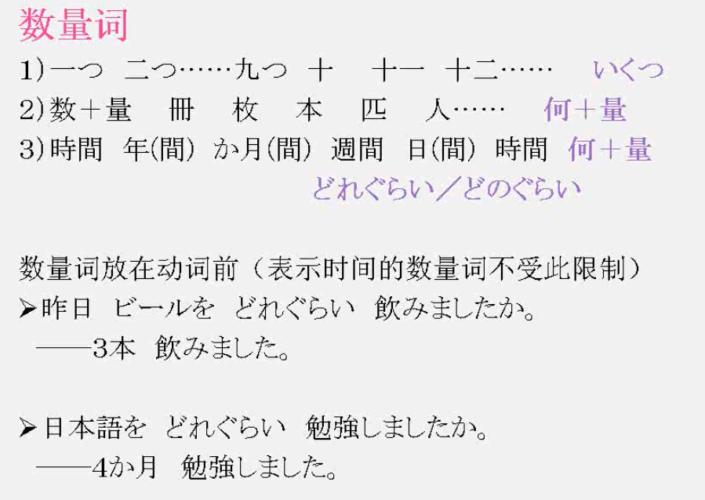

#### 助词

接续助词

##### が顺接: 承上启下

が逆接: 转折

はがは复合: 对比；は提示对比内容

が谦虚语气

##### 完全列举: と　と

不完全列举:　や　や　なと

##### 运动都用で

##### に：抽象目的地

#### 测试题

### 总复习二: 用言

#### 形容词

##### 比较级/最高级

自动词: なる→なります　

他动词:  する→します

名词+ に＋なる：时间/季节/年龄变化

名词+ に＋する・します：使变成/决定

##### 固定搭配助词

想要做某个动作的内容: が　を　可以互换, 想要东西只用が

##### 停顿连用

#### 动词

##### ます形/连用形

##### 原形=字典形=基本形

##### て形　停顿

##### て形　命令

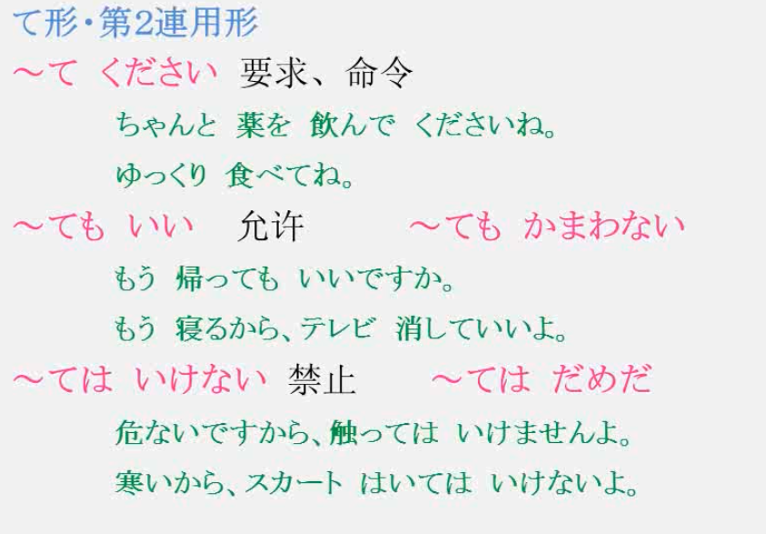

对上级+ませんが　更礼貌

ゆっくり：好好的, 放松的

认真的, 好好的: ちゃんと

##### た形

た形+之后（後で）

##### ない形

##### 动词简体/敬体

##### 一类形容词简体/敬体

##### 二类形容词/名词简体敬体

##### 普通形/简体例句

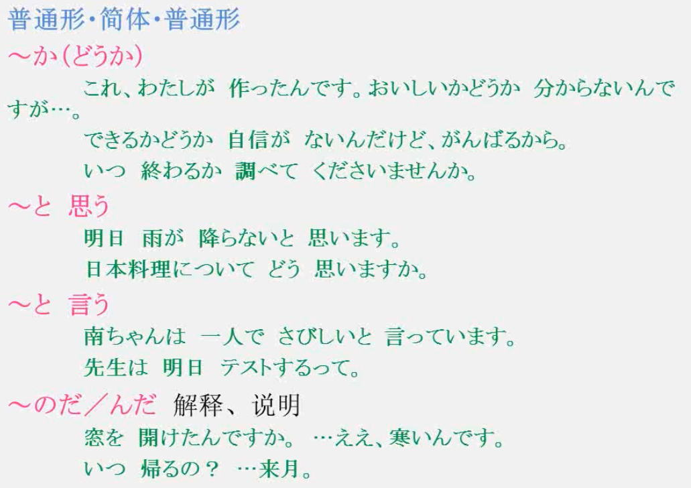

～のです・んです

#### 存在句

#### 授受关系

#### 测试题

### 总复习三: N5模拟题

第七单元

## 初级下

### 第二十五课 这是明天会议要用的资料

#### 1.连体修饰-定语从句

#### 2.定语从句当名词使用

#### 3.连体修饰 形容词/名词修饰名词

### 第二十六课 骑自行车带人很危险

#### 1.

#### 2.

#### 3.

#### 4.

### 第二十七课 我小时候发生过大地震

#### 1.

#### 2.

#### 3.

#### 4.

### 第二十八课 小马给了我一张地图

#### 1.

#### 2.

#### 3.

#### 4.

第八单元

### 第二十九课 关灯!

#### 1.

#### 2.

#### 3.

#### 4.

### 第三十课 已经十一点了, 睡觉吧

#### 1.

#### 2.

#### 3.

#### 4.

### 第三十一课 按下这个钮, 电源就接通了

#### 1.

#### 2.

#### 3.

#### 4.

### 第三十二课 这个星期天打算去游乐园

#### 1.

#### 2.

#### 3.

#### 4.

第九单元 

### 第三十三课 电车突然停了

#### 1.

#### 2.

#### 3.

#### 4.

### 第三十四课 墙上挂着挂历

#### 1.

#### 2.

#### 3.

#### 4.

### 第三十五课 明天要是下雨, 马拉松大会就不搞了

#### 1.

#### 2.

#### 3.

#### 4.

### 第三十六课 我迟到了, 真抱歉

#### 1.

#### 2.

#### 3.

#### 4.

第十单元

### 第三十七课 如果获胜, 就能够参加奥运会

#### 1.

#### 2.

#### 3.

#### 4.

### 第三十八课 小戴会说英语

#### 1.

#### 2.

#### 3.

#### 4.

### 第三十九课 戴着眼镜看书

#### 1.

#### 2.

#### 3.

#### 4.

### 第四十课 正要和朋友一起去吃饭

#### 1.

#### 2.

#### 3.

#### 4.

第十一单元 

### 第四十一课 小李受到部长表扬

#### 1.

#### 2.

#### 3.

#### 4.

### 第四十二课 开着电视就出门了

#### 1.

#### 2.

#### 3.

#### 4.

### 第四十三课 老陈让儿子去美国留学

#### 1.

#### 2.

#### 3.

#### 4.

### 第四十四课 门厅哪儿好像有人

#### 1.

#### 2.

#### 3.

#### 4.

第十二单元

### 第四十五课 孩子减少现象日益加剧, 日本人口将会越来越少

#### 1.

#### 2.

#### 3.

#### 4.

### 第四十六课 这个软软乎乎的, 好像真皮一样

#### 1.

#### 2.

#### 3.

#### 4.

### 第四十七课 周老师明天去日本

#### 1.

#### 2.

#### 3.

#### 4.

### 第四十八课 你的行李我来拿

#### 1.

#### 2.

#### 3.

#### 4.

## 中级上

## 日语语法 附录

在整个日语体系当中，按单词的**意义，形态或职能**加以分类，大体上被划分为**十二品词类型**，即名词、数词、代名词、动词、形容词、形容动词、连体词、副词、接续词、感叹词、助动词和助词。
按语言结构特点分类，日本语属于黏着语，阿尔泰语系。在语言表达上分为**简体和敬体**，另外有发达的敬语体系。

### 语法特点

1. 作为一种基本的结构，典型的日本句子的句式是**主语－宾语－谓语**。

   - 例如，太郎がりんごを食べた（Tarou ga ringo wo tabeta） 照字面直接的意思是"太郎一个苹果吃了"。

2. 当日本人觉着从语境中听者能理解，也就是谈话者或作者自信谈话对象对所谈及的情况有一定了解时，**经常会省略主语或宾语**。

   - 在这种情况下，上面所讲的那个句子可能会变成，りんごを食べた（ringo wo tabeta）（"吃了一个苹果"）或仅为：食べた（tabeta）（"吃了"）。

3. 日语不同于英语中，**词序并不能表明名词在一个句子中的语法作用**。

   - 名词也不像有些语言那样，会因语法需要加以变化。代之，**语法作用是通过名词后面的虚词来表示的**。

   - 较重要的是**が（ga）, は（wa）,お（o）,に（ni）和の（no）**。虚词は（wa）特别重要，因为它标志着一个句子的话题或主题。

4. 日语中的**动词变格不能反映出人称和单复数**。

   - 在现代语中，所有**动词**在字典中的形式都是**以元音u结尾**。这样，动词“食べる”（taberu）就象英语中"吃"的动词原形"to eat"，尽管它本身实际上是现在时，意思是"eat（吃的动词原形）/eats（吃的第三人称单数）"或者 "will eat"（ 将吃，吃的将来时）。 其它的一些变格形式是“食べない”（tabenai）("does not eat" or "will not eat"，英语的现在时不吃或将来时不会吃), “食べよう”（tabeyou）("let‘s eat"or "someone may eat"英语的祈使句让我们吃或某人可吃) “食べたい”（tabetai）("want/wants to eat"，想吃或单数人称的想吃), “食べた”（tabeta）("ate"，英语中的过去时，吃过), “食べれば”（tabereba）(if someone eats"，英语的假设句，如果某人吃) 和“食べろ”（tabero） ("eat!"，英语中的命令句吃！) 。

### 日语的时态

日语中主要有3种时态：过去时、现在时、将来时。其中，现在时和将来时没有明显的时态标记（即都采用动词原形），要靠动词的种类和上下文的关系区别。因此，从形态上说，我们也可以认为日语的时态分为过去时和非过去时两种。
例如：

1. **过去时：（即带有时态标记“た”）**
   1. ①読んだ（已经完成）对应的英语为“he read” ；
      ②読んでいた（尚未完成）“読んでいた”对应的英语为 “he was reading”（可以这么理解，但不完全是这样。这个更像西班牙语的过去未完成时。）
2. **非过去时：（即不带时态标记“た”）**
   1. ①読む（将要进行/反复恒常的动作） 对应的英语为“he is going to read /he reads”；
   2. ②読んでいる（正在进行）对应的英语为“he is reading”（这种形式用在像“読む”这样的表动作的词上时，可以认为正在进行，用于状态性动词时应该认为是一种已经结束的动作所造成的结果的存续。）

### 书写

通常情况下，日语是竖着书写的。不过随着电脑的普及，日语也出现了横向的写法。在书写中，遇到有汉字的词就要写汉字，横写时把对应假名写在汉字上边，竖写时写在汉字右边（日本汉字可不一定全是繁体字，即旧时或现在港台地区所说的“正体字”）。

### 标点

在标点方面，日语的句号、感叹号和省略号与汉语一样，逗号有“，”和“、”两种（同一段话只能用一种）。

引号使用规则也与汉语一样。

日语中有问号，不过一般几乎很少使用，使用时一般为简体表现。

通常情况表示疑问需要在句末加か，句尾仍用句号。

除逗号、句号外，现代日本还使用以下符号。

1. 引号「 」 引用句子和书写会话时使用，称作单引号，相当于汉语的引号，日语中不使用“”。
2. 双引号『 』 在引用句中再次引用时使用，相当于汉语的双引号。

### 符号

1. 々 — 重叠字符号
   例：人々、国々、佐々木
   注：过去中国大陆颁布的第二版简化汉字方案（已废止）也有采用々作为重叠字符号这样的语法。
2. ~ — 波浪线符号，表示“从……到……”的意思。
   例：东京~大阪 三月~五月

作者：清水君SHIMIZU
链接：https://www.zhihu.com/question/341798682/answer/796392455
来源：知乎
著作权归作者所有。商业转载请联系作者获得授权，非商业转载请注明出处。

一，日语语法结构是“主宾谓”。

わたし**は**りんご**を**食べます。

（每个词直接落下就是：我 苹果 吃）

（わたし＝我，りんご＝苹果，食べます＝吃，其他成分则是助词。）

标黑的部分，就是日语语法的重点“助词”。

句子被助词分成了三段，每个助词有每个助词的语法意义，但大致分出了主语，宾语和谓语。

所以日语的一大特点就是动词后置。

（助词は表示主语，を在动词前使用表示动作的对象宾语）

二，日语时态问题

日语时态很简单，不像英语那么复杂。

按照日本语法的划分，日语动词的时态有“过去”、“现在/未来”两种。

这里表现为动词本身的变化，如：“する”、“した”（做）

除此之外所说的各种时态，是借助英语的时态说法来表现，都需要+其他的词汇，

如：している=して+いる（正在做）

一般、 将来时：する （做）

进行时：している （正在做）

过去时、完成时：した（做过，做完）

三，黏着问题

以第一个句子为例：

わたしはりんごを**食べます**。

（我吃苹果。）

加黑部分是动词。

让我们来变化一下。

わたしはりんごを（**食べ**る）。

（我吃苹果。   简体形）

わたしはりんごを（**食べ**ています）。

（我正在吃苹果。）

わたしはりんごを（**食べ**ている）。

（我正在吃苹果。）简体形

わたしはりんごを（**食べ**ません）。

（我没吃苹果）

わたしはりんごを（**食べ**ない）。

（我没吃苹果）简体形

わたしはりんごを（**食べ**ました）。

（我吃了苹果）

わたしはりんごを（**食べ**た）。

（我吃了苹果）简体形

りんごを（**食べ**てください）。

（请你吃苹果。）

词头都没变，就是词尾变了，也就是所谓的黏上去。

## 书籍推荐

书单说明：列出了对我来说肥肠有用的书，其中红色为我觉得必备的
**1.**《新版中日交流标准日本语初级上、下》人民教育出版社
**2.**《新版中日交流标准日本语中级上》人民教育出版社
3从零快乐学日语语法下/（日）藤井麻里编著
4新日本语能力考试N4语法详解附练习解析文照海老原博编著
**5**新日本语能力测试全力出击N2文字词汇HOLD住芝麻门外语，洪洁编著
**6**新日本语能力测试全力出击N2语法HOLD住芦芝麻门外语，李占军编著
7新日语能力考试全真模拟试题解析版/（日）小池多津著
8新日语能力测试N2听力深度解密/总主编刘桂云主编金青华
**9**新完全掌握日语能力考试N2级阅读/北京语言大学出版社
**10**新完全掌握日语能力考试N2级听力/北京语言大学出版社
**11**.历年真题09-16闲鱼购入10元
12新日本语能力考试完全解析&模拟试题N2语言知识文字词汇语法/金基范编著
13最好考前做过这些题新日语能力考试N2语言知识（文字词汇语法）/（韩李钟权编

- 启动阶段五十音背的滚瓜烂熟
  （必须平假名+片假名一起）
  了解一些基本的概念
  比如音读训读，汉字词和语词
  3.5开始看叶子老师在b站的初级标日课
  1做随堂笔记
  2每天复习前一天的笔记和语法
  3走路听头天的课文和单词（喜马拉雅）
  4期间还把新东方的教材
  《从零快乐学日语语法》下册过了一
  查缺补漏
  5花一下午边剧剧边过了一遍N4语法书
  发现自己敬语部分薄弱，恶补加深印象
- 4.3学完标日初级，开始自学标日中级
  4.14放弃课本，开始石语法书、词汇书
  比较后选择《全力出击》词汇、语法
  语法200个必背，词汇6000个尽量
  每天看一篇语法，一篇词汇，并复习下
  前一天的内容做练习题
  接续连体词>动词>形容词>名词外来
  走路听语法（莜）单词（黑皮）
  选看《完全解析》填补基础沟壑，注重
  复合词接头接尾多义词
  515考试周开始日语份额缩水
  522做了第一套完整题，被血虐
  《全真模拟试题解析版》
  发现差距：听力阅读
  时间紧一不熟练/不集中
- 523阅读听力训练兼顾语法词汇
  《新完全掌握》阅读、听力
  《听力深度解密》
  先熟悉题型（了如指掌），再提升素养
  只做了例题，没有管练习
  快速形成应试思维方式
  6.5完成所有196个语法
  专业课考试瑞不过气暂时放下日语
  考完一科的当晚做一套真题（2）
  挤出少量时间做听力训练
  走路听音频，零碎时间看小D收藏

- 630下午四点考完最后一门专业课
  当晚：一套真题井订正
  复习《完全解析》
  7.1下午：复习196个语法（看目录）
  复习系统性笔记
  晚上：一套真题并订正
  《最好考前做过这些题》
  顺序：副词复合动词其他
  动词形容词名词
  72中午进考场前
  继续看《最好考前做过这些题》

 
